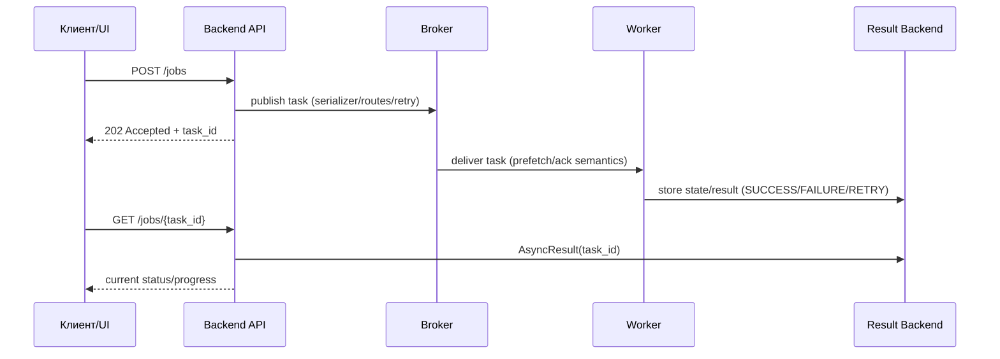

[← Назад к индексу части](index.md)
[↑ К глобальному плану](../mastery_plan.md)

## Сквозной сценарий: клиент -> API -> Celery -> статус задачи

Этот визуал закрывает частую практическую путаницу: где именно “живет” проблема, когда пользователь видит “задача не завершилась”.

**Как читать схему в контексте конфигурации:**

- если `POST /jobs` медленный — часто проблема в publish/connectivity (`broker_*`, `task_publish_retry*`);
- если статус долго `PENDING` — смотреть backend/events (`result_backend*`, `worker_send_task_events`);
- если много дублей — проверять delivery semantics (`task_acks_late`, `task_reject_on_worker_lost`, visibility timeout).

---
