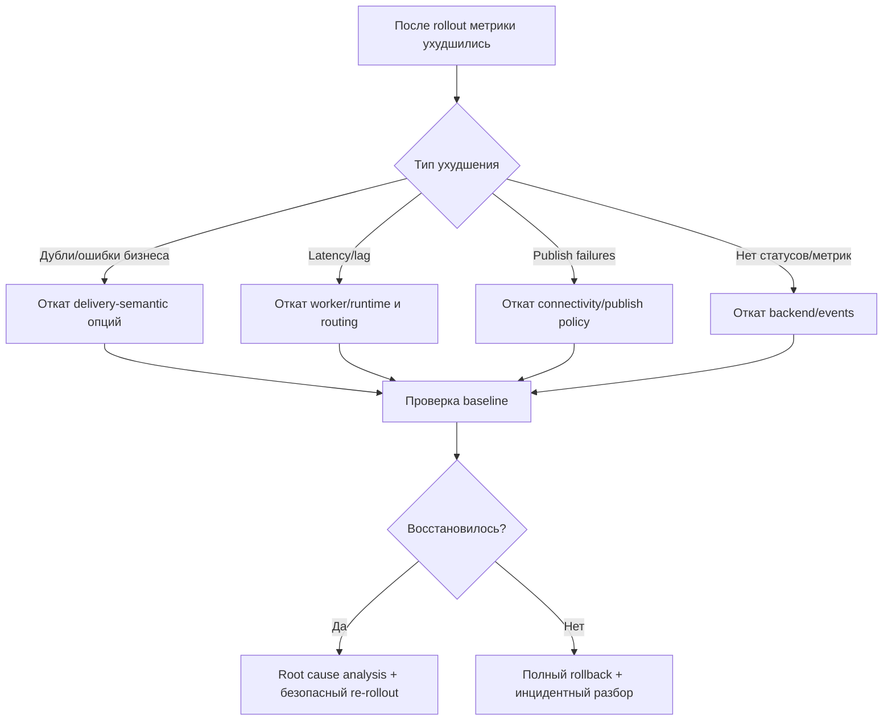

[← Назад к индексу части](index.md)
[↑ К глобальному плану](../mastery_plan.md)

## Карта rollback-решений при неудачном rollout конфигурации

Ниже — практическая логика отката: откатывать не “всё подряд”, а по категории риска.

| Что ухудшилось после изменения | Приоритет отката | Что откатывать первым |
|---|---|---|
| рост дублей и side effects | Критический | `task_acks_late`, `task_reject_on_worker_lost`, transport visibility settings |
| рост latency/queue lag | Высокий | `worker_prefetch_multiplier`, `worker_concurrency`, routing/queues |
| падение publish success rate | Высокий | `broker_*retry*`, SSL/connectivity, pool limits |
| потеря observability/статусов | Средний/Высокий | `result_backend*`, event settings, TTL/expires |
| всплеск стоимости telemetry/storage | Средний | `event_queue_*`, `result_expires`, `result_extended` |

### Проверь себя: rollback

1. Почему откат лучше делать по категориям, а не одним “большим возвратом всего”?
2. Какие изменения нельзя долго держать в деградированном состоянии даже ради эксперимента?

Ответ

1) Категориальный откат быстрее локализует причину и уменьшает риск повторно сломать уже стабильные части конфигурации.  
2) Изменения, влияющие на delivery semantics и безопасность: они могут давать прямой бизнес-ущерб (дубли, потеря доверия к данным, уязвимости).

---
