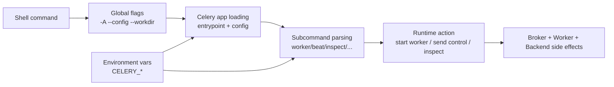

[← Назад к индексу части](index.md)
[↑ К глобальному плану](../../mastery_plan.md)

## Сквозная схема CLI-потока

Интуиция по схеме:

- сначала CLI должен понять, **какое приложение** ты хочешь запустить;
- затем подхватывается контекст (`config`, `workdir`, env);
- только после этого интерпретируется подкоманда и её флаги;
- операционные эффекты происходят уже в связке с брокером и worker-ами.

---
