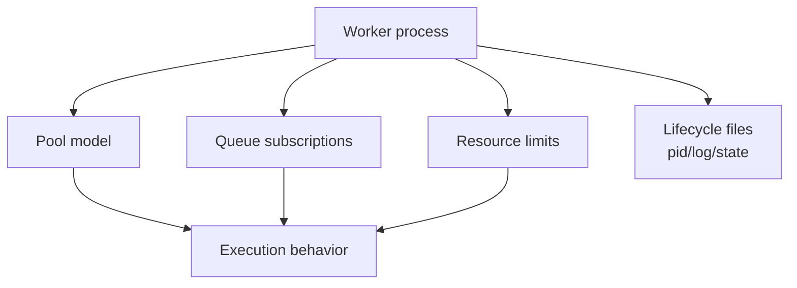

[← Назад к индексу части](index.md)
[↑ К глобальному плану](../../mastery_plan.md)

## 37.2 `celery worker`

### Цель раздела

Научиться запускать `worker` осознанно: выбирать pool, управлять параллелизмом, ограничивать ресурсы и использовать флаги безопасно для production.

### В этом разделе главное

- `worker` — не одна опция, а комбинация: pool + concurrency + queues + limits + lifecycle.
- Флаги `without-gossip/mingle/heartbeat` дают контроль, но имеют операционную цену.
- Ограничения по задачам (`time-limit`, `max-tasks-per-child`, `max-memory-per-child`) защищают систему от деградации.
- `pidfile`, `logfile`, `statedb` — часть операционной предсказуемости, а не "старомодные параметры".
- SSL/TLS-флаги и broker URL должны быть согласованы, а не дублироваться хаотично.

### Термины

| Термин | Что это | Простыми словами |
|---|---|---|
| `--pool` | Модель конкурентности (`prefork`, `threads`, `gevent`, `eventlet`, `solo`) | "Как worker параллелит работу" |
| `--concurrency` | Количество параллельных исполнителей | "Сколько задач одновременно" |
| `-Q/--queues` | Список слушаемых очередей | "Какие очереди обслуживать" |
| `-X/--exclude-queues` | Исключение очередей | "Какие очереди не трогать" |
| `--prefetch-multiplier` | Сколько задач worker резервирует заранее | "Размер локального буфера задач" |
| `--max-tasks-per-child` | Перезапуск child после N задач | "Сброс накопленных утечек" |
| `--max-memory-per-child` | Ограничение памяти на процесс | "Предохранитель от memory blowup" |
| `--without-heartbeat` | Отключение heartbeat | "Меньше сетевого шума, хуже наблюдаемость" |
| `--statedb` | Файл внутреннего состояния | "Память worker между рестартами" |

### Теория и правила

#### 1) Пул и concurrency: это архитектурное решение

Интуитивно хочется "поставить больше concurrency". Но сначала определи профиль задач:

- CPU-bound -> чаще `prefork`;
- I/O-bound -> `threads`/`gevent` (с пониманием ограничений);
- debugging -> `solo`.

Чем выше concurrency, тем выше требования к downstream, памяти и контролю backpressure.

Отдельно про `hostname` (`-n`):

- в multi-worker среде всегда задавай предсказуемый шаблон имени (`worker-<role>@%h`);
- это упрощает адресное управление через `-d/--destination`;
- без стабильных hostnames сложнее автоматизировать `inspect/control`.

#### 1.1) Autoscale и "эластичность без иллюзий"

`--autoscale=max,min` полезен, когда нагрузка сильно колеблется, но:

- он не заменяет capacity planning;
- при слишком агрессивных границах возможны "качели" процессов;
- autoscale помогает по throughput, но может ухудшить tail-latency при резких пиках.

Практический принцип: сначала выстроить корректный routing и limits, потом включать autoscale как усилитель, а не как "лекарство от всего".

#### 1.2) Optimization profile (`-O`) и когда его применять

CLI-опция оптимизационного профиля (например, `-O fair` в релевантных версиях) меняет детали поведения worker-а, включая fairness-подход к выдаче задач.

Инженерный смысл:

- полезно при mixed workload, где важно уменьшить starvation;
- нельзя включать "наугад": нужно сравнивать latency/throughput до и после;
- итог фиксировать в профиле окружения, а не только в ad-hoc запуске.

#### 2) Очереди и изоляция трафика

`-Q` и `-X` позволяют отделить критичный и фоновый трафик:

- worker для платежей не должен случайно обрабатывать маркетинговые батчи;
- отдельные очереди уменьшают blast radius;
- проще планировать capacity.

#### 3) Пределы времени и памяти

Три важных предохранителя:

- `--time-limit` / `--soft-time-limit`;
- `--max-tasks-per-child`;
- `--max-memory-per-child`.

Они не лечат плохую логику задачи, но защищают кластер от долгой деградации.

#### 4) `without-gossip/mingle/heartbeat`

Эти флаги могут быть полезны в отдельных сценариях, но:

- ухудшают observability и coordination;
- усложняют диагностику во время инцидентов;
- требуют четкого runbook, когда именно их использовать.

#### 5) pid/log/state-файлы и filesystem-контекст

Если не продумать пути:

- pidfile может не создаться (нет прав);
- логи уходят "в никуда";
- statedb теряется при рестартах.

#### 6) Detach/uid/gid/umask/executable и когда это важно

В production часто требуется запуск не от root и с контролем прав:

- `--detach` (или управление через process manager) — запуск в фоне;
- `--uid`, `--gid` — запуск от нужного пользователя/группы;
- `--umask` — контроль прав на создаваемые pid/log/state файлы;
- `--executable` — явный Python/binary путь.

Если это не согласовано с инфраструктурой, возникают "странные" проблемы: worker вроде стартует, но не может писать state/log или читать сертификаты.

#### 7) Флаги для eventlet/gevent: зона повышенной осторожности

При `eventlet/gevent` часть runtime-поведения отличается от prefork:

- выше чувствительность к блокирующим вызовам;
- требуется аккуратная совместимость библиотек;
- опции, связанные с event loop, должны тестироваться в staging под реальной нагрузкой.

Правило: не переносить prefork-профиль "как есть" в gevent/eventlet.

#### 8) SSL/TLS к брокеру: где задавать и как не запутаться

Варианты задания TLS-параметров обычно два:

- через broker URL (с transport-specific параметрами);
- через отдельные конфиги/CLI-аргументы (где поддерживается).

Ключевой риск: задать параметры частично в URL, частично во флагах и получить "конфигурационный конструктор", который трудно воспроизводить.

Практическое правило:

1. выбери один канонический способ задания TLS для команды/проекта;
2. проверь, какие параметры реально поддерживаются целевым transport;
3. зафиксируй это в runbook и deployment-шаблонах.

#### 9) `--without-gossip`, `--without-mingle`, `--without-heartbeat`: когда уместно

Краткая семантика:

- `--without-gossip`: меньше меж-worker коммуникации, но хуже динамическая осведомленность кластера;
- `--without-mingle`: worker стартует быстрее, но без части "согласования" с другими worker-ами;
- `--without-heartbeat`: меньше служебного трафика, но хуже health-видимость.

Это допустимо в специальных сценариях (например, локальная отладка, изолированный тестовый контур), но в production требует явного обоснования и альтернативных сигналов мониторинга.

### Пошагово

1. Выбери pool и concurrency по профилю нагрузки.
2. Определи, какие очереди слушает конкретный worker.
3. Добавь resource guardrails (`time-limit`, `max-tasks`, `max-memory`).
4. Настрой файлы процесса (`pidfile`, `logfile`, `statedb`) с корректными правами.
5. Проверь graceful shutdown в staging до production.
6. Документируй launch-команду в runbook без "неявных дефолтов".

### Простыми словами

`worker` — это не "просто процесс Celery", а производственная линия.  
Pool задает тип станков, concurrency — их количество, очереди — какие заказы линия принимает, лимиты — предохранители от перегрева.

### Картинка в голове



### Как запомнить

`pool` = форма параллелизма  
`concurrency` = объем параллелизма  
`limits` = границы безопасности  
`queues` = домен ответственности worker-а

### Примеры

```bash
# Пример production-oriented запуска worker
celery -A proj.celery_app worker \
  --loglevel=INFO \
  --pool=prefork \
  --concurrency=8 \
  --queues=critical,default \
  --prefetch-multiplier=1 \
  --time-limit=120 \
  --soft-time-limit=90 \
  --max-tasks-per-child=500 \
  --max-memory-per-child=300000 \
  --hostname=worker-critical@%h \
  --pidfile=/var/run/celery/worker-critical.pid \
  --logfile=/var/log/celery/worker-critical.log \
  --statedb=/var/lib/celery/worker-critical.state
```

```bash
# Временный debug-запуск
celery -A proj.celery_app worker --pool=solo --loglevel=DEBUG --without-mingle
```

```bash
# Пример с autoscale и отдельным батч-worker
celery -A proj.celery_app worker \
  --hostname=worker-batch@%h \
  --queues=batch \
  --pool=prefork \
  --autoscale=16,4 \
  --prefetch-multiplier=2 \
  --loglevel=INFO
```

```bash
# Пример запуска от непривилегированного пользователя
celery -A proj.celery_app worker \
  --uid=celery --gid=celery --umask=027 \
  --pidfile=/var/run/celery/worker.pid \
  --logfile=/var/log/celery/worker.log
```

```bash
# Пример с optimization profile и явным hostname
celery -A proj.celery_app worker \
  -n worker-fair@%h \
  -O fair \
  -Q critical,default \
  -X lowprio \
  --concurrency=12 \
  --loglevel=INFO
```

### Практика / реальные сценарии

1. **Backlog растет, latency увеличивается**  
   Причина часто не "мало concurrency", а неверная сегментация очередей и prefetch.

2. **Memory leak в worker child-процессах**  
   Временная стабилизация через `--max-tasks-per-child` и `--max-memory-per-child`.

3. **Инцидент после включения `--without-heartbeat`**  
   Наблюдаемость слепнет, on-call теряет быстрые сигналы деградации.

### Типичные ошибки

- бездумно увеличивать `--concurrency`;
- запускать один worker на "все очереди";
- не задавать `--hostname` в multi-worker окружении;
- отключать gossip/mingle/heartbeat "для ускорения" без оценки рисков;
- смешивать SSL-параметры в URL и флагах без единой политики.

### Что будет, если...

- **...сделать слишком высокий prefetch:** один worker может "захватить" много задач, fairness падает, latency у других задач растет.
- **...не задавать `max-*` ограничения:** деградация по памяти/долгим задачам будет накапливаться и проявится в пике.
- **...включить autoscale без лимитов и наблюдения:** процессный контур начнет "флапать", а профиль задержек станет нестабильным.
- **...массово отключить gossip/mingle/heartbeat в проде:** снизится видимость состояния кластера, вырастет время диагностики инцидентов.

### Проверь себя

1. Почему `--concurrency` не должен быть первым и единственным рычагом при backlog?

<details><summary>Ответ</summary>

Потому что backlog часто вызван не нехваткой "числа процессов", а несбалансированным routing, prefetch, зависшими downstream, неверным pool или смешением разных классов задач в одной очереди.

</details>

2. Что дает `--max-tasks-per-child` даже если "утечек вроде нет"?

<details><summary>Ответ</summary>

Он ограничивает накопление долгоживущего process-state и помогает держать поведение worker-а более предсказуемым на длинных аптаймах.

</details>

3. В каком случае `--without-heartbeat` особенно рискован?

<details><summary>Ответ</summary>

В проде с on-call и мониторингом, где heartbeat используется как ранний сигнал жизнеспособности и сетевой стабильности worker-ов.

</details>

### Дополнительная самопроверка по подпунктам 37.2

#### К подпунктам 37.2.1 / 37.2.1.1 / 37.2.1.2

1. Почему autoscale и `-O fair` нельзя оценивать без метрик `queue lag` и tail-latency?

<details><summary>Ответ</summary>

Потому что эти флаги меняют распределение и динамику исполнения. Без метрик легко принять "визуально лучше" за реальное улучшение, пропустив рост p95/p99.

</details>

2. Как связаны hostname (`-n`) и безопасность `control`-команд?

<details><summary>Ответ</summary>

Стабильные hostnames позволяют адресно направлять команды через `destination`, уменьшая риск случайного изменения всего кластера.

</details>

#### К подпункту 37.2.2 (очереди и изоляция)

1. Почему изоляция очередей часто полезнее, чем просто рост `--concurrency`?

<details><summary>Ответ</summary>

Изоляция убирает конкуренцию разных классов задач, снижает blast radius и делает latency критичных задач предсказуемой.

</details>

2. Какой анти-паттерн возникает при использовании `-X` без периодической ревизии?

<details><summary>Ответ</summary>

Можно случайно исключить очередь на длительный срок и получить "тихое" накопление задач без явных ошибок старта worker-а.

</details>

#### К подпункту 37.2.3 (лимиты времени/памяти)

1. Почему hard/soft time limits нужно подбирать вместе, а не независимо?

<details><summary>Ответ</summary>

Soft limit дает шанс корректно завершиться/почистить состояние, hard limit принудительно обрывает. Несогласованная пара либо не защищает, либо ломает легитимно долгие задачи.

</details>

2. Что будет, если ставить слишком маленький `max-tasks-per-child`?

<details><summary>Ответ</summary>

Частые перезапуски child-процессов создадут overhead и могут ухудшить throughput, особенно на высоком потоке коротких задач.

</details>

#### К подпунктам 37.2.4 и 37.2.9 (`without-*` флаги)

1. Почему отключение `heartbeat` не эквивалентно "оптимизации без побочных эффектов"?

<details><summary>Ответ</summary>

Потому что heartbeat — ключевой источник сигналов живости/деградации. Экономия служебного трафика покупается ценой слепых зон.

</details>

2. В каком случае временно отключать `mingle/gossip` допустимо?

<details><summary>Ответ</summary>

В контролируемом тестовом/отладочном контуре с понятной целью и альтернативным мониторингом, а не как постоянную production-практику.

</details>

#### К подпунктам 37.2.5 и 37.2.6 (pid/log/state + права процесса)

1. Почему ошибки прав доступа на `statedb` опасны не только для логирования?

<details><summary>Ответ</summary>

Потому что теряется часть операционного состояния (например, revoked/history), что влияет на поведение после рестартов и усложняет расследования.

</details>

2. Зачем согласовывать `uid/gid/umask` с путями логов и сертификатов?

<details><summary>Ответ</summary>

Иначе процесс может стартовать, но не иметь прав на критичные файлы, получая частично рабочее и трудно диагностируемое состояние.

</details>

#### К подпунктам 37.2.7 и 37.2.8 (eventlet/gevent и TLS)

1. Почему перенос TLS-настроек "половина в URL, половина в флагах" повышает риск инцидента?

<details><summary>Ответ</summary>

Потому что источник истины размыт: сложно понять, какое значение реально применилось, и воспроизвести это в другом окружении.

</details>

2. Как понять, что gevent/eventlet-профиль настроен некорректно?

<details><summary>Ответ</summary>

Появляются скрытые блокировки, нестабильная latency и поведение, не совпадающее с prefork-ожиданиями, особенно под реальной I/O-нагрузкой.

</details>

### Запомните

- `worker` флаги формируют runtime-семантику кластера.
- Изоляция очередей обычно важнее "сырых" значений concurrency.
- Ограничители времени/памяти — страховка от медленной деградации.

---
