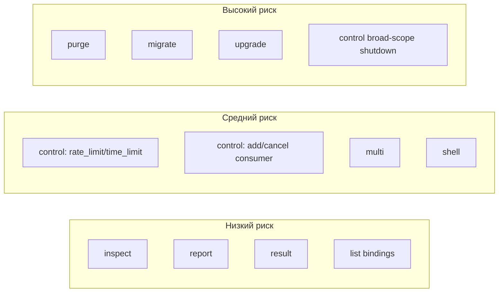
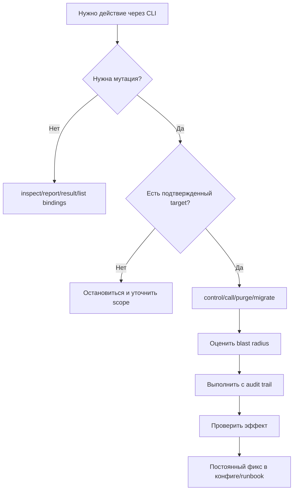
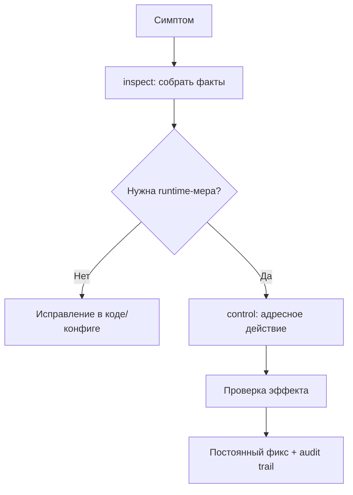

[← Назад к индексу части](index.md)
[↑ К глобальному плану](../mastery_plan.md)

## 37.4 Операционные подкоманды

### Цель раздела

Систематизировать подкоманды управления и диагностики так, чтобы в инциденте команда действовала безопасно, а не "методом случайных команд".

### В этом разделе главное

- `inspect` — read-only диагностика состояния.
- `control` — runtime-изменения, более высокий риск.
- `purge`, `migrate`, `upgrade` и часть других команд потенциально разрушительны без процедур.
- Для каждой команды важны три вещи: **когда безопасно**, **что может сломать**, **какой аудит нужен**.

### Термины

| Термин | Что это | Простыми словами |
|---|---|---|
| `inspect` | Запрос текущего состояния worker-ов | "Покажи, что происходит" |
| `control` | Команды изменения поведения worker-ов | "Сделай изменение прямо сейчас" |
| `destination` | Целевой worker для команды | "К кому именно обращаемся" |
| `timeout` | Время ожидания ответа | "Сколько ждать отклика" |
| `purge` | Удаление ожидающих задач из очередей | "Очистить очередь (опасно)" |
| `result` | Чтение результата по task id | "Посмотреть статус/результат задачи" |
| `report` | Отчет о конфигурации и окружении | "Снимок состояния приложения" |
| `multi` | Утилита запуска множества worker-процессов | "Оркестрация worker-ов с CLI" |

### Теория и правила

#### 1) `inspect`: сначала наблюдение

Типичный безопасный порядок в инциденте:

1. `inspect ping`
2. `inspect active/reserved/scheduled`
3. `inspect active_queues`
4. `inspect registered/conf/stats`

Сначала собираем факты, потом меняем runtime.

#### 2) `control`: только адресно и с rollback-планом

Команды вроде `rate_limit`, `time_limit`, `pool_grow`, `add_consumer`, `shutdown` полезны, но:

- обязательно указывай `destination` при необходимости;
- фиксируй change в журнале инцидента;
- после стабилизации переноси изменения в постоянную конфигурацию.

#### 3) Команды повышенного риска

- `purge` — может безвозвратно удалить backlog;
- `migrate` — затрагивает перенос сообщений между брокерами;
- `upgrade` — влияет на compatibility-путь;
- `call` — удаленный вызов команды, нужен контроль полномочий.

#### 3.1) Полная карта подкоманд из плана и их операционная семантика

| Подкоманда | Когда применять | Что может сломать | Что фиксировать в аудите |
|---|---|---|---|
| `inspect` | диагностика состояния без мутаций | мало рискованно, но можно неверно интерпретировать данные | время, target workers, ключевые выводы |
| `control` | адресная runtime-коррекция | неконтролируемый blast radius при broad target | команда, destination, ожидаемый/фактический эффект |
| `purge` | сознательная очистка очереди | потеря бизнес-задач | кто согласовал, какие очереди, окно и последствия |
| `list bindings` | проверка маршрутизации | обычно безопасно | снимок до/после для инцидента |
| `call` | low-level удаленные команды | ошибочный вызов к не тем worker-ам | payload вызова, destination, результат |
| `graph` | визуализация зависимостей/настроек | риск неверной трактовки как "истины в последней инстанции" | версия, контекст использования |
| `upgrade` | миграционные операции | несовместимость при частичном применении | план миграции, rollback, версия |
| `shell` | отладка в интерактивном контуре | случайные действия в production | где запускали, какие действия делали |
| `report` | сбор технического отчета | утечка чувствительных деталей при широком доступе | кому передан отчет, где хранится |
| `result` | точечная проверка результата | мало рискованно, но возможны ложные выводы без контекста | task_id, состояние, traceback |
| `migrate` | перенос сообщений между брокерами | дубли/потери при неверной процедуре | источник/цель, объем, контроль целостности |
| `multi` | запуск/остановка группы worker-ов | drift конфигурации между инстансами | итоговая команда, набор инстансов |

### Визуальная матрица риска подкоманд



Как читать диаграмму:

- **низкий риск** не означает "можно бездумно": риск в основном в неверной интерпретации;
- **средний риск** — команда меняет runtime и требует адресности + проверки эффекта;
- **высокий риск** — нужны явное согласование, rollback-план и инцидентный аудит.

#### 3.2) `inspect`: какие подкоманды проверять и зачем

| Подкоманда inspect | Что отвечает | Когда использовать в первую очередь |
|---|---|---|
| `ping` | доступность worker-а | "не отвечает/ничего не работает" |
| `active` | что выполняется прямо сейчас | долгие задержки и "зависшие" задачи |
| `reserved` | что уже получено, но не стартовало | рост backlog до старта исполнения |
| `scheduled` | отложенные/ETA задачи | проблемы с countdown/ETA |
| `active_queues` | какие очереди слушаются | задача не берется из нужной очереди |
| `registered` | какие tasks зарегистрированы | после релиза/импортных изменений |
| `stats` | ресурсы worker/pool | деградация производительности |
| `conf` | runtime-конфигурация | расхождение окружений/переопределений |
| `revoked` | отозванные задачи | анализ операционных отмен |
| `report` | агрегированный снимок состояния | постмортем и эскалация |

#### 3.3) `control`: какие команды действительно "боевые"

| Команда control | Типовой use-case | Основной риск |
|---|---|---|
| `rate_limit` | временно разгрузить downstream | накопление очереди при слишком жестком лимите |
| `time_limit` | ограничить runaway задачи | ложные таймауты на легитимно долгих задачах |
| `pool_grow/shrink` | адаптация емкости в инциденте | неустойчивый throughput без capacity-плана |
| `pool_restart` | восстановление проблемного пула | повторение симптомов без устранения причины |
| `add_consumer/cancel_consumer` | перенастройка подписки на очередь | случайное выпадение части трафика |
| `shutdown` | контролируемая остановка worker-а | потеря in-flight контекста при спешке |
| `enable_events/disable_events` | управление объемом событий | слепые зоны или перегруз observability |

#### 3.4) Мини-алгоритм "когда команда безопасна"

Команда считается относительно безопасной, если одновременно выполнены условия:

1. понятен target (`destination` или явно осознан broad scope);
2. понятен обратимый путь (rollback или компенсация);
3. есть наблюдаемые критерии эффекта;
4. действие записывается в инцидентный журнал.

Если хотя бы один пункт не выполнен — сначала доуточняй контекст, потом запускай команду.

#### 4) Аудит и повторяемость

Для критичных команд полезно вести минимальный audit trail:

- кто запустил;
- когда;
- с какими аргументами;
- какой был ожидаемый эффект;
- какой получен эффект.

### Пошагово

1. Классифицируй команду: read-only или mutating.
2. Для mutating-команд оцени blast radius.
3. Если нужно, сузь действие через `destination`.
4. Укажи `timeout` и ожидаемый результат.
5. Зафиксируй действие в инцидентном логе.
6. После инцидента преврати временные меры в устойчивый фикс.

### Decision flow: безопасная работа с подкомандами



### Простыми словами

`inspect` — это диагностика у врача.  
`control` — это лечение.  
Лечить без диагностики — рискованно, а лечить без записи — еще и невоспроизводимо.

### Картинка в голове



### Примеры

```bash
# Read-only
celery -A proj.celery_app inspect ping --timeout=5
celery -A proj.celery_app inspect active_queues -d worker-critical@host1
```

```bash
# Read-only с JSON-выводом для автоматизации (если поддерживается в версии)
celery -A proj.celery_app inspect stats -d worker-critical@host1 --timeout=10 --json
```

```bash
# Runtime control
celery -A proj.celery_app control rate_limit billing.charge_card 20/m -d worker-critical@host1
celery -A proj.celery_app control pool_grow 2 -d worker-batch@host2
```

```bash
# Дополнительные боевые примеры control
celery -A proj.celery_app control time_limit billing.charge_card 120 90 -d worker-critical@host1
celery -A proj.celery_app control add_consumer critical -d worker-default@host2
celery -A proj.celery_app control cancel_consumer lowprio -d worker-default@host2
```

```bash
# Повышенный риск
celery -A proj.celery_app purge -Q old_queue
```

```bash
# Проверка bindings (где поддерживается транспортом/CLI-версией)
celery -A proj.celery_app list bindings
```

```bash
# Получение результата конкретной задачи
celery -A proj.celery_app result 77c8d0ff-2e3f-4a96-93c3-0b114d3a23d1
```

```bash
# Дополнительные команды из плана (использовать осознанно и по runbook)
celery -A proj.celery_app graph workers
celery -A proj.celery_app report
celery -A proj.celery_app shell
celery -A proj.celery_app upgrade settings proj.celeryconfig
celery -A proj.celery_app migrate amqp://src amqp://dst
celery -A proj.celery_app multi start w1 w2 -A proj.celery_app -Q:1 critical -Q:2 default
```

### Практика / реальные сценарии

1. **Очередь растет, downstream нестабилен**  
   Временно снижай `rate_limit`, затем исправляй retry/backoff и capacity.

2. **Нужно проверить, почему задача "не берется"**  
   Смотри `active_queues` и `registered`, не начинай с `pool_grow`.

3. **Давление на кластер, хочется "очистить всё"**  
   `purge` только после явного бизнес-решения и фиксации последствий.

4. **Нужно мигрировать сообщения между брокерами без потерь**  
   Сначала dry-run/малый срез, затем контроль дубликатов и обратимый план.

5. **Команда запускает `multi`, но инстансы расходятся по параметрам**  
   Фиксируй шаблон команды и периодически сверяй фактический runtime через `inspect conf`.

### Типичные ошибки

- использовать `control` до `inspect`;
- не указывать `destination` и случайно менять весь fleet;
- выполнять `purge` без подтверждения от владельца бизнес-процесса;
- не фиксировать временные изменения в runbook/postmortem.
- рассматривать `multi` как "удобную замену" process manager без контроля drift.

### Что будет, если...

- **...массово применять runtime-команды без переноса в конфиг:** инциденты будут повторяться, знания останутся "в головах".
- **...делать `purge` в спешке:** возможно удаление критичных задач и прямой бизнес-ущерб.
- **...выполнять `control` без `destination` в крупном кластере:** случайно изменишь поведение сразу у всех worker-ов.

### Проверь себя

1. Почему `inspect` и `control` нельзя считать равными по риску?

<details><summary>Ответ</summary>

`Inspect` не меняет состояние системы, а `control` изменяет runtime-поведение, что может ухудшить ситуацию при неверном применении.

</details>

2. Когда у команды должен "зажигаться красный флаг" перед `purge`?

<details><summary>Ответ</summary>

Всегда, если в очереди могут быть задачи с бизнес-ценностью, и нет явного решения владельца процесса о допустимости их удаления.

</details>

3. Что обязательно сделать после успешной временной `control`-меры?

<details><summary>Ответ</summary>

Зафиксировать постоянное решение в конфиге/архитектуре и обновить runbook, чтобы не повторять ручное "тушение".

</details>

4. Почему `inspect --json` полезен в mature-операционном контуре?

<details><summary>Ответ</summary>

Потому что дает machine-readable вывод для автоматизации runbook/алертов и снижает риск ручной ошибки при интерпретации текстового вывода.

</details>

### Дополнительная самопроверка по подпунктам 37.4

#### К подпунктам 37.4.1 и 37.4.2 (`inspect` vs `control`)

1. Почему в инциденте полезно фиксировать снимок `inspect` до первого `control`?

<details><summary>Ответ</summary>

Это дает baseline: можно сравнить состояние "до/после" и понять, что именно изменило поведение, а не перепутать причину и следствие.

</details>

2. Какой главный риск у `control` без явного `destination`?

<details><summary>Ответ</summary>

Широкий blast radius: команда применяется ко множеству worker-ов, что может усилить инцидент вместо локального смягчения.

</details>

#### К подпунктам 37.4.3 / 3.1 (high-risk команды и полная карта)

1. Почему `migrate` и `purge` требуют бизнес-согласования, а не только approval платформенной команды?

<details><summary>Ответ</summary>

Потому что они напрямую влияют на бизнес-события: можно потерять/дублировать задачи, что выходит за рамки чисто инфраструктурного риска.

</details>

2. Когда `shell` из удобного инструмента превращается в риск?

<details><summary>Ответ</summary>

Когда используется в production без ограничений и аудита: легко сделать ручные действия, которые трудно восстановить и объяснить постфактум.

</details>

#### К подпунктам 37.4.3.2 / 3.3 (`inspect` и `control` таблицы)

1. Почему `registered` и `conf` нужно проверять парой после релиза?

<details><summary>Ответ</summary>

`Registered` подтверждает загрузку задач, `conf` — фактический runtime-конфиг. По отдельности они дают неполную картину релизного состояния.

</details>

2. В каком случае `pool_restart` — временная помощь, но не решение?

<details><summary>Ответ</summary>

Когда первопричина в коде задач, routing или downstream-сбое: перезапуск пула кратко снимает симптом, но проблема возвращается.

</details>

#### К подпунктам 37.4.3.4 и 4 (безопасность команды и аудит)

1. Почему "есть rollback" не равно "команда безопасна"?

<details><summary>Ответ</summary>

Rollback может быть дорогим, частичным или невозможным для уже потерянных/выполненных задач. Нужны еще target-точность, критерии эффекта и аудит.

</details>

2. Какой минимальный состав audit trail делает постмортем воспроизводимым?

<details><summary>Ответ</summary>

Исполнитель, время, команда/аргументы, scope (destination/queues), ожидаемый и фактический эффект, ссылка на инцидент/тикет.

</details>

### Запомните

- `inspect` -> факты, `control` -> действие.
- Команды высокого риска требуют явного бизнес- и операционного согласования.
- Любое временное действие должно заканчиваться постоянным инженерным изменением.

---
