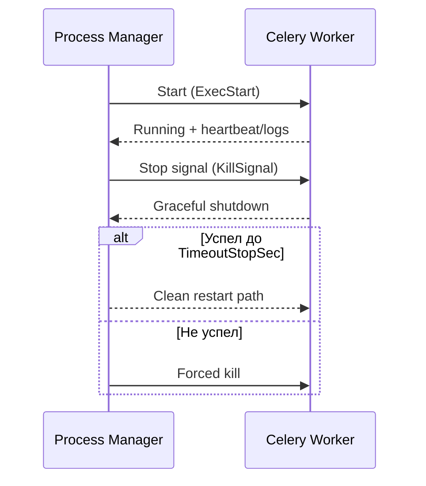

[← Назад к индексу части](index.md)
[↑ К глобальному плану](../../mastery_plan.md)

## 37.6 Интеграция с process managers

### Цель раздела

Закрепить запуск Celery через `systemd`, `supervisord`, `circus` так, чтобы процесс корректно стартовал, перезапускался и останавливался без потери управляемости.

### В этом разделе главное

- Process manager не "дополнение", а основной слой надежности запуска в production.
- Ключевые параметры (`ExecStart`, `KillSignal`, `TimeoutStopSec`, restart policy) сильно влияют на корректность shutdown.
- Нужно согласовывать manager-level и celery-level настройки, чтобы не было конфликтов.
- Lifecycle в контейнерах и на VM похож по принципам, но отличается деталями сигналов/хранилищ.

### Термины

| Термин | Что это | Простыми словами |
|---|---|---|
| `ExecStart` | Команда запуска процесса (systemd) | "Что именно запускать" |
| `KillSignal` | Сигнал остановки | "Каким сигналом просим завершиться" |
| `TimeoutStopSec` | Таймаут graceful stop | "Сколько даем времени на корректное завершение" |
| `Restart` | Политика перезапуска | "Когда автоматически поднимать процесс снова" |
| Supervisor program | Описание процесса в supervisord | "Конфиг запуска/мониторинга процесса" |
| Circus watcher | Аналог наблюдателя процесса в circus | "Контур управления группой процессов" |

### Теория и правила

#### 1) Почему важен graceful shutdown

Если manager слишком быстро "убивает" процесс:

- in-flight задачи могут остаться в неоднозначном состоянии;
- увеличивается риск повторной обработки;
- растет шум инцидентов после рестартов.

#### 2) Согласование таймаутов

`TimeoutStopSec` в systemd должен учитывать:

- тип задач (долгие/короткие);
- time-limit политику;
- допустимую длительность graceful stop.

#### 3) Restart policy и флаппинг

Слишком агрессивный `Restart=always` без backoff может:

- маскировать корневую проблему;
- создавать restart-loop;
- мешать расследованию.

#### 4) Circus и минимальный operational-профиль

`circus` полезен, когда нужно управлять несколькими однотипными процессами и получать единый контроль через watchers.  
Базовые принципы те же, что у systemd/supervisord:

- явная команда запуска;
- контролируемые stop/restart таймауты;
- отдельные stdout/stderr каналы;
- отсутствие "магии" в env и cwd.

### Пошагово

1. Сформируй каноническую команду запуска `celery`.
2. Вынеси env в отдельный управляемый источник (`EnvironmentFile`/Secret).
3. Настрой сигналы и таймауты под профиль задач.
4. Добавь restart policy с учетом anti-flap мер.
5. Проверь сценарий "graceful stop -> restart -> recovery" в staging.
6. Закрепи чеклист on-call по process manager действиям.

### Простыми словами

Process manager — это диспетчер смены.  
Он должен не просто "включать станок", а корректно останавливать, перезапускать и передавать смену без аварий.

### Картинка в голове



### Примеры

```ini
# systemd unit (концептуальный пример)
[Unit]
Description=Celery Worker
After=network.target

[Service]
Type=simple
User=celery
Group=celery
WorkingDirectory=/srv/app
EnvironmentFile=/etc/celery/celery.env
ExecStart=/usr/local/bin/celery -A proj.celery_app worker --loglevel=INFO --concurrency=8
Restart=on-failure
RestartSec=5
KillSignal=SIGTERM
TimeoutStopSec=90

[Install]
WantedBy=multi-user.target
```

```ini
# supervisord (концептуальный пример)
[program:celery_worker]
command=/usr/local/bin/celery -A proj.celery_app worker --loglevel=INFO
directory=/srv/app
autostart=true
autorestart=true
stopsignal=TERM
stopwaitsecs=90
stdout_logfile=/var/log/celery/worker.out.log
stderr_logfile=/var/log/celery/worker.err.log
```

```ini
# circus (концептуальный пример)
[watcher:celery-worker]
cmd = /usr/local/bin/celery -A proj.celery_app worker --loglevel=INFO --concurrency=8
working_dir = /srv/app
numprocesses = 1
copy_env = True
stopsignal = TERM
stdout_stream.class = FileStream
stdout_stream.filename = /var/log/celery/circus-worker.out.log
stderr_stream.class = FileStream
stderr_stream.filename = /var/log/celery/circus-worker.err.log
```

### Мини-чеклист перед вводом process manager-конфига в production

1. Проверен единый `-A` и `WorkingDirectory`/`working_dir`.
2. Проверена корректность env-источников и доступов к ним.
3. Проверены права на `pid/log/state` пути.
4. Пройден тест graceful stop под нагрузкой.
5. Есть документированный rollback (команда/процедура).

### Практика / реальные сценарии

1. **После deploy много дублей задач** — слишком жесткий stop timeout, процессы убиваются до graceful завершения.
2. **Worker постоянно перезапускается** — restart policy маскирует ошибку импорта/конфига.
3. **Разные команды в разных юнитах** — drift между инстансами и непредсказуемое поведение.

### Типичные ошибки

- не задавать `WorkingDirectory`;
- использовать `SIGKILL` как обычный способ остановки;
- не согласовывать таймауты manager-а с time-limit политикой задач;
- хранить env-файл без контроля доступа.

### Что будет, если...

- **...таймаут остановки слишком короткий:** вырастут некорректные прерывания и повторные side effects.
- **...restart policy агрессивная без ограничений:** вместо лечения будет бесконечный цикл рестартов.

### Проверь себя

1. Почему `TimeoutStopSec` нельзя выбирать "на глаз"?

<details><summary>Ответ</summary>

Потому что он должен учитывать реальные длительности задач и политику ограничений. Слишком короткий — ломает graceful shutdown, слишком длинный — замедляет восстановление и операционные процедуры.

</details>

2. Какой минимальный набор полей в systemd unit критичен для Celery worker?

<details><summary>Ответ</summary>

`WorkingDirectory`, корректный `ExecStart`, `KillSignal`, `TimeoutStopSec`, `Restart`-политика и источник env (`EnvironmentFile` или эквивалент).

</details>

3. Почему restart-loop опасен даже если "процесс в итоге жив"?

<details><summary>Ответ</summary>

Он скрывает корневую причину, создает турбулентность в обработке задач и повышает риск потери управляемости во время инцидента.

</details>

### Дополнительная самопроверка по подпунктам 37.6

#### К подпунктам 37.6.1 и 37.6.2 (graceful и timeout)

1. Почему короткий `TimeoutStopSec` может увеличить количество дублей даже при идемпотентных задачах?

<details><summary>Ответ</summary>

Потому что процесс чаще прерывается принудительно, и задачи чаще повторно доставляются. Идемпотентность смягчает бизнес-эффект, но технический шум и нагрузка растут.

</details>

2. Как связать `TimeoutStopSec` с реальным профилем задач?

<details><summary>Ответ</summary>

Опирайся на фактические длительности (p95/p99), soft/hard time limits и сценарии graceful завершения под нагрузкой, а не на "круглое" число.

</details>

#### К подпунктам 37.6.3 и 37.6.4 (restart policy и circus)

1. Почему restart policy без anti-flap мер опасна для диагностики?

<details><summary>Ответ</summary>

Она "перезатирает" симптомы: процесс быстро перезапускается, а корневая причина маскируется. Логи и состояние становятся менее информативными.

</details>

2. В чем главный критерий выбора между systemd/supervisord/circus?

<details><summary>Ответ</summary>

Не инструмент "по вкусу", а соответствие операционной модели команды: как управлять lifecycle, логами, env, количеством процессов и аудитом изменений.

</details>

3. Как понять, что manager-конфиг уже ушел в drift?

<details><summary>Ответ</summary>

Когда фактические команды/параметры на разных узлах расходятся с каноническим шаблоном, а `inspect conf` показывает несоответствие ожиданиям.

</details>

### Запомните

- Process manager задает реальный lifecycle процесса.
- Graceful shutdown — часть надежности, а не "приятная опция".
- Каноническая команда запуска должна быть единой и проверяемой.

---
