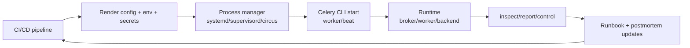

[← Назад к индексу части](index.md)
[↑ К глобальному плану](../../mastery_plan.md)

## Интеграционный production-playbook

Этот блок связывает все подпункты `37.1-37.6` в единый операционный цикл: от сборки команды до проверки эффекта в runtime.

### Цель блока

Дать последовательность действий, которая уменьшает риск "локально работает, в проде ломается" при запуске/изменении Celery-процессов.

### Сквозной алгоритм

1. Зафиксируй `-A`, `--workdir`, config profile и источники env.
2. Собери каноническую команду (`worker`/`beat`) и закрепи её в process manager.
3. Проверь preflight: `celery --version`, обязательные env, доступность секретов.
4. Запусти процесс и проверь диагностикой: `inspect ping`, `inspect active_queues`, `inspect conf`.
5. При отклонении сначала read-only диагностика, затем адресные `control`-меры.
6. После стабилизации зафиксируй постоянный фикс (конфиг/runbook), а не оставляй ad-hoc override.

### Визуальная схема "CI/CD -> process manager -> Celery runtime"

### Типовые провалы в этом цикле

- CI собрал одни env, а manager использует другой файл окружения;
- команда запуска изменилась в одном юните, но не изменилась в остальных;
- в инциденте применили `control`, но не перенесли решение в постоянный конфиг;
- timezone-политика не формализована, periodic-задачи деградируют на DST.

### Проверь себя: интеграционный блок

1. Почему этот блок начинается с фиксации источников конфигурации, а не с подбора `--concurrency`?

Ответ

Без единого и прозрачного источника параметров любые tuning-настройки ненадежны: один и тот же процесс может стартовать с разными значениями в разных окружениях.

2. Что в этой схеме чаще всего приводит к "тихому drift", который обнаруживают только в инциденте?

Ответ

Расхождение между артефактами CI/CD, фактическими env process manager-а и реальной CLI-командой запуска на узле.

3. Почему в интеграционном цикле шаг "постоянный фикс после инцидента" обязателен?

Ответ

Без этого команда остается в режиме ручного тушения: одна и та же проблема возвращается, а знания не превращаются в устойчивую инженерную практику.

---
