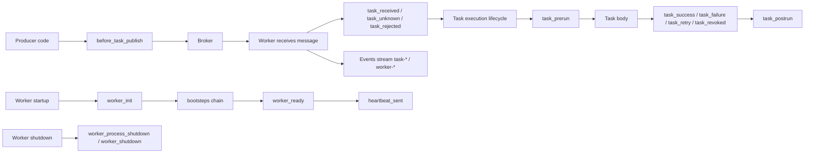

[← Назад к индексу части](index.md)
[↑ К глобальному плану](../celery_mastery_plan.md)

## Сквозная схема точек расширения

### Простыми словами

У Celery есть «дорога задачи» и «дорога worker-а».  
Сигналы и события — это маяки на этих дорогах.  
Bootsteps — это порядок сборки самой дороги worker-а перед стартом движения.

### Картинка в голове

Представь аэропорт:

- **signals** — объявления в ключевых точках («регистрация открыта», «посадка началась», «рейс завершен»);
- **events** — телеметрия для диспетчерского центра;
- **bootsteps** — чеклист подготовки аэропорта до открытия смены.

#### Проверь себя: сквозная схема

1. Почему `before_task_publish` и `task_success` находятся на разных «участках дороги»?
2. Где в схеме проходит граница между наблюдаемостью и исполнением бизнес-логики?
3. Как по схеме понять, в каком месте искать причину `task_unknown`?

Ответ

1) Первый относится к producer-публикации, второй — к фазе исполнения на worker; это разные lifecycle-этапы.  
2) Наблюдаемость — в signals/events, бизнес-логика — в task body и управляемых Task hooks.  
3) На участке приема worker-ом (consume phase), до реального выполнения task body.

---
