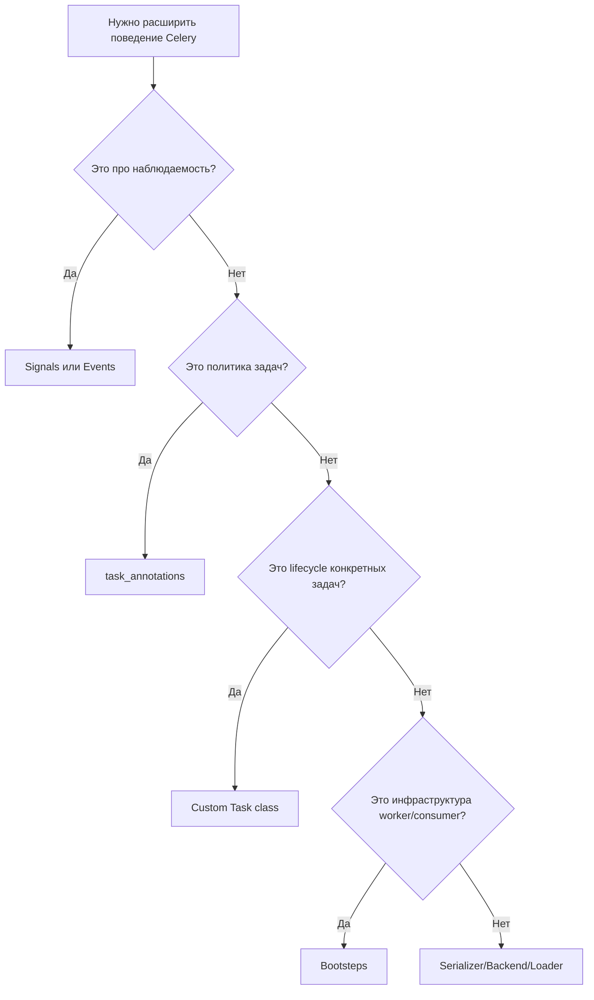

[← Назад к индексу части](index.md)
[↑ К глобальному плану](../../mastery_plan.md)

## Матрица выбора точки расширения (быстрый decision guide)

### Простыми словами

Сначала выбирай самое «легкое» расширение.  
Переходи к более глубокому уровню только если предыдущий объективно не решает задачу.

#### Проверь себя: выбор точки расширения

1. Почему неправильный выбор между signal и bootstep чаще приводит не к багу, а к росту сложности системы?
2. Когда `serializer/backend/loader` — оправданный выбор, а когда это преждевременная оптимизация?

Ответ

1) Потому что система может «работать», но становится хрупкой, трудной в отладке и дорогой в сопровождении.  
2) Оправдано при реальных ограничениях стандартных механизмов и четком контракте; иначе это лишний слой риска и поддержки.

---
