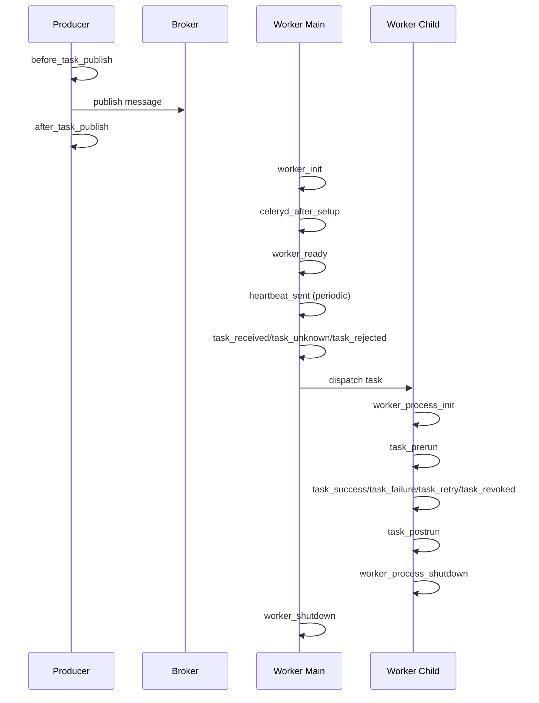

[← Назад к индексу части](index.md)
[↑ К глобальному плану](../../mastery_plan.md)

## 38.1 Сигналы Celery

### Цель раздела

Понять полный набор ключевых сигналов Celery, их смысл и безопасные паттерны использования в production.

### В этом разделе главное

- Signal — это уведомление о событии, а не место для тяжелой бизнес-логики.
- Правильный сигнал выбирают по фазе lifecycle: publish, receive, run, shutdown.
- В signal-handlers легко случайно создать дубль эффектов, race condition или деградацию latency.
- Сигналы удобны для telemetry/audit/correlation, но опасны для «скрытых» side effects.
- Если нужен стабильный контракт поведения задачи, часто лучше `Task` subclass, а не глобальный signal.

### Термины

| Термин | Формально | Простыми словами |
|---|---|---|
| **Signal handler** | Функция, подписанная на signal через `connect` | «Реакция на событие Celery» |
| **Sender** | Объект-источник сигнала (`task`, `app`, worker-компонент) | «Кто отправил сигнал» |
| **Weak reference handler** | Подписка, которая может быть собрана GC при слабой ссылке | «Хендлер может исчезнуть незаметно» |
| **Publish phase** | Фаза отправки сообщения producer-ом | «Момент до попадания в очередь» |
| **Execution phase** | Фаза выполнения задачи worker-ом | «Момент, когда код задачи уже исполняется» |

### Теория и правила

#### 1) Publish signals: `before_task_publish`, `after_task_publish`

Эти сигналы срабатывают на стороне producer (процесса, который публикует задачу).

- `before_task_publish` — можно добавить/проверить headers, correlation id, trace metadata.
- `after_task_publish` — полезен для аудита факта публикации и lightweight-метрик.

Ограничение: heavy I/O в publish handler замедляет публикацию и повышает задержку пользовательских API, которые отправляют задачи.

#### Важная тонкость про publish phase

`before_task_publish` и `after_task_publish` не являются гарантией того, что задача будет успешно выполнена worker-ом.  
Это только фаза публикации. Между публикацией и реальным выполнением есть сеть, брокер, worker availability, retry/ack-семантика.

Поэтому:

- для **аудита факта отправки** — publish signals подходят;
- для **аудита факта выполнения** — нужны task signals и/или result/event слой;
- для **бизнес-гарантий** (например, «деньги списаны ровно один раз») сигналов недостаточно без идемпотентности и transactional паттернов.

#### 2) Task signals (исполнение)

Ключевые сигналы:

- `task_prerun` — перед выполнением task body;
- `task_postrun` — после выполнения (успех/ошибка/ретрай);
- `task_success`, `task_failure`, `task_retry`, `task_revoked` — семантически специализированные фазы.

Практическое правило: если тебе нужны SLA-метрики или cleanup, обычно комбинация `task_prerun + task_postrun` безопаснее, чем разрозненные хендлеры.

#### 3) Receive/reject/unknown signals

- `task_received` — worker получил задачу;
- `task_rejected` — задача отвергнута;
- `task_unknown` — неизвестная задача (часто проблема регистрации/import path).

Это ключевой слой для диагностики «почему задача в очереди есть, а исполняться не начала».

#### 4) Worker lifecycle signals

- `worker_init`, `worker_ready`, `worker_shutdown`;
- `worker_process_init`, `worker_process_shutdown` (особенно важны для prefork);
- `heartbeat_sent`, `setup_logging`, `celeryd_after_setup`.

Эти сигналы часто используют для:

- инициализации process-local клиентов (DB/HTTP/tracing);
- настройки логирования;
- регистрации runtime health-маркеров.

#### 5) Версионные различия

Список сигналов может отличаться между версиями Celery.  
Поэтому для production нужно:

1. сверять docs и `celery/signals.py` целевой версии;
2. фиксировать проверку в release checklist (связь с частью 43).

### Полная карта ключевых сигналов из плана 38.1

| Группа | Сигнал | Когда срабатывает | Практическая польза | Частая ошибка |
|---|---|---|---|---|
| publish | `before_task_publish` | до отправки сообщения в broker | проставить headers/correlation id | тяжелая логика блокирует API |
| publish | `after_task_publish` | после публикации | аудит факта отправки, publish metrics | путать с «гарантией выполнения» |
| task runtime | `task_prerun` | перед `run()` | старт таймера, контекст логов | mutable shared state между задачами |
| task runtime | `task_postrun` | после выполнения (любой исход) | финализация и cleanup | делать долгий I/O в синхронном пути |
| task outcome | `task_success` | при SUCCESS | учет успешных бизнес-метрик | не учитывать ретраи других задач |
| task outcome | `task_failure` | при FAILURE | алерты, incident hooks | side effects без идемпотентности |
| task outcome | `task_retry` | при RETRY | контроль retry-storm | считать retry финальным провалом |
| task outcome | `task_revoked` | при revoke | аудит отмен, причины | не различать revoke до/после старта |
| consume | `task_received` | worker принял сообщение | диагностика «получено, но не исполнено» | думать, что задача уже началась |
| consume | `task_rejected` | сообщение отклонено | анализ reject policy | игнор причины reject |
| consume | `task_unknown` | неизвестное имя задачи | выявление import/registration drift | не алертить, теряя задачи |
| worker lifecycle | `worker_init` | старт worker процесса | ранняя инициализация окружения | открывать тяжелые соединения слишком рано |
| worker lifecycle | `worker_ready` | worker готов к работе | health marker для orchestrator | считать готовность без проверок зависимостей |
| worker lifecycle | `worker_shutdown` | завершение worker | общая финализация | не закрывать ресурсы корректно |
| child process | `worker_process_init` | старт дочернего процесса | process-local клиенты в prefork | реиспользование pre-fork соединений |
| child process | `worker_process_shutdown` | shutdown дочернего процесса | cleanup дескрипторов/клиентов | утечки ресурсов |
| infra | `heartbeat_sent` | отправка heartbeat | мониторинг живости | путать живость и готовность выполнять |
| infra | `setup_logging` | конфигурация логирования | единый формат structured logs | конфликт с внешней лог-конфигурацией |
| infra | `celeryd_after_setup` | после базовой настройки worker | поздняя донастройка | делать здесь бизнес-логику |

### Диаграмма: где какие сигналы на timeline



### Пошагово: как безопасно вводить signal-handlers

1. Определи цель (telemetry, audit, correlation, cleanup).
2. Выбери фазу lifecycle (publish/task/worker).
3. Зафиксируй допустимую стоимость handler-а (время, I/O, риски блокировок).
4. Сделай handler идемпотентным и fail-safe (ошибка в handler не должна валить прод).
5. Добавь unit/integration тесты на порядок вызовов.
6. Введи canary rollout и метрики регрессий (latency, error rate, queue depth).
7. Проверь поведение при worker crash/retry/revoke, чтобы handler не ломал инварианты.

### Простыми словами

Сигнал — это «уведомление о событии», а не «новое место для всей бизнес-логики».  
Он должен быть коротким, предсказуемым и проверяемым.

### Картинка в голове

Signal — как датчик двери в серверной: отлично показывает «дверь открыли», но если к нему подключить сложный роботизированный сценарий, можно случайно заблокировать всю систему.

### Как запомнить

Формула: **Signal = Observe + Light Reaction, не Core Business Logic**.

### Примеры

#### Пример 1: добавление correlation id в publish phase

```python
from celery.signals import before_task_publish
import uuid

@before_task_publish.connect
def add_trace_headers(sender=None, headers=None, body=None, **kwargs):
    headers = headers or {}
    headers.setdefault("x-correlation-id", str(uuid.uuid4()))
```

#### Пример 2: измерение времени выполнения через `task_prerun/postrun`

```python
import time
from celery.signals import task_prerun, task_postrun

_starts = {}

@task_prerun.connect
def mark_start(task_id=None, **kwargs):
    _starts[task_id] = time.monotonic()

@task_postrun.connect
def mark_finish(task_id=None, task=None, state=None, **kwargs):
    started = _starts.pop(task_id, None)
    if started is None:
        return
    duration = time.monotonic() - started
    task.app.log.get_default_logger().info(
        "task_duration_seconds task=%s id=%s state=%s duration=%.3f",
        getattr(task, "name", "unknown"),
        task_id,
        state,
        duration,
    )
```

#### Пример 3: process-local инициализация для prefork

```python
from celery.signals import worker_process_init

@worker_process_init.connect
def init_process_local_clients(**kwargs):
    # Здесь создаются клиенты, которые нельзя безопасно шарить между fork-потомками.
    # Например, отдельный DB/HTTP pool на каждый процесс.
    pass
```

#### Пример 4: fail-safe обработка ошибок внутри signal

```python
from celery.signals import task_failure

@task_failure.connect
def report_failure(task_id=None, exception=None, sender=None, **kwargs):
    try:
        # Псевдокод отправки lightweight-события в мониторинг
        sender.app.log.get_default_logger().warning(
            "task_failed id=%s task=%s exc=%s",
            task_id,
            getattr(sender, "name", "unknown"),
            exception,
        )
    except Exception:
        # Handler не должен обрушать основной runtime path
        sender.app.log.get_default_logger().exception("signal_handler_failure")
```

### Практика / реальные сценарии

1. **Audit trail публикации**: в `after_task_publish` писать в легковесный лог факт публикации и route key.
2. **SLA мониторинг**: `task_prerun/postrun` для duration + статус исполнения.
3. **Диагностика регистрации задач**: `task_unknown` в алертинг с именем нераспознанной задачи.
4. **Graceful startup**: `worker_ready` сигнализирует orchestrator-у готовность ноды.

### Типичные ошибки

- выполнять сетевые вызовы с долгими timeout внутри signal;
- делать неидемпотентные side effects в `task_failure` без защиты от повторов;
- подписывать handlers в модуле, который не всегда импортируется worker-ом;
- не учитывать fork-модель и инициализировать общий connection pool до форка.

#### Граничные случаи, о которых часто забывают

- Handler может сработать несколько раз при рестартах/ретраях: не рассчитывай на «ровно один вызов».
- Часть сигналов зависит от pool/режима исполнения (особенно различия eager/dev/prod и prefork/gevent).
- Ошибка в handler может скрыть первопричину основной проблемы, если логирование сделано неаккуратно.
- Сигнал может приходить в процессе, где нет нужного контекста (например, child process без ожидаемого глобального состояния).

### Что будет, если...

- **...на `task_postrun` повесить тяжелый синхронный экспорт в внешнюю систему?**  
  Увеличится tail-latency воркера, упадет throughput, вырастет backlog.

- **...использовать signal для критичного бизнес-эффекта (например, списания денег)?**  
  Повысится риск дублирования или пропуска эффекта при ретраях/падениях; такую логику нужно делать явной и идемпотентной в основном task-flow.

- **...не проверять handlers после апгрейда Celery?**  
  Возможны тихие регрессии: часть handlers перестанет вызываться или получит иной набор аргументов.

### Проверь себя

1. Когда лучше использовать `task_prerun/postrun`, а когда `task_success/task_failure`?
2. Почему `worker_process_init` критичен для prefork-модели?
3. Какой главный критерий качества signal-handler-а?

<details><summary>Ответ</summary>

1) `task_prerun/postrun` удобны для универсальных обвязок (тайминг, контекст), а `task_success/failure` — для специализированной реакции по результату.  
2) В prefork нужно инициализировать process-local ресурсы после fork, иначе возможны shared-descriptor проблемы и нестабильность соединений.  
3) Предсказуемость и низкая стоимость: handler должен быть быстрым, идемпотентным и безопасным к отказам.

</details>

### Запомните

Signals — это «точки наблюдения и легкой реакции». Чем критичнее бизнес-логика, тем меньше она должна зависеть от неявных глобальных хендлеров.

---
