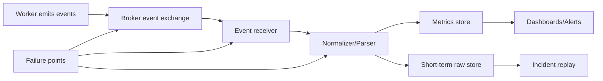

[← Назад к индексу части](index.md)
[↑ К глобальному плану](../celery_mastery_plan.md)

## 38.2 События (event protocol)

### Цель раздела

Понять, как устроен event protocol Celery, какие типы событий полезны, сколько это стоит и как управлять потоком событий на высокой нагрузке.

### В этом разделе главное

- Events — это телеметрия runtime-поведения Celery, а не замена бизнес-логов.
- Поток событий полезен для мониторинга/Flower, но имеет стоимость по сети, брокеру и хранению.
- На высокой нагрузке нужен управляемый режим: включение только нужных типов, sampling и retention policy.
- Важно различать «оперативную диагностику» и «долгосрочную аналитику» событий.

### Термины

| Термин | Формально | Простыми словами |
|---|---|---|
| **Task event** | Событие о жизненном цикле задачи (`task-sent`, `task-started`, `task-succeeded` и т.д.) | «Что происходит с задачей» |
| **Worker event** | Событие состояния worker (`worker-online`, `worker-heartbeat`, `worker-offline`) | «Что происходит с воркером» |
| **Event receiver** | Компонент, который читает поток событий | «Потребитель телеметрии» |
| **Sampling** | Отбор части событий по правилу | «Берем не 100%, а репрезентативную долю» |
| **Event storm** | Лавинообразный поток событий под нагрузкой | «Мониторинг сам стал нагрузкой» |
| **Event cardinality** | Число уникальных комбинаций labels/полей | «Сколько уникальных серий создает телеметрия» |
| **Telemetry budget** | Допустимый лимит ресурсов на наблюдаемость | «Сколько ресурсов можно тратить на мониторинг» |

### Теория и правила

#### 1) Что даёт event protocol

События позволяют видеть:

- скорость поступления и завершения задач;
- «живость» worker-ов (heartbeats);
- задержки между фазами;
- участки деградации (например, задачи получены, но не стартуют).

Это основа для Flower и для кастомного мониторинга.

#### 2) Цена наблюдаемости

Включенные события увеличивают:

- объём сообщений в брокере;
- сетевой трафик;
- нагрузку на хранилище телеметрии;
- CPU у потребителей событий.

Поэтому правило: **события — это бюджетируемый ресурс**, а не «всегда включено без лимитов».

#### 3) Совместимость с инструментами

- Flower ожидает определённый набор task/worker events;
- кастомные monitoring pipelines могут требовать стабильной схемы и версии полей;
- при апгрейде Celery нужно проверять совместимость event consumer-а.

#### 4) Sampling при high load

Подходы:

1. Полный поток только для incident-mode.
2. В обычном режиме — sampling неключевых событий.
3. Для SLO-индикаторов сохранять полные агрегаты через метрики, а не полный event stream.

#### 5) Что именно обычно мониторят по event protocol

Минимальный «скелет» событий для большинства production-контуров:

- `worker-online`, `worker-heartbeat`, `worker-offline` — живость;
- `task-received`, `task-started`, `task-succeeded`, `task-failed`, `task-retried` — путь выполнения;
- дополнительные события включаются под конкретный инцидент, а не навсегда.

#### 6) Где чаще ломается интерпретация событий

- `task-received` принимают за старт выполнения (хотя задача может ждать слот);
- отсутствие `task-succeeded` интерпретируют как «задача потеряна», хотя возможно retry/revoke/worker restart;
- heartbeat жив, но pool заблокирован — «живость есть, полезная работа не идет».

### Пошагово: стратегия event-наблюдаемости

1. Определи, какие вопросы должен отвечать мониторинг (очередь растет? worker жив? retry storm?).
2. Составь минимальный набор событий для этих вопросов.
3. Введи лимиты retention и sampling-политику.
4. Раздели алерты на «живость» (heartbeat) и «качество исполнения» (task states).
5. Тестируй event-поток на нагрузочном стенде, а не только в dev.
6. Раз в релиз проверяй схему событий и поля, которые парсит monitoring pipeline.

### Диаграмма: поток событий и точки потерь сигнала



### Практическая мини-матрица sampling

| Режим | Что сохраняем полностью | Что семплируем | Когда использовать |
|---|---|---|---|
| Steady-state | worker live events + агрегаты task outcomes | часть низкоприоритетных task events | обычная эксплуатация |
| Elevated load | только критичные SLO события | большинство debug-полей и детальных событий | пиковая нагрузка |
| Incident mode | почти полный поток по нужным очередям | минимум семплинга | расследование 30-120 минут |

### Простыми словами

События — это «камера наблюдения».  
Если поставить камеры везде без плана, сеть и диски быстро закончатся, а важные сигналы утонут в шуме.

### Картинка в голове

Event protocol — как телеметрия самолета: полезно знать все в момент инцидента, но для ежедневной эксплуатации лучше заранее выбрать, какие параметры пишутся постоянно, а какие — по запросу.

### Как запомнить

**Observe what you can act on.**  
Наблюдай только то, по чему реально принимаешь решение.

### Примеры

#### Пример 1: включение событий у worker (CLI)

```bash
celery -A proj worker --loglevel=INFO -E
```

#### Пример 1.1: оперативный просмотр событий из CLI

```bash
celery -A proj events --dump
```

> В production этот режим используют кратковременно для диагностики: поток может быть очень шумным.

#### Пример 2: структура событий в monitoring-пайплайне (концептуально)

```text
Broker events exchange
   -> event receiver
      -> parser/normalizer
         -> metrics (Prometheus)
         -> short-term event store (for incident replay)
```

#### Пример 3: агрегирование вместо полного хранения

```python
# Псевдокод: на каждое task-succeeded/event считаем гистограмму latency,
# но не храним все сырые события бесконечно.
def on_task_succeeded(event):
    metrics.histogram("celery_task_duration_seconds").observe(event["runtime"])
```

#### Пример 4: минимальный набор алертов на событиях

```text
- worker-offline without planned maintenance
- heartbeat gap > N seconds
- task-failed rate above baseline
- task-retried spike (possible retry storm)
```

### Практика / реальные сценарии

1. **Incident mode**: на время расследования включить расширенный поток событий и усилить retention на 24 часа.
2. **Cost control**: в steady-state хранить агрегаты + ограниченный сыро́й поток.
3. **Noisy tenant isolation**: выделить отдельный pipeline для «шумных» очередей.

### Типичные ошибки

- считать Flower «бесплатным» с точки зрения брокера и сети;
- не отделять debugging events от постоянной телеметрии;
- не проверять влияние event stream на брокер в пиковые часы;
- пытаться строить аудиторский журнал только на event stream без устойчивого storage policy.

#### Что будет, если перепутать event и metric ответственность

- Если хранить всё в сырых событиях — дорого и нестабильно для долгого горизонта.
- Если оставить только метрики — потеряешь детальность нужную для расследований.
- Если смешать оба слоя без схемы именования — вырастет cardinality и усложнится поиск причин инцидента.

### Что будет, если...

- **...всегда хранить 100% сырых событий без TTL?**  
  Рост стоимости хранения и деградация систем анализа; в какой-то момент мониторинг начнёт мешать самой системе.

- **...оставить только агрегаты без возможности короткого incident replay?**  
  Станет сложнее расследовать редкие race conditions и межпроцессные аномалии.

### Проверь себя

1. Почему event protocol нельзя считать «бесплатным каналом данных»?
2. Когда полный поток событий оправдан, а когда нужен sampling?
3. Зачем разделять метрики и сырые события?

<details><summary>Ответ</summary>

1) Он создает нагрузку на брокер, сеть, CPU и storage.  
2) Полный поток нужен обычно для инцидента/короткого окна диагностики; в steady-state разумнее sampling и агрегаты.  
3) Метрики дают дешевый непрерывный контроль SLO, а сырые события — детализацию для расследований.

</details>

### Запомните

Events дают сильную наблюдаемость, но их нужно проектировать как управляемый поток с бюджетом, а не как бесконечный лог без ограничений.

---
