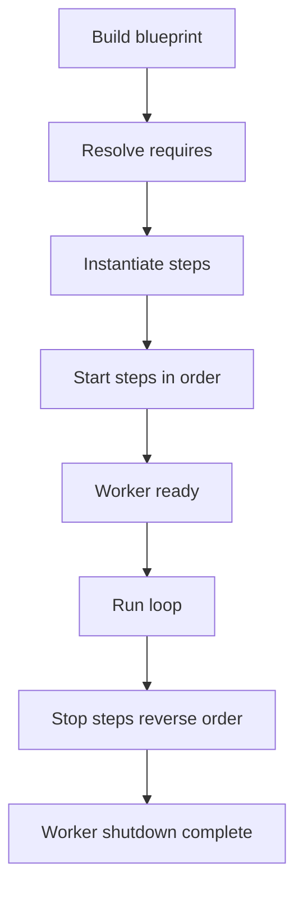

[← Назад к индексу части](index.md)
[↑ К глобальному плану](../../mastery_plan.md)

## 38.3 Bootsteps и кастомизация worker

### Цель раздела

Освоить bootsteps-модель Celery и научиться добавлять кастомные consumer steps безопасно для lifecycle worker-а.

### В этом разделе главное

- Bootsteps — это конвейер сборки worker/consumer, а не просто «хук на старте».
- Порядок и зависимости шагов критичны: ошибка в step может блокировать старт или корректную остановку.
- Кастомный consumer step должен быть минимальным, предсказуемым и тестируемым в изоляции.
- Избыточная логика в bootstep быстро превращается в «хрупкий framework внутри framework-а».

### Термины

| Термин | Формально | Простыми словами |
|---|---|---|
| **Bootstep** | Шаг инициализации компонента worker/consumer | «Этап сборки worker-а» |
| **Blueprint** | Набор шагов и их зависимостей | «План запуска по шагам» |
| **requires** | Явное указание зависимостей шага | «Без этих шагов мой шаг невалиден» |
| **start/stop lifecycle** | Методы старта и остановки шага | «Как шаг запускается и закрывается» |
| **Consumer step** | Шаг, связанный с потреблением сообщений | «Расширение в контуре чтения задач» |

### Теория и правила

#### 1) Идея цепочки bootsteps

Worker запускается не монолитно, а по шагам:

1. сборка компонентов;
2. удовлетворение зависимостей;
3. запуск в корректном порядке;
4. остановка в обратном порядке.

Это важно для стабильного startup/shutdown.

#### 2) Когда нужен custom Consumer step

Подход оправдан, когда требуется:

- дополнительный контролируемый consumer-side сервис;
- интеграция с внешним каналом lifecycle-событий;
- узкоспециализированная инструментальная логика рядом с consumer.

Если задача решается обычным signal или метрикой — bootstep обычно избыточен.

#### 3) Риски bootsteps

- блокировки на старте worker-а;
- зависание при shutdown из-за неосвобожденных ресурсов;
- скрытая зависимость от внутренностей версии Celery;
- сложность апгрейдов.

#### 4) Порядок инициализации важнее, чем кажется

Bootsteps — это не «добавил класс и забыл».  
Нужно понимать, что шаг может зависеть от:

- транспортного подключения;
- внутренних consumer-компонентов;
- remote-control/event подсистемы;
- настроек пула и таймингов shutdown.

Неправильная зависимость может проявляться только под нагрузкой, когда локально «вроде работает».

### Диаграмма: упрощенная модель bootsteps lifecycle



### Пошагово: внедрение custom Consumer step

1. Формализуй цель шага одним предложением.
2. Определи зависимости (`requires`) и ограничения времени старта/остановки.
3. Реализуй минимальный step без тяжелых операций.
4. Добавь health-логирование start/stop.
5. Проверь поведение при reload/restart/kill на staging.
6. Зафиксируй rollback-стратегию отключения шага флагом конфигурации.
7. Проведи chaos-проверку: что будет, если внешний ресурс шага недоступен на старте и в рантайме.
8. Зафиксируй owner-команду и runbook шага (кто чинит, как отключать, где метрики).

### Простыми словами

Bootsteps — это «чеклист запуска двигателя».  
Если вставить туда «большой кастом», можно сорвать весь взлет worker-а.

### Картинка в голове

Подумай о bootsteps как о Lego-инструкции:

- сначала базовая платформа,
- затем обязательные детали,
- только потом дополнительные модули.

Если поставить деталь «вне очереди», модель не соберется или развалится при нагрузке.

### Как запомнить

**Bootstep = lifecycle infrastructure, not business feature.**

### Примеры

#### Пример 1: conceptual custom consumer step

```python
from celery import bootsteps

class MyObserverStep(bootsteps.ConsumerStep):
    requires = {"celery.worker.consumer.consumer.Consumer"}

    def __init__(self, c, **kwargs):
        self.enabled = c.app.conf.get("MY_OBSERVER_ENABLED", False)

    def start(self, c):
        if not self.enabled:
            return
        c.app.log.get_default_logger().info("MyObserverStep started")

    def stop(self, c):
        if not self.enabled:
            return
        c.app.log.get_default_logger().info("MyObserverStep stopped")
```

#### Пример 2: регистрация шага

```python
from celery import Celery

app = Celery("proj")
app.steps["consumer"].add(MyObserverStep)
```

#### Пример 2.1: «более реальный» consumer step с отдельным сервисом

```python
from celery import bootsteps

class MetricsBridgeStep(bootsteps.ConsumerStep):
    requires = {"celery.worker.consumer.consumer.Consumer"}

    def __init__(self, c, **kwargs):
        self.bridge = None
        self.enabled = c.app.conf.get("METRICS_BRIDGE_ENABLED", False)

    def start(self, c):
        if not self.enabled:
            return
        self.bridge = object()  # здесь мог бы быть клиент/сервис
        c.app.log.get_default_logger().info("MetricsBridgeStep up")

    def stop(self, c):
        if self.bridge is None:
            return
        self.bridge = None
        c.app.log.get_default_logger().info("MetricsBridgeStep down")
```

#### Пример 3: ASCII-схема зависимостей step-ов

```text
[Core Consumer]
      |
      +--> [Events/Heartbeats]
      |
      +--> [Custom Observer Step]  (requires Core Consumer)
```

### Практика / реальные сценарии

1. **Process-local sidecar telemetry**: custom step публикует технический heartbeat в внутренний канал.
2. **Контролируемый feature flag**: step включается только для canary worker-ов.
3. **Migration-safe extension**: step отключается одним конфигом при апгрейде Celery.
4. **Graceful degradation**: step в degraded mode не блокирует прием задач.

### Типичные ошибки

- ставить network calls в `__init__` шага;
- не реализовывать корректный `stop`, надеясь на «процесс всё равно убьют»;
- скрывать критические исключения, из-за чего step «полустартует»;
- не документировать зависимость step-а от версии Celery internals.

#### Production-чеклист для bootstep

- есть явный `requires`;
- start/stop ограничены по времени и логируют статус;
- отказ внешней зависимости не приводит к вечному зависанию;
- есть флаг отключения без релиза кода;
- есть тест restart/shutdown под реальной concurrency.
- есть documented owner и дежурный runbook.

### Что будет, если...

- **...bootstep долго стартует?**  
  Worker может не перейти в `ready`, оркестратор сочтет его unhealthy, начнется restart-loop.

- **...step не останавливает ресурсы?**  
  Вероятны утечки, hanging shutdown, увеличение времени релиза и риск потери задач при принудительном kill.

### Проверь себя

1. Чем custom bootstep отличается от signal по уровню вмешательства?
2. Почему `requires` нельзя игнорировать?
3. Какой минимальный operational чек нужен для нового bootstep?

<details><summary>Ответ</summary>

1) Bootstep вмешивается в инфраструктурный lifecycle worker/consumer, signal чаще лишь реагирует на события.  
2) Без зависимостей шаг может стартовать в неверный момент, что приводит к нестабильной инициализации.  
3) Проверка startup/shutdown под нагрузкой, health-метрики и быстрый rollback-флаг.

</details>

### Запомните

Bootsteps — мощный инструмент экспертного уровня. Используй их только там, где signal или `Task` lifecycle действительно недостаточны.

---
