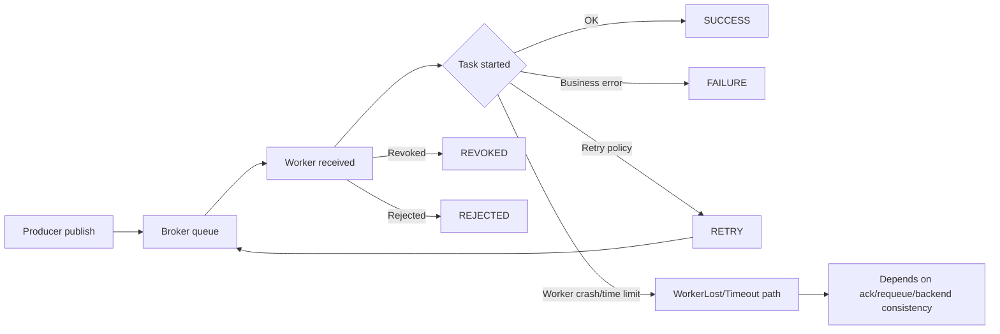

[← Назад к индексу части](index.md)
[↑ К глобальному плану](../../mastery_plan.md)

## Сквозная схема жизненного цикла состояния и ошибок



ASCII-образ для быстрых обсуждений на инцидентах:

```text
publish -> queued -> reserved -> running -> (success | failure | retry)
                              \-> revoked/rejected before normal finish
runtime crash/time-limit -> "неоднозначный финал" до восстановления контекста
```

#### Проверь себя: сквозная схема

1. Почему путь через `WorkerLost/Timeout` нельзя трактовать как однозначный `FAILURE` без дополнительной проверки?
2. Что показывает стрелка `RETRY -> Broker queue` с точки зрения модели доставки?

<details><summary>Ответ</summary>

1) Потому что финальная видимость результата зависит от ack/requeue/backend и может быть неоднозначной до сверки источников.  
2) Что retry возвращает задачу в цикл доставки для новой попытки, а не завершает исполнение как terminal state.

</details>

### Матрица переходов состояний в разных режимах

| Сценарий | Типичный путь состояний | Что важно помнить |
|---|---|---|
| Обычное async-исполнение + backend + `task_track_started=True` | `PENDING -> STARTED -> SUCCESS/FAILURE` | Самый "прозрачный" режим диагностики |
| Async-исполнение + backend + `task_track_started=False` | `PENDING -> SUCCESS/FAILURE` | Отсутствие `STARTED` не равно проблеме |
| Async-исполнение без result backend | клиент часто видит только `PENDING` | Статус исполнения смотри через логи/events/метрики worker |
| Retry-политика с backoff | `PENDING/STARTED -> RETRY -> PENDING/STARTED -> ... -> SUCCESS/FAILURE` | `RETRY` — промежуточное состояние, не финал |
| Административная отмена | `PENDING/STARTED -> REVOKED` | Момент revoke влияет на фактический side effect |
| Eager (`task_always_eager=True`) | локальное sync-выполнение, статусы могут быть "схлопнуты" | Это режим тестов/локальной отладки, не модель production |

#### Проверь себя: матрица переходов

1. Какой режим чаще всего дает наиболее полную картину статусов и почему?
2. Почему eager-путь нельзя использовать как эталон для SLO-фона в production?

<details><summary>Ответ</summary>

1) Async с backend и `task_track_started=True`, потому что видны и промежуточные, и финальные переходы.  
2) Eager обходится без реального broker/worker контура и скрывает типичные async-риски: задержки, requeue, transport-сбои.

</details>

### Матрица "наблюдаемый статус vs реальность в системе"

| Наблюдаемый статус | Что это может значить в реальности | Что проверить первым |
|---|---|---|
| `PENDING` | задача еще в очереди **или** уже выполнена, но статус не записан/нечитаем | backend доступность, `task_ignore_result`, worker logs |
| `STARTED` | задача реально исполняется **или** зависла на долгом внешнем вызове | runtime длительность, external dependency latency, time limits |
| `RETRY` | контролируемая повторная попытка **или** начало retry storm | retry policy, тип исключений, число попыток, queue depth |
| `FAILURE` | бизнес-ошибка **или** инфраструктурный сбой исполнения | traceback класс, `WorkerLostError`/timeouts, broker signals |
| `REVOKED` | отмена до старта **или** попытка остановки уже исполняемой задачи | кто вызвал revoke, был ли side effect до revoke |
| `REJECTED` | сообщение отклонено корректно по политике **или** сломан контракт payload | reject reason, serializer/accept_content, protocol compatibility |

#### Проверь себя: статус vs реальность

1. Почему для `REJECTED` нужна проверка контракта payload, а не только очереди?
2. Какой статус чаще всего вводит в заблуждение при отключенном backend и почему?

<details><summary>Ответ</summary>

1) Потому что reject может быть вызван несовместимостью serializer/схемы, даже если очередь и transport работают корректно.  
2) `PENDING`, потому что он часто означает “нет видимости результата”, а не “задача не исполнялась”.

</details>

---
