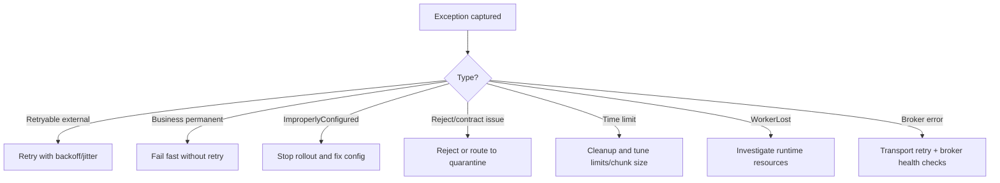

[← Назад к индексу части](index.md)
[↑ К глобальному плану](../../mastery_plan.md)

## 39.2 Исключения и классы ошибок

### Цель раздела

Научиться разбирать ошибки Celery по типам так, чтобы быстро понимать: это управляемый retry, контролируемое отклонение, баг в задаче, таймаут выполнения или инфраструктурная деградация.

### В этом разделе главное

- Не каждое исключение означает "падение задачи".
- `Retry`, `Ignore`, `Reject` — это управляющие сигналы поведения Celery.
- Таймауты и `WorkerLostError` отражают проблемы runtime, а не только бизнес-логики.
- Ошибки Kombu/соединения нужно обрабатывать отдельно от исключений твоей функции.

### Термины

| Класс/понятие | Формальный смысл | Простыми словами |
|---|---|---|
| **`Retry`** | Специальное исключение Celery для перехода в retry | "Пока не получается, попробуем позже" |
| **`Ignore`** | Пропуск стандартной обработки результата/состояния | "Не записывай обычный финал так, как обычно" |
| **`Reject`** | Отклонить текущее сообщение (опц. с requeue) | "Это сообщение сейчас не принимаю" |
| **`ImproperlyConfigured`** | Ошибка конфигурации приложения/worker | "Система собрана неверно" |
| **`SoftTimeLimitExceeded`** | Мягкий лимит времени превышен | "Нужно аккуратно завершиться" |
| **`TimeLimitExceeded`** | Жесткий лимит времени превышен | "Выполнение принудительно оборвано" |
| **`WorkerLostError`** | Потеря дочернего процесса worker | "Исполнитель исчез до подтвержденного финала" |

### Теория и правила

1. **`Retry` как явная политика**  
   Рекомендуется применять для *временных* ошибок: сеть, rate limit, короткая недоступность внешнего сервиса.

2. **`Ignore` и `Reject` использовать осознанно**  
   Эти механизмы мощные, но легко ломают ожидания downstream систем, если команда не понимает, что будет со статусами и очередью.

3. **Таймауты — отдельная ось контроля**  
   `soft_time_limit` дает шанс на cleanup.  
   `time_limit` завершает исполнение жестко.  
   Нужна четкая политика cleanup и идемпотентности.

4. **`WorkerLostError` не равно `FAILURE` бизнес-логики**  
   Это, как правило, operational-сигнал (OOM, kill, segfault в нативной библиотеке, системный сбой).

5. **Ошибки Kombu/брокера**  
   Connection reset, channel errors, timeout publish/consume требуют отдельного runbook-а: retry публикации, backoff, failover, мониторинг broker health.

6. **`ImproperlyConfigured` как "ошибка сборки системы"**  
   Это не runtime-флуктуация, а сигнал, что конфигурационный контракт нарушен (неверный backend URL, неподдерживаемый serializer, конфликт настроек пула и т.д.).  
   Правильная реакция: не ретраить задачу, а останавливать rollout и чинить конфигурацию/деплой.

### Decision guide: какое действие выбрать по типу исключения

| Тип проблемы | Примеры классов | Действие с задачей | Операционное действие |
|---|---|---|---|
| Временная внешняя ошибка | timeout API, transient network | `Retry` с backoff/jitter | наблюдать error budget внешней зависимости |
| Постоянная бизнес-ошибка | validation/domain mismatch | `FAILURE` без retry | исправлять данные/контракт |
| Конфигурационная ошибка | `ImproperlyConfigured` | fail fast | блокировать деплой, чинить конфиг |
| Проблема потребления сообщения | `Reject` | reject/requeue по политике | анализ контракта payload/очереди |
| Ограничение времени выполнения | `SoftTimeLimitExceeded`, `TimeLimitExceeded` | cleanup + failure/retry по правилу | пересмотр task granularity и лимитов |
| Потеря исполнения | `WorkerLostError` | неопределенный/ошибочный финал | расследование OOM/kill/cgroup/system issues |
| Broker/connection faults | kombu transport/channel errors | retry publish/consume по policy | проверка broker health/failover |

Визуальный triage-поток (быстрый выбор ветки действий):



### `Reject(requeue=...)` и poison message: как не зациклить очередь

Ключевая идея: `Reject` без четкой брокерной политики может создать бесконечный цикл повторной доставки одного и того же "ядовитого" сообщения (poison message).

| Ситуация | Рекомендованное действие | Почему |
|---|---|---|
| Payload явно невалиден и никогда не станет валидным | `Reject(..., requeue=False)` + маршрут в DLQ/карантин | Повтор не даст нового результата |
| Временная инфраструктурная причина чтения | `Reject(..., requeue=True)` или `Retry` (по политике) | Есть шанс успешной повторной обработки |
| Неясная причина отклонения | Временный карантин + наблюдение + лимит повторов | Иначе легко получить queue loop |

Мини-правило:  
**`requeue=True` допустим только если есть обоснованная гипотеза, что следующая попытка может быть успешной.**

### Пошагово: как строить политику retry по исключениям

1. Раздели ошибки на категории: временные, постоянные, конфигурационные, системные.
2. Для временных включи `autoretry_for` или ручной `self.retry(...)`.
3. Для постоянных (валидация, логическая невозможность) делай быстрый `FAILURE` без retry.
4. Для `Reject`/`Ignore` зафиксируй в команде единые правила использования.
5. Для таймаутов добавь cleanup-path и компенсационные действия.
6. Для broker-ошибок определи отдельно: сколько раз retry publish и при каком сигнале эскалировать инцидент.

### Простыми словами

Исключения в Celery — это не только "красный экран". Часть из них похожа на команды диспетчеру: "попробуй позже", "не принимай этот пакет", "завершаемся мягко". Если воспринимать все как одинаковое "упало", ты теряешь управляемость.

### Картинка в голове

Есть три корзины:

- **Контролируемое поведение:** `Retry`, `Ignore`, `Reject`;
- **Проблема кода/данных:** обычные Python exceptions;
- **Проблема исполнения/инфры:** таймауты, потеря worker-а, broker connection errors.

### Как запомнить

Формула: **"Class of exception = class of response"**.  
Не наоборот.

### Примеры

```python
from celery import Celery
from celery.exceptions import Ignore, Reject, SoftTimeLimitExceeded, ImproperlyConfigured
import httpx

app = Celery("retry_demo")

@app.task(bind=True, max_retries=4, retry_backoff=True, retry_jitter=True)
def fetch_partner_data(self, partner_id: str):
    try:
        resp = httpx.get(f"https://partner.api/items/{partner_id}", timeout=3.0)
        if resp.status_code == 404:
            # постоянная причина: retry не нужен
            raise Ignore("Entity does not exist at partner side")
        resp.raise_for_status()
        return resp.json()
    except httpx.TimeoutException as exc:
        # временная проблема: controlled retry
        raise self.retry(exc=exc)
    except SoftTimeLimitExceeded:
        # cleanup и явный подъем ошибки
        # здесь может быть rollback внешнего lock-а
        raise

@app.task
def validate_runtime_settings():
    if app.conf.task_serializer not in {"json"}:
        # конфигурационная проблема, retry бесполезен
        raise ImproperlyConfigured("Only JSON serializer is allowed by platform policy")
    return "ok"
```

Пример с `Reject`:

```python
from celery.exceptions import Reject

@app.task(bind=True, acks_late=True)
def process_event(self, payload: dict):
    if "schema_version" not in payload:
        # управляемо отклоняем некорректное сообщение
        raise Reject("Schema version is missing", requeue=False)
    # нормальная обработка
```

### Практика / реальные сценарии

- **Сценарий 1: партнерский API отвечает 429**  
  Решение: retry с backoff/jitter, а не мгновенный `FAILURE`.
- **Сценарий 2: worker ловит `SoftTimeLimitExceeded` в длинной задаче**  
  Решение: обработать cleanup, сохранить промежуточный checkpoint, затем завершить контролируемо.
- **Сценарий 3: внезапные `WorkerLostError`**  
  Проверять OOM, cgroup limits, native dependencies, external kill signals.

### Типичные ошибки

- глобально ретраить *все* исключения;
- считать `Ignore` "удобным способом скрыть ошибку";
- не различать timeout внешнего API и timeout выполнения задачи;
- пытаться лечить broker connection instability на уровне бизнес-кода задачи.

### Что будет, если...

- **...ретраить постоянные ошибки (например, неверный payload):**  
  получишь retry storm, рост очереди и бесполезную нагрузку.
- **...игнорировать `WorkerLostError` как "обычный failure":**  
  пропустишь инфраструктурную проблему и столкнешься с повторяющимися инцидентами.

### Проверь себя

1. Почему `Retry` — это не "падение" в обычном смысле?
2. Когда `Reject` лучше, чем `FAILURE`?
3. Чем operationally отличается `SoftTimeLimitExceeded` от `TimeLimitExceeded`?

<details><summary>Ответ</summary>

1) Потому что он переводит задачу в управляемый повторный запуск по политике, а не завершает ее окончательно.  
2) Когда нужно явно отклонить конкретное сообщение по политике потребления (например, заведомо невалидный контракт) с контролем requeue-поведения.  
3) Soft дает задаче окно на cleanup, hard может оборвать исполнение резко, оставив незавершенные побочные эффекты.

</details>

### Запомните

- Исключения Celery нужно читать как сигналы управления и диагностики.
- Retry-политика должна быть избирательной, а не "для всего".
- Таймауты и потеря worker-а чаще требуют SRE-анализа, а не только правки бизнес-кода.
- `ImproperlyConfigured` лечится изменением конфигурации, а не повторными попытками задачи.

---
