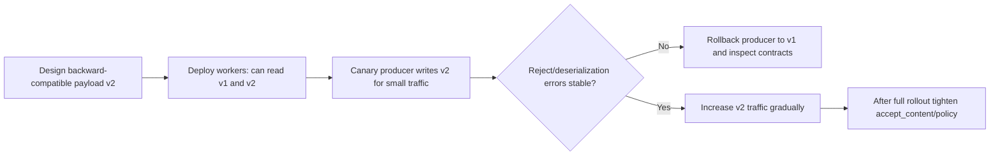

[← Назад к индексу части](index.md)
[↑ К глобальному плану](../../mastery_plan.md)

## 39.3 Тело сообщения и протокол

### Цель раздела

Понять контракт сообщения Celery на уровне wire-format: какие поля присутствуют, как сериализация и compression влияют на совместимость и производительность, и где начинаются границы "слишком большого payload".

### В этом разделе главное

- Сообщение Celery состоит из метаданных (`headers/properties`) и полезной нагрузки (`body`).
- `content-type` и `content-encoding` задают правила интерпретации body.
- `task_protocol` влияет на совместимость producer и worker разных версий.
- Большие сообщения бьют по latency, памяти, broker IO и стоимости.

### Термины

| Термин | Формально | Простыми словами |
|---|---|---|
| **Headers** | Метаданные задачи (id, retries, eta, routing и т.д.) | "Паспорт" сообщения |
| **Body** | Сериализованные args/kwargs и callback-структуры | "Что нужно выполнить" |
| **`content-type`** | MIME-тип сериализатора (`application/json`, и т.д.) | Как читать payload |
| **`content-encoding`** | Кодировка/компрессия payload | В каком виде хранится/передается |
| **`task_protocol`** | Версия структуры task message | Правила языка между producer/consumer |

### Теория и правила

1. **Payload должен быть минимальным**  
   Передавай идентификаторы и легкие DTO, а не тяжелые объекты/бинарные данные.

2. **Сериализация = контракт**  
   Если producer отправляет в одном формате, worker должен уметь это декодировать.

3. **Протокол и версия**  
   При mixed-version окружении заранее проверяй совместимость `task_protocol`.

4. **Compression — компромисс**  
   Меньше трафик и размер в broker, но больше CPU на сжатие/распаковку.

5. **Ограничение размера сообщения**  
   У брокеров и инфраструктуры есть практические лимиты; даже до формального лимита большие сообщения ухудшают throughput.

6. **`headers` и `body` решают разные задачи**  
   В `headers` лежит управляющая метаинформация (идентификаторы, маршрут, попытки), в `body` — бизнес-аргументы задачи.  
   Если смешивать эти роли, дебаг и эволюция контракта становятся хрупкими.

7. **Совместимость producer/consumer проверяется как API**  
   Версии приложения могут выкатываться постепенно, поэтому payload-совместимость проверяют на mixed-стенде так же строго, как HTTP-совместимость.

### Пошагово: проектирование безопасного payload-контракта

1. Определи явную схему аргументов задачи.
2. Утверди сериализатор (обычно JSON) и запрети небезопасные/непредсказуемые форматы.
3. Ограничь максимальный размер payload на уровне producer-side валидации.
4. Для крупных данных передавай ссылку (object storage key), а не сам файл.
5. На апгрейдах проверяй `task_protocol` совместимость в staging с mixed workers.
6. Добавь метрики размера сообщения и процент compression hit.

### Простыми словами

Task message — это конверт и письмо внутри:

- на конверте (`headers`) — кому, когда, с какими условиями;
- в письме (`body`) — что именно сделать.

Если в письмо кладешь "кирпич" (огромный payload), почтовая система замедляется и дорожает.

### Картинка в голове

```text
[headers: task_id, retries, eta, routing_key, correlation_id]
                +
[body: args/kwargs in serializer format]
                +
[content-type/content-encoding/task_protocol]
                =
message contract between producer and worker
```

Пример "анатомии" сообщения (упрощенный, учебный):

```json
{
  "headers": {
    "id": "8f4f3e7c-2d73-4c5a-b3e0-9b48c8ef4b7a",
    "task": "billing.tasks.capture_payment",
    "retries": 1,
    "eta": null,
    "origin": "api@pod-a1",
    "timelimit": [30, 45]
  },
  "properties": {
    "correlation_id": "8f4f3e7c-2d73-4c5a-b3e0-9b48c8ef4b7a",
    "content_type": "application/json",
    "content_encoding": "utf-8"
  },
  "body": {
    "args": ["pay_100500"],
    "kwargs": {"currency": "EUR"},
    "callbacks": null,
    "errbacks": null
  }
}
```

### Как запомнить

Формула: **"Small payload, explicit schema, strict serializer, tested protocol"**.

### Примеры

Пример задачи с "тонким" payload:

```python
@app.task
def generate_report(report_id: str, requested_by: str):
    # внутри задачи читаем фактические данные по report_id из БД/хранилища
    ...
```

Антипример (что не стоит делать):

```python
@app.task
def generate_report_bad(full_dataframe_bytes: bytes):
    # огромный бинарный payload через broker -> плохо для throughput/cost
    ...
```

Пример конфигурационного фрагмента:

```python
app.conf.update(
    task_serializer="json",
    accept_content=["json"],
    result_serializer="json",
    task_compression="gzip",  # включать после измерений
)
```

### Практика / реальные сценарии

- **Сценарий 1: деградация latency после релиза**  
  Выявляется рост среднего размера task payload в 8 раз.
- **Сценарий 2: mixed-version deployment**  
  Старые worker-ы некорректно обрабатывают новое поле в message headers без backward-совместимости.
- **Сценарий 3: высокие затраты на broker**  
  Причина: массовая передача крупных payload вместо паттерна "id + lookup".

Технический чеклист по размеру и формату payload:

1. Порог warning/error для размера сообщения (например, warn от 128KB, block от 512KB — под ваши ограничения).
2. Явная схема аргументов (pydantic/dataclass schema) с валидацией до publish.
3. Набор разрешенных serializer-ов (`accept_content`) как allow-list.
4. Прогон mixed-version теста перед релизом, где producer новее worker.
5. Наблюдение: p95 size, p99 deserialize time, доля reject по неверному формату.

Release-gate checklist для `task_protocol` и message compatibility:

1. Зафиксировать матрицу версий: какие producer/worker версии одновременно живут в кластере.
2. Проверить, что новый producer не отправляет поля/форматы, которые старые worker не понимают.
3. Прогнать canary: небольшой процент задач через новый producer с контролем reject/deserialization ошибок.
4. Проверить rollback-путь: может ли старый producer безопасно работать с обновленными worker.
5. Подготовить триггеры остановки раскатки (например, рост reject/deserialization ошибок выше порога).

### Типичные ошибки

- сериализовать сложные Python-объекты "как есть";
- передавать чувствительные данные в headers/body без необходимости;
- включать compression "по умолчанию" без измерения CPU overhead;
- не проверять совместимость при rolling upgrade.

### Что будет, если...

- **...передавать тяжелые бинарные payload массово:**  
  брокер станет узким местом, вырастут задержки, может начаться нестабильность worker-ов по памяти.
- **...игнорировать protocol compatibility:**  
  получишь трудно диагностируемые ошибки десериализации и "плавающие" сбои.

### Граничные случаи совместимости протокола и payload

1. **Producer уже пишет новый формат, а часть worker еще на старой версии**  
   Симптом: часть задач проходит, часть уходит в reject/deserialization errors.  
   Практика: держать backward-compatible payload минимум на одно окно rolling deploy.

2. **`accept_content` ужесточили раньше, чем обновили всех producer-ов**  
   Симптом: неожиданный всплеск `REJECTED` после релиза безопасности.  
   Практика: миграция в два шага — сначала dual-accept, затем отключение старого формата.

3. **Слишком агрессивная компрессия на CPU-ограниченных worker-ах**  
   Симптом: очередь не растет резко, но растет latency обработки и время десериализации.  
   Практика: отдельно мерить p95 deserialize/decompress time и сравнивать с сетевой экономией.

4. **"Невидимая" несовместимость в optional-полях body**  
   Симптом: бизнес-логика ломается не на десериализации, а глубже в коде задачи.  
   Практика: versioned schema для args/kwargs и явный defaulting для новых полей.

Визуальный rollout-шаблон безопасной совместимости:



### Проверь себя

1. Почему payload-контракт лучше делать "тонким" (`id + metadata`), а не "толстым" (все данные сразу)?
2. Когда compression помогает, а когда вредит?
3. Что проверять первым при ошибках десериализации после апгрейда?

<details><summary>Ответ</summary>

1) Тонкий контракт снижает нагрузку на broker и сеть, упрощает совместимость и уменьшает стоимость эксплуатации.  
2) Помогает при сетевом узком месте и умеренном CPU; вредит, если CPU уже загружен и выигрыш в размере небольшой.  
3) Совместимость версий producer/worker, `task_protocol`, `content-type`, `accept_content` и фактический формат payload.

</details>

### Запомните

- Payload — это API-контракт между сервисами.
- Размер сообщения — полноценный ресурсный параметр, а не мелочь.
- Совместимость протокола нужно тестировать до прод-раската.
- `headers` отвечают за управление маршрутом/контекстом, `body` — за бизнес-данные задачи.

---
