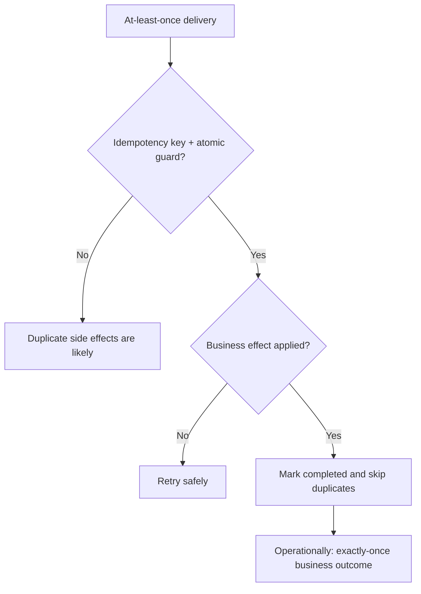
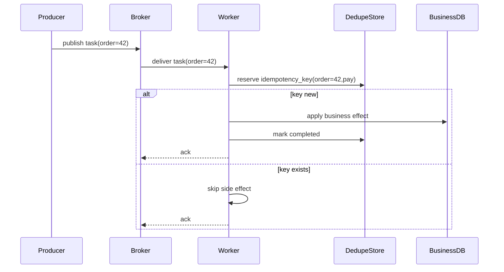

[← Назад к индексу части](index.md)
[↑ К глобальному плану](../mastery_plan.md)

## 39.4 Идентификаторы и дедупликация

### Цель раздела

Понять, почему даже при корректном `task_id` возможны повторные выполнения, и как строить защиту на уровне бизнеса через идемпотентность и dedupe-паттерны.

### В этом разделе главное

- `task_id` удобен для трассировки, но сам по себе не гарантирует exactly-once эффект.
- Дубликаты появляются из-за повторной доставки, сетевых сбоев, retries, race-condition в producer path.
- Идемпотентность и внешние ключи дедупликации — базовая защита production-систем.
- Дедупликация должна быть частью бизнес-контракта, а не ad-hoc патчем.

### Термины

| Термин | Формально | Простыми словами |
|---|---|---|
| **`task_id`** | Идентификатор конкретного сообщения задачи | Номер попытки/экземпляра задачи |
| **Idempotent operation** | Повторный вызов не меняет итоговый эффект сверх первого успешного | "Повтор безопасен" |
| **Idempotency key** | Ключ бизнес-операции для защиты от двойного применения | "Один ключ -> один эффект" |
| **Dedupe store** | Хранилище уже обработанных ключей/операций | "Реестр того, что уже выполнено" |

### Теория и правила

1. **Где появляются дубликаты**
   - producer не получил подтверждение публикации и повторил publish;
   - worker завершил бизнес-эффект, но ack/result не дошел;
   - retry-path слабо отделен от постоянных ошибок;
   - race при параллельной постановке одинаковых задач.

2. **Что защищает от дубликатов**
   - unique constraints в БД;
   - idempotency key в таблице операций;
   - outbox/inbox pattern;
   - compare-and-set/conditional write в key-value store.

3. **Что не защищает полностью**
   - "у нас же есть `task_id`";
   - "мы почти не видели дублей";
   - "retry стоит маленький, значит безопасно".

4. **Выбор места дедупликации**
   - на уровне БД (unique + transactional guard) — хорошо для CRUD и платежных контуров;
   - на уровне KV (Redis CAS/SETNX) — хорошо для высокочастотных коротких задач;
   - на уровне event log/outbox — хорошо для интеграционных пайплайнов и аудита.

5. **Миф exactly-once и практическая альтернатива**
   - На уровне task queue в общем случае живем в модели at-least-once.
   - Exactly-once на уровне бизнес-эффекта достигается комбинацией идемпотентности, дедупликации и корректных транзакционных границ.
   - Формула "exactly-once transport" без бизнес-контракта часто дает ложное чувство безопасности.

Визуальная модель "почти exactly-once" в проде:



### Пошагово: минимальный pattern идемпотентности

1. Выбери business key операции (например, `order_id + operation_type`).
2. Перед выполнением проверяй/резервируй ключ в dedupe-store атомарно.
3. Если ключ уже обработан, заверши задачу без повторного side effect.
4. Выполни бизнес-логику и зафиксируй "completed".
5. На ошибках раздели: retryable vs non-retryable.
6. Добавь мониторинг конфликтов dedupe как отдельную метрику качества.

### Простыми словами

`task_id` — это номер письма, а идемпотентность — правило склада "один заказ отгружаем один раз, даже если письмо пришло дважды".

### Картинка в голове



### Как запомнить

Формула: **"At-least-once transport + non-idempotent side effect = риск двойного эффекта"**.

### Примеры

```python
@app.task(bind=True, acks_late=True)
def capture_payment(self, payment_id: str):
    key = f"payment:capture:{payment_id}"
    if dedupe_store.is_completed(key):
        return {"status": "skipped_duplicate", "payment_id": payment_id}

    locked = dedupe_store.try_lock(key, ttl_seconds=600)
    if not locked:
        raise self.retry(countdown=3)

    try:
        payment_gateway.capture(payment_id)  # внешний side effect
        dedupe_store.mark_completed(key)
        return {"status": "captured", "payment_id": payment_id}
    finally:
        dedupe_store.release_lock_if_needed(key)
```

### Практика / реальные сценарии

- **Сценарий 1: двойное списание**  
  Причина: повторное выполнение без idempotency key при сетевой турбулентности.
- **Сценарий 2: высокая конкуренция одной операции**  
  Решение: atomic lock + dedupe-store + bounded retry.
- **Сценарий 3: миграция producer-а**  
  На переходе часть задач публикуется двумя путями; без dedupe растет число дублей.

Мини-runbook диагностики дублей:

1. Найти бизнес-ключ эффекта и собрать выборку повторов.
2. Сопоставить timeline: publish timestamp, delivery timestamp, retry count, ack moment.
3. Проверить, где реально стоит dedupe-check (до side effect или после).
4. Проверить атомарность lock/unique операции.
5. Проверить TTL и очистку dedupe-store: не слишком ли рано "забываются" ключи.
6. Проверить процессные рестарты, OOM и сетевые сбои в окне дублей.

### Типичные ошибки

- использовать `task_id` как бизнес-ключ операции;
- не делать атомарную проверку dedupe;
- хранить dedupe-состояние слишком коротко (TTL меньше реального окна повторов);
- не учитывать, что retry может приходить после "почти успешного" первого запуска.

### Что будет, если...

- **...не внедрить идемпотентность для денежного side effect:**  
  получишь высокий риск двойной операции и сложных ручных компенсаций.
- **...делать dedupe только в памяти worker-процесса:**  
  после рестарта/масштабирования защита исчезнет.

Сравнение практических стратегий дедупликации:

| Стратегия | Где хранится ключ | Плюсы | Компромиссы |
|---|---|---|---|
| DB unique constraint + transaction | Реляционная БД | сильная консистентность, удобно для финансовых операций | выше latency и нагрузка на primary DB |
| Redis `SETNX`/CAS | KV-хранилище | очень быстро, подходит для high-throughput | нужно аккуратно управлять TTL и отказами Redis |
| Outbox/Inbox журнал | Лог событий/таблица интеграции | сильный аудит и трассировка | сложнее реализация и сопровождение |
| In-memory local cache | Память процесса worker | минимальная сложность | непригодно для прод при рестартах/масштабировании |

### Проверь себя

1. Почему `task_id` недостаточен как защита от двойного эффекта?
2. Что важнее для dedupe-store: скорость или атомарность?
3. Как выбрать TTL для idempotency key?

<details><summary>Ответ</summary>

1) Потому что дублирование может происходить на уровне бизнес-операции разными task_id или при повторной доставке/повторной постановке; нужен бизнес-ключ операции.  
2) Атомарность: без нее возможны race-condition и двойное выполнение даже на быстром хранилище.  
3) TTL должен покрывать максимальное окно повторной доставки/ретраев и операционных задержек, а не только "обычное время выполнения".

</details>

### Запомните

- Дедупликация — задача бизнес-уровня, не только инфраструктуры Celery.
- Идемпотентность проектируется заранее, а не добавляется после первого инцидента.
- Для критичных операций нужен внешний, устойчивый dedupe-store.

---
