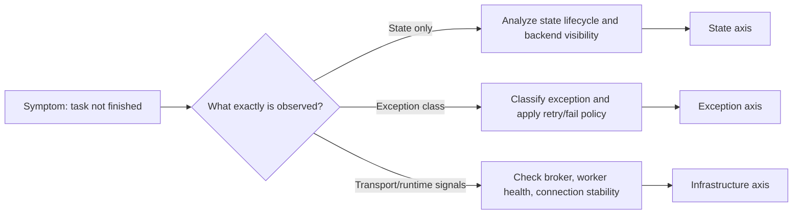

[← Назад к индексу части](index.md)
[↑ К глобальному плану](../../mastery_plan.md)

## Анти-путаница: где состояние, где исключение, где проблема транспорта

Этот блок нужен, потому что в реальных инцидентах команды часто смешивают три разные оси анализа.

Короткое правило:

- если видишь статус (`PENDING`/`RETRY`) — это еще не диагноз причины;
- если видишь исключение — это не всегда инфраструктурная проблема;
- если видишь broker warning — это не всегда баг в коде задачи.

Матрица источников истины (что чем лучше подтверждать):

| Вопрос | Главный источник | Дополнительный источник | Почему одного источника мало |
|---|---|---|---|
| "Задача точно завершилась?" | `AsyncResult`/backend state | worker logs/events | backend может запаздывать или быть отключен |
| "Почему случился `REJECTED`?" | worker events/logs | broker queue/DLQ метрики | `REJECTED` не всегда стабильно отражается как backend state |
| "Это retry storm или норма?" | retry-rate метрики + queue depth | исключения по классам | голый счетчик `RETRY` не показывает качество ретраев |
| "Это баг кода или инфраструктура?" | traceback/exception class | worker health, broker connectivity | симптомы могут быть похожими |

#### Проверь себя: анти-путаница

1. Почему сравнение только `AsyncResult` и только логов по отдельности может давать ложные выводы?
2. Какие два типа сигналов нужно соединить, чтобы отличить retry storm от нормального retry?

Ответ

1) Каждый источник ограничен: backend может запаздывать, а логи могут быть неполными/шумными; надежная диагностика требует корреляции минимум двух источников.  
2) Retry-rate/queue depth (метрики) плюс класс исключений/контекст ошибок из логов или events.

---
