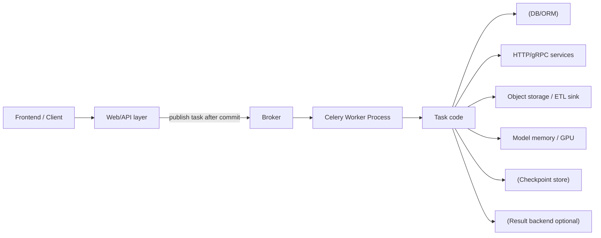

[← Назад к индексу части](index.md)
[↑ К глобальному плану](../../mastery_plan.md)

## Сквозная архитектурная схема интеграций



ASCII-образ для "картинки в голове":

```text
[Producer] --(task id + payload contract)--> [Broker]
   -> [Worker process]
      -> [ORM session lifecycle]
      -> [HTTP/gRPC client with timeout/retry]
      -> [Domain side effect: ETL/ML]
      -> [Checkpoint + logs + metrics]
```

Ключевая идея схемы: Celery находится в центре исполнения, но надежность определяется границами между компонентами, а не "чистотой" одного участка кода.

### Decision tree: с чего начинать интеграцию

```text
Новая задача Celery?
  ├─ Нужно читать/писать БД из этой задачи?
  │    ├─ Да -> зафиксируй transaction boundary (on_commit, per-task session)
  │    └─ Нет -> переход к контракту payload
  ├─ Есть внешний HTTP/gRPC вызов?
  │    ├─ Да -> timeout budget + retry policy + idempotency key
  │    └─ Нет -> переход к модели исполнения
  ├─ Задача преимущественно async I/O?
  │    ├─ Да -> оценить async layer vs bridge
  │    └─ Нет -> prefork/threads по профилю нагрузки
  └─ Долгий ETL/ML процесс?
       ├─ Да -> chunking + checkpointing + queue isolation
       └─ Нет -> стандартный runbook мониторинга и алертов
```

### Матрица выбора интеграционного подхода

| Контекст | Базовый выбор | Когда этого уже недостаточно | Что усилить |
|---|---|---|---|
| Django + БД | `transaction.on_commit` + id в payload | много связанных side effects | outbox pattern + idempotency key |
| SQLAlchemy + API вызовы | per-task `Session` + timeout | долгие задачи и частые retries | явный retry budget + breaker |
| Много payload-типов | Pydantic contract | высокая нагрузка сериализации | `msgspec` для hot path |
| Сильный async I/O | bridge через `asyncio.run` | 50%+ задач async, растет latency | выделенный async execution layer |
| ETL/ML pipeline | chunking + checkpointing | большие data windows, дорогие перезапуски | stage-level runbook + queue isolation |

#### Проверь себя: decision tree и матрица выбора

1. Почему decision tree начинается с транзакционной границы, а не с выбора пула worker-а?
2. В каком случае “базовый выбор” из матрицы уже недостаточен и что делать дальше?

<details><summary>Ответ</summary>

1) Потому что ошибка границы данных обычно дороже и фундаментальнее, чем ошибка оптимизации пула.  
2) Когда появляются признаки масштабирования/нестабильности; нужно включать усиления из столбца “что усилить”.

</details>

---
