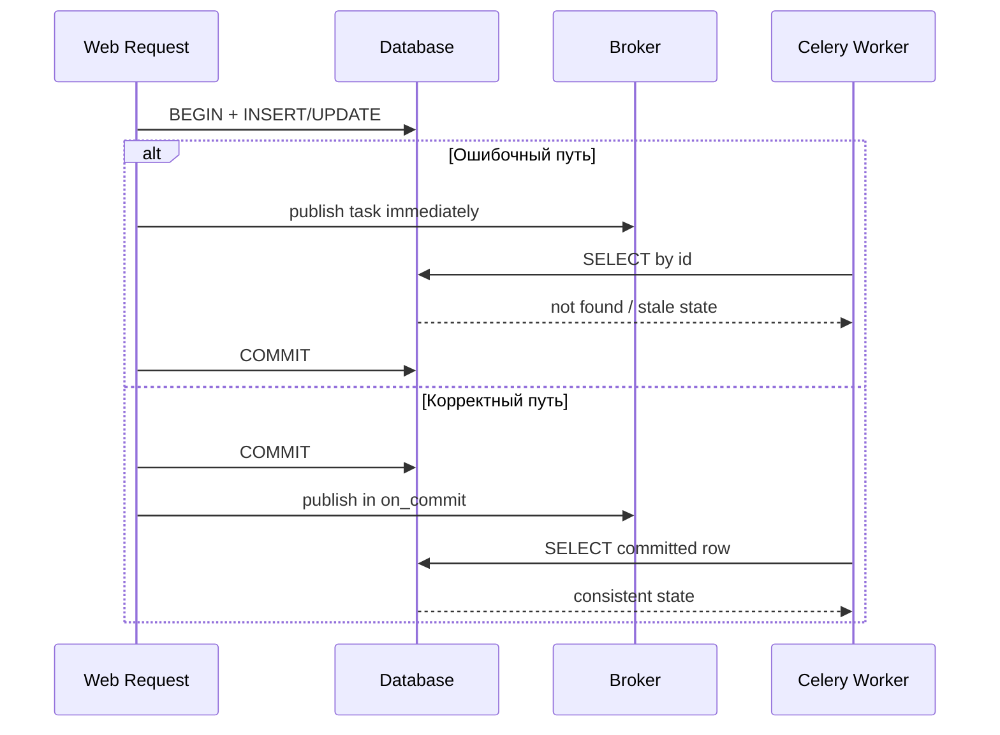

[← Назад к индексу части](index.md)
[↑ К глобальному плану](../../mastery_plan.md)

## 40.1 ORM и транзакции

### Цель раздела

Понять, как правильно связывать задачи Celery с транзакциями и жизненным циклом ORM-соединений, чтобы исключить гонки данных, утечки и "фантомные" ошибки при prefork-исполнении.

### В этом разделе главное

- публикация задач должна быть привязана к факту commit, а не к моменту вызова функции;
- ORM-сессия/коннект живут в границах процесса и запроса, их нельзя "тащить" между fork-процессами;
- при долгоживущем worker-процессе критично регулярно чистить stale-соединения и держать короткий lifecycle сессий.

### Термины

| Термин | Значение |
|---|---|
| **Read-after-write race** | Задача пытается прочитать данные до того, как транзакция producer-а зафиксирована. |
| **Stale connection** | Соединение, которое формально существует, но уже невалидно после idle/fork/reconnect. |
| **Unit of Work** | Набор операций в одной транзакционной границе. |
| **Outbox pattern** | Надежный способ публиковать события/задачи через таблицу outbox после commit. |

### Теория и правила

1. **Django + Celery**  
   Если задача использует данные, созданные в той же транзакции запроса, публикация должна идти через `transaction.on_commit(...)`. Иначе worker может стартовать раньше commit и не увидеть запись.

2. **`close_old_connections()` и lifecycle**  
   Worker-процессы живут долго. В Django это означает: перед/после задачи нужно закрывать устаревшие соединения, особенно если есть длительные idle-паузы.

3. **SQLAlchemy: session scope**  
   Правило простое: "одна задача — одна session scope". Нельзя хранить глобальную сессию "на модуль", потому что она переживает задачи и смешивает контекст.

4. **`scoped_session` — не магия**  
   Это только способ привязать сессию к текущему контексту выполнения. В Celery-коде всё равно нужно явно закрывать/rollback в `finally`.

5. **Async session внутри sync worker**  
   Возможна обертка через `asyncio.run`, но это не бесплатная стратегия: overhead, сложная диагностика, риск nested-loop конфликтов. Лучше разделять async-задачи отдельно или выносить в async-воркеры/сервисы.

6. **Общее правило для любых ORM**  
   Передавай в задачу идентификаторы и "плоские" данные, а ORM-объекты загружай уже внутри worker, в свежем lifecycle.

### Диаграмма: где ломается консистентность



### Пошагово: безопасная публикация после транзакции

1. В producer-коде сохраняешь сущность в БД.
2. Вызываешь `transaction.on_commit(lambda: task.delay(entity_id))`.
3. В задаче открываешь новую ORM-сессию/контекст.
4. Загружаешь сущность по `id`; если не найдена — обрабатываешь как доменный случай (не как transport-error).
5. Выполняешь side effect.
6. Закрываешь/очищаешь сессию в `finally`.

### Простыми словами

Транзакция — как "непубликованный черновик". Если Celery-задача стартует до публикации, она читает пустую или старую версию. `on_commit` — это кнопка "отправить задачу только когда документ уже опубликован".

### Картинка в голове

```text
Плохой путь:
HTTP request -> save() -> task.delay() -> worker reads -> COMMIT later

Хороший путь:
HTTP request -> save() -> on_commit(task.delay) -> COMMIT -> worker reads committed state
```

### Как запомнить

**Сначала commit, потом publish. Сначала ID, потом ORM-load.**

### Примеры

Пример Django:

```python
from django.db import transaction
from myapp.tasks import process_invoice

def create_invoice_and_enqueue(invoice_data):
    invoice = Invoice.objects.create(**invoice_data)

    transaction.on_commit(
        lambda: process_invoice.delay(invoice.id)
    )
    return invoice
```

Закрытие старых соединений в Django worker:

```python
from celery.signals import task_prerun, task_postrun
from django.db import close_old_connections

@task_prerun.connect
def celery_task_prerun(*args, **kwargs):
    close_old_connections()

@task_postrun.connect
def celery_task_postrun(*args, **kwargs):
    close_old_connections()
```

Пример SQLAlchemy (sync):

```python
from sqlalchemy.orm import sessionmaker
from myapp.celery_app import app

SessionLocal = sessionmaker(bind=engine, autoflush=False, autocommit=False)

@app.task(bind=True, autoretry_for=(TransientAPIError,), retry_backoff=True)
def sync_customer(self, customer_id: int):
    session = SessionLocal()
    try:
        customer = session.get(Customer, customer_id)
        if customer is None:
            return {"status": "not_found"}
        # business logic...
        session.commit()
        return {"status": "ok"}
    except Exception:
        session.rollback()
        raise
    finally:
        session.close()
```

`scoped_session` с обязательным `remove()`:

```python
from sqlalchemy.orm import scoped_session, sessionmaker

Session = scoped_session(sessionmaker(bind=engine))

@app.task
def rebuild_projection(projection_id: int):
    session = Session()
    try:
        # business logic
        session.commit()
    except Exception:
        session.rollback()
        raise
    finally:
        Session.remove()  # снимает привязку с контекста выполнения
```

### Практика / реальные сценарии

- **E-commerce:** заказ создан в веб-запросе, задача отправки чека в очередь. Без `on_commit` чек может уйти для несуществующего заказа.
- **Billing:** пересчет баланса в задаче Celery после batch-апдейта. Без scoped lifecycle получаются "грязные" сессии и случайные deadlock/retry cascades.
- **Legacy ORM (не Django/SQLAlchemy):** общий принцип тот же — не переносить живые коннекты между процессами и всегда ограничивать сессию рамками одной задачи.

### Типичные ошибки

- публиковать задачу внутри незавершенной транзакции;
- передавать ORM instance в `kwargs`;
- держать глобальную ORM-сессию "для удобства";
- не закрывать сессию в `finally`.

### Что будет, если...

- **...игнорировать `on_commit`?**  
  Появятся непредсказуемые `DoesNotExist`, дубликаты retries и ложные алерты "Celery нестабилен".

- **...не чистить старые соединения?**  
  Через часы/сутки получишь каскад `OperationalError` и медленные подвисания задач.

- **...использовать async session в sync worker без дисциплины?**  
  Получишь сложный стек ошибок event loop и трудно предсказуемые блокировки на пике.

### Проверь себя

1. Почему передача `invoice.id` в задачу надежнее, чем `invoice` как объект?
2. В чем проблема "одна глобальная SQLAlchemy Session на весь worker"?
3. Почему `on_commit` важен даже когда локально "и так работает"?

<details><summary>Ответ</summary>

1) `id` стабилен и сериализуем; объект может быть устаревшим, тяжелым и невалидным после сериализации.  
2) Она смешивает контексты задач, накапливает состояние и приводит к утечкам/конфликтам транзакций.  
3) Локально нет конкуренции и задержек сети/брокера, в проде timing другой и гонки проявляются.

</details>

### Запомните

Надежность интеграции Celery с БД строится на двух правилах: **publish только после commit** и **новый lifecycle сессии на каждую задачу**.

---
