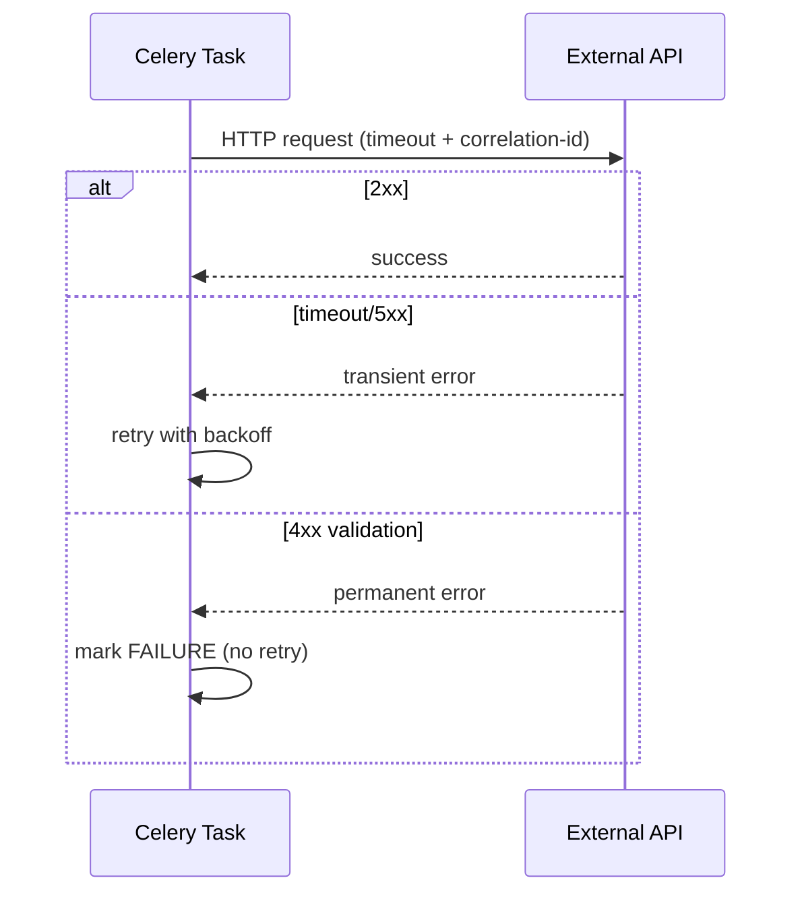
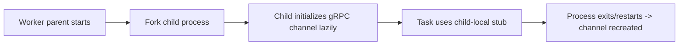

[← Назад к индексу части](index.md)
[↑ К глобальному плану](../celery_mastery_plan.md)

## 40.3 HTTP и gRPC клиенты

### Цель раздела

Научиться безопасно использовать внешние сетевые клиенты внутри Celery-задач с учетом timeout-стратегий, retry-политик и ограничений prefork.

### В этом разделе главное

- всегда задавай timeout (connect/read/write/total), иначе зависания превращаются в "вечные" задачи;
- connection pool должен быть process-local в prefork-модели;
- retry в Celery и retry в HTTP-клиенте нельзя настраивать независимо "вслепую";
- для gRPC канал обычно создается per process, а не как наследуемый глобальный singleton после fork.

### Термины

| Термин | Значение |
|---|---|
| **Timeout budget** | Общий временной бюджет на операцию с учетом всех ретраев. |
| **Retry amplification** | Умножение повторов, когда несколько слоев делают retry независимо. |
| **Connection reuse** | Повторное использование TCP-соединений для снижения латентности. |
| **Fork-unsafe client** | Клиент, который ломается или ведет себя нестабильно после `fork`. |

### Теория и правила

1. **`requests` и `httpx`**  
   Создавай клиент в контексте worker-процесса; контролируй keep-alive и лимиты пула.

2. **Timeout обязателен**  
   Без timeout задача может висеть до hard kill. С timeout ты управляешь SLA и очередью.

3. **Retry layering**  
   Если HTTP-клиент повторяет 3 раза, а Celery повторяет еще 5, итог — до 15 вызовов. Это нормально только если ты осознанно заложил такой бюджет.

4. **gRPC и fork**  
   Канал/стаб лучше инициализировать после fork (например, lazy per process). Иначе можно получить непредсказуемые ошибки транспорта.

5. **Idempotency при внешнем API**  
   Для POST/charge/send-операций нужен idempotency key или внешний dedupe-контур.

### Формула retry-бюджета (практическое правило)

```text
total_budget ≈ (attempts_celery * attempts_http * average_timeout) + backoff_sum
```

Если получившийся бюджет больше допустимого SLA задачи, уменьшай количество попыток или таймауты и вводи circuit breaker/деградацию.

### Матрица retry-решений для HTTP/gRPC ошибок

| Тип ошибки | Примеры | Retry? | Почему |
|---|---|---|---|
| Сетевой transient | timeout, reset, temporary DNS failure | Да | проблема обычно временная, повтор часто успешен |
| Сервисная перегрузка | HTTP `429`, `503`, gRPC `UNAVAILABLE` | Да, с backoff+jitter | нужно снизить давление и дождаться восстановления |
| Внутренняя ошибка сервиса | HTTP `500` | Да, ограниченно | может быть временный инцидент, но нужен cap по попыткам |
| Контрактная ошибка | HTTP `400/422`, gRPC `INVALID_ARGUMENT` | Нет | данные/схема неверны, повтор без изменений бесполезен |
| Ошибка авторизации/доступа | HTTP `401/403`, gRPC `PERMISSION_DENIED` | Обычно нет | требуется исправление конфигурации/секретов, не время |
| Конфликт идемпотентности | HTTP `409` | Зависит от бизнес-контракта | иногда это сигнал “уже выполнено”, а не технический сбой |

Практика: перед включением `autoretry_for` зафиксируй таблицу решений по вашим кодам/исключениям в коде и в runbook.

### Пошагово: устойчивый HTTP-вызов в задаче

1. Определи timeout budget (например, 8 секунд total).
2. Настрой клиент с явными timeout и ограничениями пула.
3. Раздели ошибки: transient (5xx, timeout) и permanent (4xx валидация).
4. Transient -> retry Celery с backoff+jitter; permanent -> fail fast.
5. Добавь correlation id в заголовок и логи.

### Простыми словами

Сеть — это "дорога с пробками и авариями". Если не задаешь ограничение времени и правила объезда, машина может застрять, а колонна задач позади встанет.

### Картинка в голове



### Как запомнить

**Нет timeout -> нет контроля. Нет разделения ошибок -> нет правильного retry.**

### Примеры

```python
import httpx
from celery import shared_task

@shared_task(bind=True, autoretry_for=(httpx.ReadTimeout, httpx.ConnectError), retry_backoff=True, retry_jitter=True, retry_kwargs={"max_retries": 5})
def push_event(self, event_id: str, payload: dict):
    timeout = httpx.Timeout(connect=1.0, read=3.0, write=2.0, pool=1.0)
    limits = httpx.Limits(max_connections=50, max_keepalive_connections=20)
    with httpx.Client(timeout=timeout, limits=limits) as client:
        resp = client.post(
            "https://partner.example/api/events",
            json=payload,
            headers={"X-Correlation-ID": event_id},
        )
        if resp.status_code >= 500:
            resp.raise_for_status()
        if resp.status_code >= 400:
            # permanent failure: don't retry blindly
            return {"status": "rejected", "code": resp.status_code}
    return {"status": "ok"}
```

gRPC (упрощенно):

```python
# channel should be initialized per worker process (lazy singleton per process)
_grpc_client = None

def get_grpc_client():
    global _grpc_client
    if _grpc_client is None:
        _grpc_client = build_grpc_stub()  # create channel after process starts
    return _grpc_client
```

Пример с `requests.Session` per process:

```python
import requests

_session = None

def get_session() -> requests.Session:
    global _session
    if _session is None:
        s = requests.Session()
        adapter = requests.adapters.HTTPAdapter(pool_connections=20, pool_maxsize=50)
        s.mount("http://", adapter)
        s.mount("https://", adapter)
        _session = s
    return _session
```

Диаграмма lifecycle gRPC-клиента в prefork:



### Практика / реальные сценарии

- **Webhook dispatcher:** высокая частота задач и нестабильный partner API; без jitter получаешь synchronized retry storms.
- **Billing через gRPC:** канал поднят в master до fork -> после deploy случайные `UNAVAILABLE` и зависания.
- **Internal REST mesh:** без correlation-id инцидент невозможно отследить через три сервиса и Celery-worker.

### Типичные ошибки

- оставлять default timeout (или вовсе без timeout);
- одновременно включать агрессивный retry в HTTP-библиотеке и Celery без общего бюджета;
- использовать один глобальный сетевой клиент без учета prefork lifecycle.

### Что будет, если...

- **...не ограничить retry-бюджет?**  
  Очередь заполнится "старыми" задачами, новые бизнес-операции будут ждать, SLA ухудшится.

- **...не использовать correlation id?**  
  Невозможно быстро связать попытку задачи с конкретным HTTP/gRPC запросом в логах разных систем.

### Проверь себя

1. Почему 4xx и 5xx обычно требуют разной retry-политики?
2. Как связаны timeout budget и `soft_time_limit` в Celery?
3. Почему per-process инициализация gRPC-клиента безопаснее в prefork?

<details><summary>Ответ</summary>

1) 5xx/timeout чаще transient, 4xx обычно говорит о постоянной ошибке данных/контракта.  
2) `soft_time_limit` должен учитывать суммарный бюджет сетевых попыток + обработку внутри задачи.  
3) Потому что fork меняет процессный контекст; наследованный канал может вести себя некорректно.

</details>

### Запомните

Сетевой клиент в Celery — это часть отказоустойчивости системы. Таймауты, retries и lifecycle процесса должны проектироваться вместе.

---
