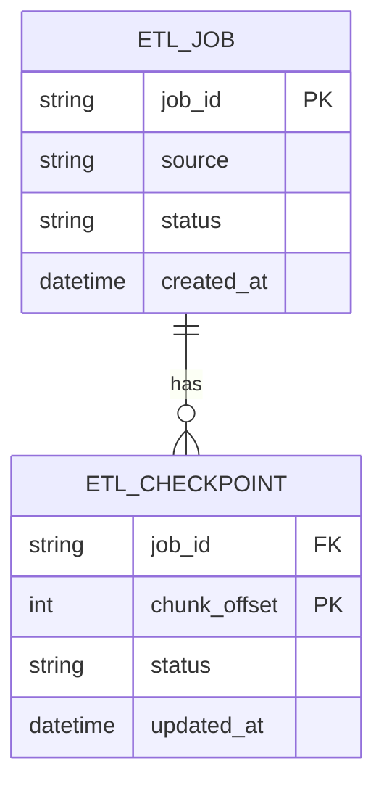
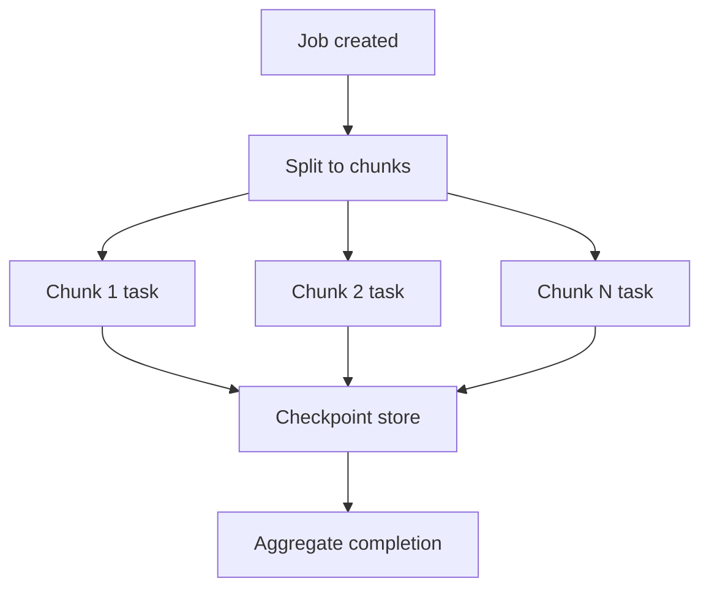

[← Назад к индексу части](index.md)
[↑ К глобальному плану](../celery_mastery_plan.md)

## 40.6 Специализированные домены

### Цель раздела

Показать, как принципы интеграции применяются в сложных практических доменах — ML и ETL — где ошибки масштаба и стоимости особенно дорогие.

### В этом разделе главное

- для ML важно управлять warm state модели и ресурсами GPU;
- для ETL критичны chunking, checkpointing и идемпотентные коммиты;
- result backend не заменяет бизнес-стейт пайплайна;
- долгие доменные задачи требуют observability и runbook на уровне этапов.

### Термины

| Термин | Значение |
|---|---|
| **Chunking** | Разбиение большого объема данных на контролируемые части. |
| **Checkpoint store** | Хранилище прогресса ETL/ML-задачи (offset, статус этапа, версия). |
| **Warm start** | Повторное использование уже загруженных ресурсов (например, ML-модели). |
| **GPU pinning** | Привязка задач к воркерам/устройствам с конкретным GPU-контуром. |

### Теория и правила

1. **ML на Celery**  
   Загрузка модели "на каждую задачу" проста, но дорого по времени. Warm model в процессе быстрее, но требует контроля памяти и версий модели.

2. **GPU-контур**  
   GPU-задачи обычно выделяют в отдельные очереди/воркеры, чтобы не блокировать CPU-поток общих задач.

3. **ETL и checkpointing**  
   Не храни критический прогресс только в result backend. Нужен явный checkpoint-store (БД/объектное хранилище/metadata table).

4. **Chunk size trade-off**  
   Малые chunk-ы дают гибкость и retry granularity, но увеличивают overhead. Большие chunk-ы снижают overhead, но увеличивают blast radius ошибки.

5. **Идемпотентность этапов**  
   Каждый chunk должен быть безопасен к повтору: upsert, dedupe key, versioned writes.

6. **Связь с нишевыми средами (часть 32)**  
   Для GPU, geo-distributed и нестандартных окружений проектируй отдельные очереди, affinity и quotas; общий worker-пул не должен быть "универсальным" по умолчанию.

### Пошагово: ETL-конвейер через Celery

1. `extract` создает список chunk-ов.
2. Каждый chunk публикуется как отдельная задача с `job_id + offset`.
3. Задача записывает checkpoint после успешной обработки chunk-а.
4. Финальный aggregator проверяет completeness по checkpoint-store, а не по "кажется все задачи прошли".
5. При сбое перезапускаются только незакрытые chunk-ы.

### Диаграмма данных ETL-checkpoint (минимальный вариант)



### Простыми словами

ETL и ML — это не "одна большая задача". Это конвейер, где важно не только доехать до финиша, но и уметь продолжить путь с ближайшей контрольной точки.

### Картинка в голове



### Как запомнить

**Result backend показывает статус задач, checkpoint-store хранит бизнес-прогресс процесса.**

### Примеры

ETL chunk payload:

```python
{
  "job_id": "etl_2026_04_23_01",
  "offset": 50000,
  "limit": 1000,
  "schema_version": 2
}
```

Checkpoint table (упрощенная SQL-идея):

```sql
CREATE TABLE etl_checkpoint (
    job_id TEXT NOT NULL,
    chunk_offset BIGINT NOT NULL,
    status TEXT NOT NULL,
    updated_at TIMESTAMPTZ NOT NULL,
    PRIMARY KEY (job_id, chunk_offset)
);
```

ML queue routing (концептуально):

```python
task_routes = {
    "ml.tasks.*": {"queue": "gpu_inference"},
    "etl.tasks.*": {"queue": "etl_batch"},
}
```

### Практика / реальные сценарии

- **ML inference:** отдельный пул GPU-воркеров с warm model, лимит concurrency и health-check на VRAM.
- **ETL nightly:** при падении на 87-м chunk-е перезапускается только хвост, а не весь job.
- **Geo ETL:** данные из нескольких регионов обрабатываются разными очередями, чтобы не блокировать друг друга из-за региональной деградации канала.

### Типичные ошибки

- использовать result backend как единственный источник "где мы сейчас";
- смешивать GPU и обычные задачи в одной очереди;
- не фиксировать `schema_version` для chunk payload.

### Что будет, если...

- **...не делать checkpointing?**  
  Любой сбой приводит к дорогому полному перезапуску и риску повторных side effects.

- **...не разделить очереди по типу нагрузки?**  
  Noisy neighbor: тяжелые задачи вытесняют легкие и ломают SLA фоновых операций.

### Проверь себя

1. Почему result backend и checkpoint-store решают разные задачи?
2. Когда warm model вреден, несмотря на ускорение?
3. Как выбрать chunk size без гадания?

<details><summary>Ответ</summary>

1) Result backend хранит техстатус попыток, checkpoint-store — бизнес-прогресс пайплайна.  
2) Когда память ограничена, модели часто меняются или процесс нестабилен; warm state может давать утечки и stale-версии.  
3) Через профиль данных и метрики: latency per chunk, error rate, стоимость retry и загрузка воркеров.

</details>

### Запомните

В доменных сценариях Celery эффективен только вместе с явным контролем прогресса, ресурсов и границ повторяемости.

---
