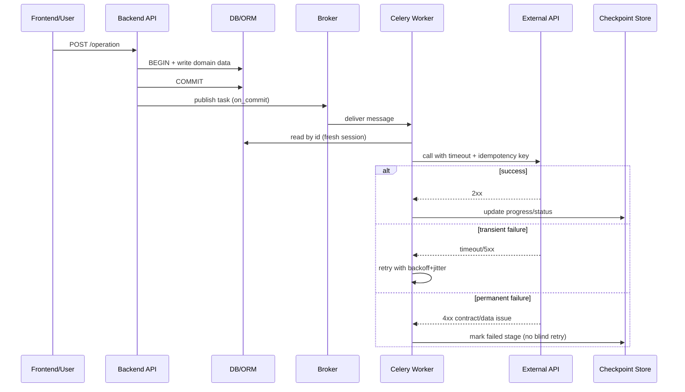

[← Назад к индексу части](index.md)
[↑ К глобальному плану](../celery_mastery_plan.md)

## End-to-end поток: клиент -> API -> Celery -> внешние системы

Зачем этот сценарий нужен: он показывает, где именно находятся контрактные границы и какие ошибки типичны на каждой из них.

#### Проверь себя: end-to-end поток

1. Где в E2E-схеме проходит критичная граница консистентности данных?
2. Почему ветка permanent failure не должна автоматически уходить в бесконечный retry?

Ответ

1) Между commit в БД и publish в broker — именно здесь решается, что увидит worker.  
2) Потому что при контрактной/валидационной ошибке повтор без изменения данных не исправляет причину.

---
