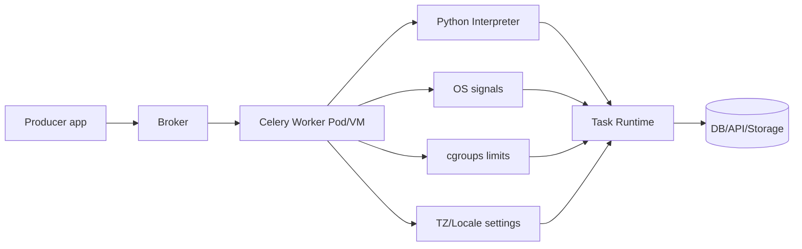
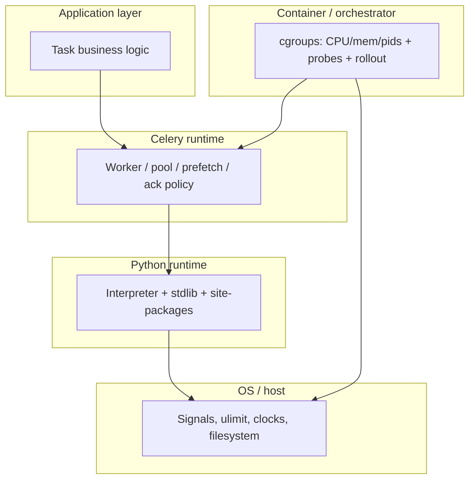

[← Назад к индексу части](index.md)
[↑ К глобальному плану](../mastery_plan.md)

## Сквозная схема среды исполнения



ASCII-образ "что реально влияет на задачу":

```text
Task code
  inside Python runtime
    inside worker process model
      inside container/VM limits
        inside OS scheduling + time settings
          inside orchestration lifecycle
```

Дополнительная "слоистая" карта (удобно для triage): где заканчивается прикладной код и начинается платформа.



Ключевая идея схемы: проблема редко живет в одном слое. Обычно инцидент — это пересечение нескольких факторов (например, CPU throttle + длинный I/O timeout + aggressive prefetch).

#### Проверь себя: сквозная модель

1. Почему "исправить код задачи" не всегда лечит operational-инцидент?
2. Какие два внешних слоя чаще всего делают код "медленным" без изменений в коде?
3. Почему на ASCII-схеме **orchestration lifecycle** стоит на самом нижнем уровне, хотя «логика задачи» кажется главной?

<details><summary>Ответ</summary>

1. Потому что корень может быть в лимитах, сигналах, сети, scheduler-е или времени, а не в логике задачи.
2. cgroup-лимиты CPU/memory и оркестрационная политика (rollout, reschedule, node pressure).
3. Потому что оркестратор может в любой момент остановить/пересоздать pod и тем самым оборвать исполнение; без учёта этого даже идеальный task-код не выполнит контракт доставки.

</details>

---

<a id="411-ос"></a>
