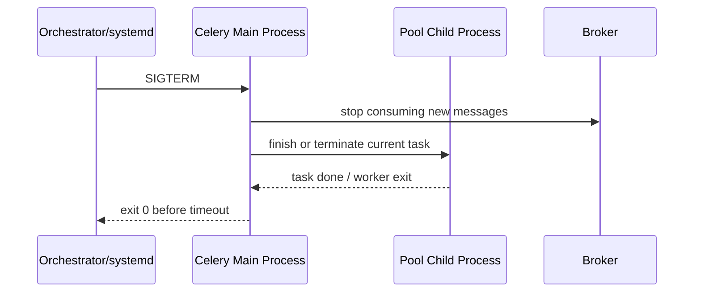

[← Назад к индексу части](index.md)
[↑ К глобальному плану](../celery_mastery_plan.md)

## 41.1 ОС

### Цель раздела

Понять, как различия между ОС влияют на модель исполнения Celery, выбор pool-а, обработку сигналов и эксплуатационную предсказуемость.

### В этом разделе главное

- production-практика Celery ориентирована прежде всего на Linux;
- поведение процессов, сигналов и fork-механики в разных ОС напрямую влияет на надежность;
- "работает на dev-машине" не гарантирует переносимость в server runtime.

#### Проверь себя: введение в 41.1

1. Чем **fork-механика** из «главного» списка связана с выбором **pool** в Celery?
2. Почему Linux как baseline важнее «списка фич Celery» при проектировании деплоя?
3. Как тезис про dev-машину соотносится с разделом про **macOS** ниже по тексту?

<details><summary>Ответ</summary>

1. `prefork` опирается на fork; без понимания процессов/сигналов/reaping нельзя предсказать поведение worker под нагрузкой и при остановке.
2. Потому что эксплуатационные контракты (cgroups, сигналы, инструменты) вокруг worker стандартизованы на Linux чаще и полнее.
3. macOS иллюстрирует тот же риск: удобный dev не заменяет проверку на Linux-рантайме, иначе «переносимость» оказывается иллюзией.

</details>

### Термины

| Термин              | Значение                                                     |
| ------------------- | ------------------------------------------------------------ |
| **Process model**   | Как ОС создает, планирует и завершает процессы.              |
| **Signal handling** | Реакция процесса на `SIGTERM`, `SIGINT`, `SIGKILL` и др.     |
| **Fork**            | Копирование процесса; база prefork-модели Celery.            |
| **Spawn**           | Альтернатива fork с более дорогим запуском и иным lifecycle. |
| **Reaping**         | Очистка завершившихся дочерних процессов родителем.          |

#### Проверь себя: термины 41.1

1. Чем **Spawn** принципиально отличается от **Fork** с точки зрения наследования состояния?
2. Почему **Reaping** вынесен в термины рядом с **Signal handling**?
3. Как **Process model** ОС влияет на то, будет ли `SIGTERM` «вежливым» на практике?

<details><summary>Ответ</summary>

1. Fork копирует адресное пространство; spawn стартует интерпретатор/процесс заново с другим набором начального состояния и стоимости запуска.
2. Потому что корректная обработка завершения детей связана с сигналами `SIGCHLD` и обязанностями родителя/PID1 в контейнере.
3. Process model + оркестратор задают, кому доставляется сигнал, есть ли grace и кто reap-ит детей; без этого `SIGTERM` остаётся «правильным в теории».

</details>

### Теория и правила

1. **Linux как baseline**  
   Большинство production-кейсов Celery строится на Linux: зрелая сигнализация, cgroups, predictable fork/prefork, лучшая совместимость инструментария мониторинга.

2. **macOS как dev-окружение**  
   Подходит для разработки и тестов, но не как "истина production". Различия в системных лимитах, scheduler-нюансах и сетевом стеке могут скрыть реальные проблемы.

3. **Windows и ограничения**  
   См. отдельный подраздел [Windows: пулы, пути, песочница и что **официально**](#windows-пулы-пути-песочница-и-что-официально): в FAQ Celery прямо сказано, что Windows не является _поддерживаемой_ платформой, поэтому "работает на моем ПК" != "эксплуатационно безопасно", даже если запускается.

4. **Сигналы и корректная остановка**  
   Worker должен получать и корректно обрабатывать `SIGTERM` для graceful shutdown. Если среда доставляет только жесткую остановку, ты получаешь больше redelivery и "грязных" завершений.

5. **Файловые дескрипторы и ulimit**  
   Низкие лимиты по fd приводят к "случайным" ошибкам сети/брокера под нагрузкой. Платформа должна быть подготовлена заранее.

### Linux, сигналы, отличия Windows/macOS

<a id="linux-сигналы-отличия-windowsmacos"></a>

**Linux (основной production target):** это эталонная площадка для `prefork` (process pool), cgroups, нормальной работы `SIGTERM` и предсказуемого reaping child-процессов.

**Сигналы, которые важно понимать на практике:**

- **`SIGTERM`:** вежливая просьба завершиться. В хорошем сценарии worker успевает завершить/осторожно прервать текущую работу, корректно отпустив ресурсы.
- **`SIGKILL`:** "убийство" процесса. Не ловится, нельзя обработать. Это частая причина "обрывов" задач при таймаутах оркестраторов, если `SIGTERM` не сработал вовремя.
- **`SIGHUP`:** иногда прилетает от терминалов/сервис-менеджеров, но в production чаще важнее именно `SIGTERM` + grace period.
- **`SIGCHLD`:** уведомляет **родителя** о завершении/останове дочернего процесса; дальше родитель обязан **reap** (считать exit code) — иначе child превращается в zombie. В `prefork` у Celery это часть "дерева процессов", поэтому косвенно связано с init-wrapper/PID1 (см. [41.3 — PID1, reaping](#pid1-reaping-init-wrapper)).
- **Ограничение:** не все "удобные" сигналы/механики remote control ведут себя одинаково в разных ОС — поэтому Linux проще сопровождать по runbook-ам.

#### Проверь себя: Linux и сигналы

1. Почему `SIGTERM` важнее, чем "правильный код задачи" при деплое?
2. Почему `SIGKILL` почти никогда не "лечит" проблему, а только ухудшает диагностику?
3. Зачем в triage знать про **`SIGCHLD` + reaping**, если «главный» сигнал остановки — `SIGTERM`?

<details><summary>Ответ</summary>

1. Потому что деплой/оркестратор завершает процессы сигналами, и если shutdown не встроен в эксплуатационный сценарий, задача заканчивается на полпути, не по бизнес-логике.
2. Потому что процесс исчезает без шанса записать лог, аккуратно сходить в БД, завершить идемпотентность и снять метрики: остается только симптом "пропало".
3. Потому что в `prefork` дочерние процессы постоянно завершаются и порождаются; без корректного reaping накапливаются zombie и деградирует дерево процессов, что маскируется под «странный pool» и плохой shutdown.

</details>

### Windows: пулы, пути, песочница и что **официально**

<a id="windows-пулы-пути-песочница-и-что-официально"></a>

**Официальная рамка (важно зафиксировать ментально):** в FAQ Celery прямо говорится, что **Windows не является поддерживаемой платформой** (начиная с `4.x`), из-за ограниченности ресурсов сопровождения; при этом отмечается, что _может_ работать, и патчи приветствуются. См. документацию: [Frequently Asked Questions](https://docs.celeryq.dev/en/stable/faq.html#does-celery-support-windows).

**Что это значит тебе как инженеру:**

- **для real production** почти всегда правильный ответ: **Linux** (включая WSL2/Docker/VM) как runtime для worker-ов;
- **для Windows-ноутбука/корпоративного ПК** можно разрабатывать, но нужно заранее планировать **переезд на Linux** в CI/стендах.

**Пулы, сигналы, процессы (интуиция, без "магии"):**

- `prefork` опирается на **fork/мультипроцессную** модель, которая в Unix-мире "родная", а в Windows исторически устроена иначе.
- на Windows сценарий часто сводят к:
  - **`--pool=solo`**: один worker-процесс, последовательная обработка (удобно для dev, плохо для throughput, если тебе нужен настоящий параллелизм);
  - **`--pool=threads`**: конкурентность, но **GIL** может ограничивать CPU-bound (см. части про `08/16`).

**Пути и ввод/вывод (почему "на Windows падает импорт"):**

- `\\` vs `/`, `C:\...` vs относительные пути;
- `PYTHONPATH` и регистр букв в путях;
- line endings, кодировки (`UTF-8` vs `cp1251` в старых контурах);
- права/антивирус, которые "замедляют" сетевые/файловые операции (проявляется как хаотичные задержки).

**Практичный вывод (коротко):** если в организации _настаивают_ на Windows, закладывай риск: отдельный runbook, отдельные тесты, **и** план миграции в Linux-контейнеры.

#### Проверь себя: Windows

1. Как "официальная неподдержка" Windows меняет твой risk management?
2. Почему `solo` часто "работает в деве", но плохо масштабируется в проде на CPU-bound?
3. Почему «пути и кодировки» на Windows — это не косметика, а источник **drift** относительно Linux CI?

<details><summary>Ответ</summary>

1. Потому что баги/особенности могут всплывать вне основной тест-матрицы релизов Celery, и ты сильнее зависишь от локальных костылей.
2. `solo` обычно обрабатывает по одной задаче/ограниченно конкурентно, а CPU-bound throughput часто требует процессного параллелизма и разделения по worker-ам.
3. Потому что импорты, `PYTHONPATH`, регистр путей и кодировки дают «зелёный» локальный запуск, который ломается в Linux-контейнере с другим FS и locale — без явного CI на target-ОС это выглядит как «Celery сломан».

</details>

### macOS: dev-особенности

<a id="macos-dev-особенности"></a>

**Зачем отдельный подпункт:** macOS — отличный dev-компьютер, но он часто "врет" в вопросах, которые в Linux-кластерах важны:

- **case sensitivity** файлов: macOS чаще case-insensitive, Linux чаще case-sensitive. Импорты/шаблоны "случайно" работают на Mac и ломаются в Linux.
- **сетевой стек и Docker Desktop:** пинг/latency и особенно volume mount могут вести себя иначе, чем в Linux container runtime.
- **Apple Silicon (arm64):** другие wheels, другие нюансы numpy/крипто-библиотек.

**Практичный dev-паттерн:** "код пишу на Mac, **истину** проверяю в Linux (docker-compose/k8s/minikube) на том же lockfile-е".

#### Проверь себя: macOS dev

1. Как case sensitivity ведет к инциденту "у меня в Docker импорты не сходятся"?
2. Почему dev на arm64 важно сверить с target-архитектурой (часто amd64) перед релизом?
3. Чем **Docker Desktop на Mac** опасен для оценки latency Celery к брокеру по сравнению с Linux node?

<details><summary>Ответ</summary>

1. Потому что пути, которые "случайно" уникальны в case-insensitive FS, не уникальны в Linux, и `import`/`open()` начинают вести себя иначе.
2. Потому что бинарные пакеты и perf могут отличаться; "не собралось" или "тесты прошли" не гарантируют идентичный runtime.
3. Потому что сетевой путь и volume mount часто добавляют прокладку/особенности, не совпадающие с production Linux; метрики round-trip и I/O к брокеру/диску на Mac не переносятся «как есть».

</details>

### Сравнение платформ: что реально меняется для Celery

| Платформа                | Что обычно хорошо                                     | Что рискованно                                                             | Практический вывод                                                         |
| ------------------------ | ----------------------------------------------------- | -------------------------------------------------------------------------- | -------------------------------------------------------------------------- |
| **Linux (production)**   | Предсказуемые сигналы, cgroups, зрелая process-модель | Неправильные `ulimit`/sysctl при росте нагрузки                            | Базовый и рекомендуемый выбор для production                               |
| **macOS (dev/staging)**  | Удобная локальная разработка                          | Поведение под нагрузкой не равно Linux cluster                             | Использовать для разработки, а не как эталон нагрузки                      |
| **Windows (спец-кейсы)** | Вписывается в корпоративные окружения                 | Ограничения process/signal-сценариев, сложнее воспроизводить Linux-runbook | Для production только при осознанном ограниченном scope и отдельных тестах |

#### Проверь себя: сравнение платформ

1. Почему в таблице для macOS в колонке «рискованно» акцент на **нагрузке**, а не на «багах Celery»?
2. В каком случае строка про Windows **не** запрещает production, но меняет архитектурные обязательства?
3. Что общего у трёх строк таблицы с точки зрения **runbook** (сигналы, лимиты, пулы)?

<details><summary>Ответ</summary>

1. Потому что macOS чаще ломает именно **экстраполяцию perf и лимитов** в Linux-кластер, а не базовый запуск одного worker-а.
2. Когда scope осознанно узкий, есть отдельные тесты и план миграции в Linux-рантайм; иначе «спец-кейс» превращается в скрытый долг.
3. Везде нужно явно зафиксировать: модель процессов/сигналов, лимиты fd/pids, выбор pool и сценарии graceful shutdown — просто приоритеты и «дефолтная безопасность» различаются.

</details>

### Диаграмма: путь сигнала остановки



#### Проверь себя: путь сигнала остановки

1. Почему на диаграмме сначала **Main** взаимодействует с **Broker**, а не сразу **Child**?
2. Что означает для диспетчера очереди шаг «finish or terminate current task» при уже присланном `SIGTERM`?
3. Почему важно уложиться в «exit 0 before timeout» с точки зрения **идемпотентности**?

<details><summary>Ответ</summary>

1. Потому что главный процесс координирует pool: сначала нужно остановить потребление новых сообщений и распорядиться детьми, иначе получится гонка «ещё берём из брокера» vs shutdown.
2. Это граница между graceful completion и принудительным обрывом: часть задач успеет завершиться, часть может быть прервана и уйдёт в redelivery — это надо учитывать в ack/retry политике.
3. Если timeout оркестратора истекает, прилетает жёсткая остановка без шанса на drain; идемпотентность и «чистые» side-effects должны переживать такие обрывы.

</details>

### Пошагово: platform readiness для ОС

1. Зафиксируй Linux как production baseline в архитектурном документе.
2. Проверь модель процессов и сигналов на целевой платформе.
3. Настрой `ulimit` (fd/processes) и системные лимиты заранее.
4. Прогони тест graceful shutdown на staging.
5. Добавь platform-check в release checklist.

#### Проверь себя: platform readiness (ОС)

1. Почему пункт «зафиксировать Linux baseline в документе» стоит **первым**, а не после настройки `ulimit`?
2. Как шаг 4 (staging shutdown) связан с шагом 2 (модель сигналов)?
3. Что именно должно попасть в **platform-check** релиза, чтобы он не свёлся к «запустили smoke-task»?

<details><summary>Ответ</summary>

1. Потому что без зафиксированного target-рантайма команда бессмысленно тюнит лимиты под «абстрактный прод».
2. Shutdown на staging должен воспроизводить ту же цепочку сигналов/таймаутов, что и в проде; иначе тест «прошёл», а при деплое другой grace/kill.
3. Минимум: согласованные `SIGTERM`/`TimeoutStopSec` или аналог, проверка fd/pids под нагрузкой, сравнение pool с прод-политикой, явный чеклист для macOS/Windows dev vs Linux prod.

</details>

### Простыми словами

ОС — это "фундамент здания". Можно сделать красивый интерьер (код задач), но если фундамент подвижный или не рассчитан на нагрузку, здание будет трещать в неожиданных местах.

### Картинка в голове

```text
ОС -> процессы -> worker -> задачи
Если нижний слой нестабилен, верхний не спасает.
```

### Как запомнить

**Celery любит предсказуемую платформу. В production это почти всегда Linux + проверенные лимиты + корректные сигналы.**

### Примеры

Проверка лимитов fd и процессов в Linux:

```bash
ulimit -n
ulimit -u
cat /proc/sys/fs/file-max
cat /proc/self/limits
```

Systemd unit с корректным остановом:

```ini
[Service]
ExecStart=/venv/bin/celery -A app worker -l INFO
TimeoutStopSec=120
KillSignal=SIGTERM
Restart=always
```

Быстрый health-check сигналов в процессе:

```bash
ps -o pid,ppid,comm -p $(pgrep -f "celery.*worker" | head -n 1)
kill -TERM <worker_pid>
```

#### Проверь себя: команды и systemd для ОС

1. Зачем смотреть и `ulimit -n`, и `cat /proc/self/limits`, а не один из вариантов?
2. Почему в unit важен **`TimeoutStopSec`**, а не только `KillSignal=SIGTERM`?
3. Чем рискован `kill -TERM` по `pgrep` в проде по сравнению с управляемым restart через оркестратор?

<details><summary>Ответ</summary>

1. `ulimit` показывает shell/процессные soft limits, а `/proc/self/limits` даёт жёсткую картину для текущего процесса; расхождения часто объясняют «на пике» сюрпризы.
2. Оркестратор/systemd ждут завершения ограниченное время; без адекватного timeout сигнал остаётся «правильным», но процесс всё равно убьют жёстко.
3. Легко послать сигнал не тому PID или прервать не тот worker; в проде предпочтительны контролируемые rolling restart и метрики, а ручной kill — только в triage с пониманием последствий.

</details>

### Практика / реальные сценарии

- **Инцидент "worker висит при деплое":** root cause — платформа отправляет `SIGKILL` слишком рано, задача не успевает завершиться.
- **Инцидент "раз в день отваливаются соединения":** root cause — низкий `ulimit -n`, исчерпание дескрипторов на пике.
- **Инцидент "на macOS быстро, на Linux медленно":** root cause — разные лимиты CPU/memory и иная конкуренция процессов в реальном кластере.

#### Проверь себя: практика по ОС

1. Как отличить инцидент «**SIGKILL слишком рано**» от «**низкий ulimit**» по внешним симптомам в первые минуты?
2. Почему «worker висит при деплое» часто оказывается **платформенным** таймаутом, а не «зависшим» Python-кодом?
3. Какой минимальный эксперимент на staging докажет гипотезу про fd exhaustion?

<details><summary>Ответ</summary>

1. SIGKILL/короткий grace даёт всплеск `WorkerLost`/redelivery около деплоя; ulimit обычно проявляется **на пике** нагрузки без привязки к релизу, с сетевыми/брокерными ошибками и ростом открытых соединений.
2. Потому что оркестратор не ждёт завершения долгой задачи: процесс жив, но платформа его убивает — это выглядит как «hang», хотя корень в политике остановки.
3. Нагрузочный прогон с измерением открытых fd (`/proc/<pid>/fd` count), мониторинг ошибок `EMFILE`/connection reset и сравнение с лимитом до/после увеличения `ulimit -n` в том же образе.

</details>

### Типичные ошибки

- принимать поведение локальной ОС за эталон production;
- не тестировать graceful shutdown в реальной среде;
- игнорировать `ulimit` и системные лимиты;
- запускать Celery в "экзотической" платформе без отдельного compatibility-плана.

### Что будет, если...

- **...не учитывать сигналы ОС?**  
  Повысится число недозавершенных задач и повторной доставки.

- **...не контролировать лимиты fd?**  
  Появятся периодические сетевые ошибки и нестабильный consume из брокера.

### Проверь себя

1. Почему Linux обычно выбирают как стандартную платформу для Celery production?
2. Как связаны корректные сигналы и идемпотентность задач?
3. Почему "локально все работает" не доказательство platform readiness?

<details><summary>Ответ</summary>

1. Из-за зрелой process/signal модели, лучшей совместимости и более предсказуемого поведения под нагрузкой.
2. При жесткой остановке задачи чаще выполняются повторно, поэтому идемпотентность должна учитывать platform-failures.
3. Локальная среда редко воспроизводит лимиты, сетевые задержки и конкуренцию реального production.

</details>

### Запомните

Платформа ОС — не фон, а часть контракта надежности Celery.

---

<a id="412-интерпретатор"></a>
