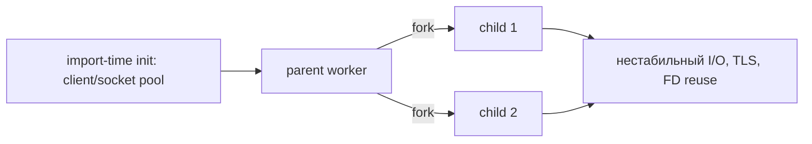

[← Назад к индексу части](index.md)
[↑ К глобальному плану](../../mastery_plan.md)

## 41.2 Интерпретатор

### Цель раздела

Разобраться, как версия Python, совместимость зависимостей и особенности runtime влияют на корректность и производительность задач Celery.

### В этом разделе главное

- версия Python и стек библиотек должны быть согласованы как единый runtime-контур;
- бинарные зависимости и ABI могут ломать worker без явных ошибок в коде задач;
- performance-профиль задач зависит от взаимодействия GIL, C-расширений и модели concurrency;
- в `prefork` критична **fork-safety** import-time глобальных клиентов (см. [Prefork и fork-safety](#prefork-и-fork-safety-глобальные-объекты-после-fork)).

#### Проверь себя: введение в 41.2

1. Почему **runtime-контур** шире, чем версия `celery` в `requirements.txt`?
2. Как ABI связан с фразой «падает без явных ошибок в коде задач»?
3. Зачем в «главном» сразу отсылают к **fork-safety**, а не только к версии Python?

<details><summary>Ответ</summary>

1. Потому что в контур входят транзитивные зависимости, нативные колёса и политика сборки образа — всё это меняет поведение без изменения тела задачи.
2. Несовместимый wheel/`.so` может падать в нативном коде с коротким трейсом или рестартами процесса, что выглядит не как обычное Python-исключение в бизнес-логике.
3. Потому что типичный production Linux использует `prefork`; без fork-safety самый «правильный» Python не спасает от наследования сокетов.

</details>

### Термины

| Термин                  | Значение                                                            |
| ----------------------- | ------------------------------------------------------------------- |
| **ABI**                 | Двоичный контракт между интерпретатором и расширениями.             |
| **Wheel compatibility** | Совместимость собранного пакета с вашей платформой/интерпретатором. |
| **GIL**                 | Global Interpreter Lock, влияющий на CPU-конкурентность в потоках.  |
| **Manylinux**           | Стандарт сборки Python wheel для Linux-совместимости.               |
| **Runtime drift**       | Расхождение версий Python/библиотек между средами.                  |

#### Проверь себя: термины 41.2

1. Чем **Manylinux** помогает именно **контейнерному** Linux, а не разработчику на Mac?
2. Почему **Wheel compatibility** — это не то же самое, что «пакет есть на PyPI»?
3. Какой практический смысл у термина **Runtime drift** для CI?

<details><summary>Ответ</summary>

1. Manylinux задаёт ожидаемый набор libc/ядра для бинарных колёс; в целевом Linux-образе это определяет, загрузится ли `.so`.
2. PyPI гарантирует наличие артефакта, но не гарантирует wheel под вашу связку Python+arch+glibc; иначе сборка уедет в sdist/локальную компиляцию.
3. CI должен ловить расхождение lockfile/образа с prod; drift — это когда «зелёный» pipeline не воспроизводит поставку.

</details>

### Теория и правила

1. **Единая версия Python по контуру**  
   Producer, worker и tooling должны быть согласованы по поддерживаемым версиям. Разные minor-версии без контроля часто приводят к subtle bug-ам.

2. **Зависимости — часть платформы**  
   Для Celery критичны не только `celery`, но и `kombu`, `billiard`, serializer-библиотеки, драйверы БД, сетевые клиенты. Несовместимая комбинация может дать падения в runtime.

3. **Бинарные расширения и ABI**  
   Если задача использует numpy/pandas/crypto/ML-библиотеки, проверяй wheel-совместимость с образом и Python-версией. Иначе "падает только в проде".

4. **GIL и выбор модели**  
   Для CPU-bound задач threads редко дают линейный рост. Prefork/process-level параллелизм чаще предсказуемее, но требует контроля памяти.

5. **Интерпретатор и latency**  
   На больших объемах serialization/deserialization версия Python и выбранная библиотека могут давать заметный вклад в e2e latency.

#### Проверь себя: теория интерпретатора

1. Почему пункт «зависимости — часть платформы» важнее маркетингового «мы используем только Celery»?
2. Как правило про **GIL** связано с выбором **prefork** и риском по памяти?
3. Что такое **runtime drift** на практике между dev, CI и prod?

<details><summary>Ответ</summary>

1. Потому что worker падает/деградирует из-за `kombu`/драйвера/сериализатора так же часто, как из-за кода задачи; без единого контура версий triage уходит в хаос.
2. Threads редко дают линейный рост CPU-bound из-за GIL, поэтому выбирают процессы; каждый процесс несёт свой RSS → суммарная память растёт быстрее, чем у одного потокового пула.
3. Это расхождение minor Python, lockfile, архитектуры CPU и набора wheels: «зелёно» в одной среде и «падает в рантайме» в другой при том же исходнике.

</details>

### Минимальная версия Python: как читать из фактов, а не "на ухо"

<a id="минимальная-версия-python-как-читать-из-фактов-а-не-на-ухо"></a>

**Принцип:** Celery (как и любой серьёзный пакет) объявляет совместимость через **packaging metadata** — это единственный "истинный" ориентир **для твоей конкретной установленной версии**.

1. В контейнере/venv на production:

```bash
python -c "import importlib.metadata as m; print(m.metadata('celery')['Requires-Python'])"
```

2. Если нужно "как в исходниках репозитория" (пример: вы сверяете пинning при security review) — `python_requires` в `setup.cfg/setup.py` конкретного git tag/релиза.

**Частая ошибка:** copy-paste `requires-python` из чужого `pyproject.toml` учебника, который не совпадает с тем `celery`, который у тебя реально в проде.

**Ориентир-факт (пример, почему нельзя "угадать глазами"):** в релизных ветках `5.x` у пакета обычно встречается `python_requires` вида `>=3.9`, но **конкретная** нижняя граница для **твоей** установки всегда берется из `Requires-Python` (см. команду выше), а не из "памятки" из статьи.

**Практичное правило релизов:** bump Python — это **отдельный** change management шаг, не меньше, чем bump Redis/Rabbit.

#### Проверь себя: минимальная версия

1. Почему "поддержка Python 3.8 в новостях старых релизов" не гарантирует, что **твой** текущий Celery стартует на 3.8?
2. Где в системе "истина" — в документации или в metadata установленного пакета?
3. Почему bump Python сравнивают с bump брокера, а не с «косметическим» рефакторингом?

<details><summary>Ответ</summary>

1. Потому что с новыми major/minor релизами Celery меняет диапазон `Requires-Python`, а старые релиз-ноуты — исторический контекст, а не контракт твоей установки.
2. Для твоей конкретной поставки истина — `Requires-Python` в установленной сборке; документация должна совпадать, но в споре verification побеждает `importlib.metadata`.
3. Потому что меняется ABI, поведение stdlib, совместимость wheels и транзитивных пакетов — это org-wide change с откатом и пересборкой образов, как при смене major инфраструктуры.

</details>

### PyPy: когда это может быть выгодно

<a id="pypy-когда-это-может-быть-выгодно"></a>

**PyPy** — альтернативный Python с JIT, который ускоряет много _чистого_ Python кода, но ведет себя иначе в части C-расширений.

**Плюсы (потенциально):**

- ускорение CPU-heavy _python-only_ кода;
- снижение нагрузки в некоторых сценариях сериализации/парсинга (на практике — только если профилирование подтвердило).

**Минусы/риски:**

- нативные расширения: часть пакетов требует отдельных wheel/сборок и может деградировать в perf;
- комбинация `prefork` + специфичные библиотеки = больше edge cases, чем на CPython.

**Практичное правило:** PyPy — это _осознанный_ эксперимент "по метрикам", а не дефолт для "просто Celery".

#### Проверь себя: PyPy

1. Почему "ускорит Python" не всегда ускорит Celery end-to-end?
2. Какой сигнал в профилировании укажет, что PyPy потенциально полезен?
3. Почему сочетание **PyPy + prefork + тяжёлые C-расширения** часто хуже «дефолтного» CPython для операционной предсказуемости?

<details><summary>Ответ</summary>

1. Потому что e2e включает сеть, брокер, БД, сериализацию, а иногда 90% времени вне "чистого" Python.
2. Когда в flamegraph/профайлере CPU реально в горячем pure-python, а не в I/O, и метрика подтверждается A/B.
3. Потому что C-расширения могут уйти в медленный путь или несовместимую сборку, а prefork добавляет fork-semantics; растёт число edge cases при том же runbook.

</details>

### Free-threading / subinterpreters: риск и правило безопасности

<a id="free-threading--subinterpreters-риск-и-правило-безопасности"></a>

**Термины (простыми словами):**

- **Free-threading (no-GIL / PEP 703+экосистема):** тренд, где Python постепенно уходит от классического GIL, но _библиотечная_ совместимость ещё "догоняет".
- **Subinterpreters:** модель, где внутри одного процесса существуют отдельные "виртуальные интерпретаторы" с разной степенью изоляции (зависит от версии/экспериментальности).

**Правило safety для Celery production:**

- не смешивай это с "обычной" схемой `prefork + библиотеки с глобальным состоянием`, пока:
  1. не уверен в совместимости _всех_ C-зависимостей;
  2. не снял A/B тест;
  3. не согласовал rollback/наблюдаемость.

**Простыми словами:** free-threading/subinterpreters — это "новая подвеска" у спорткара. Она может быть крутой, но сначала проверяют гоночный круг, а не покупают в семейный минивэн "на всякий случай".

#### Проверь себя: free-threading

1. Почему "новый CPython" не равен "можно в прод без A/B" для Celery?
2. Какой минимум доказательств нужен, чтобы сказать: "включаю это на worker pool"?
3. Почему **subinterpreters** опасно смешивать с библиотеками с **глобальным состоянием**, даже если «в документации Python звучит круто»?

<details><summary>Ответ</summary>

1. Потому что стек библиотек и расширений часто отстает, а Celery нагружен I/O+fork+concurrency+сериализацией.
2. Набор smoke/load тестов на целевом стеке, сравнение p95, отсутствие segfault, корректный remote control, контроль rollback.
3. Потому что изоляция «виртуальных интерпретаторов» не отменяет реальность нативных библиотек и их глобальных lock/кешей; Celery-задачи тянут тот же процессный мир, что и раньше.

</details>

### Prefork и fork-safety: что наследует child после `fork()`

<a id="prefork-и-fork-safety-глобальные-объекты-после-fork"></a>

**Зачем это в части про интерпретатор:** `prefork` = родительский процесс `fork()`-ит детей, а дети **наследуют** копию адресного пространства и **открытые файловые дескрипторы** (сокеты, pipe-ы) на уровне ОС. Это не "баг Celery" — это контракт Unix, который легко нарушить библиотеками, если **инициализировать тяжёлые клиенты на import-time** (до того, как пул детей создан).

**Типовые опасные классы "наследия":**

- **ORM/DB pool** и "один engine на весь модуль": в child оказывается сокет/состояние, которое _ожидало_ другой process model;
- **gRPC/HTTP/Redis клиенты** с keep-alive, созданные глобально при старте;
- **OpenSSL / libcrypto / нативные** объекты, чей internal state нельзя честно разделить между процессами после `fork` без re-init;
- **locks/thread state** (редко, но больно), если библиотека не рассчитана на child после fork.

**Практичные правила (production mindset):**

1. **Ленивое создание** дорогих клиентов: создавай соединения **внутри** задачи (или в явном per-process hook), а не на уровне import side-effects.
2. **Явно измеряй** эффект `max_tasks_per_child` / `worker_max_memory_per_child`: это и про утечки, и про "периодически обнулить подозрительный процесс" (см. часть `08`).
3. **Не путай** "потоки внутри tasks" с **prefork** на уровне pool: сочетай только осознанно; иначе получишь комбинированные deadlock/GIL-истории, которые среда усугубляет.

**Mermaid: почему "глобальный клиент" и prefork плохо сочетаются**



#### Проверь себя: fork-safety

1. Почему "один глобальный gRPC-канал в модуле" опасен именно в `prefork`?
2. Какой operational-симптом чаще всего маскируется под "рандомные" ошибки сети/БД, хотя root cause в fork+глобальном state?
3. Зачем в triage временно крутить **`max_tasks_per_child`**, если подозрение на «грязный» child после долгой жизни?

<details><summary>Ответ</summary>

1. Потому что дети наследуют сокет/состояние, которое библиотека не готова "разделять" честно между ними без повторной инициализации.
2. `connection already closed`, `SSL`/`TLS` errors, "иногда" segfault, зависания на I/O, странные `OperationalError` у БД, которые не воспроизводятся на `solo`/threads.
3. Чтобы ускоренно сбросить процесс с накопленным мусором/подозрительным native state и проверить, исчезает ли «рандом» при ротации детей (диагностика, не финальное лечение архитектуры).

</details>

### Матрица решений по интерпретатору и пакетам

| Вопрос                       | Безопасный выбор                                                             | Рискованный выбор                          | Почему это важно                                                           |
| ---------------------------- | ---------------------------------------------------------------------------- | ------------------------------------------ | -------------------------------------------------------------------------- |
| Версия Python                | Одна целевая minor-версия во всем контуре                                    | Разные minor-версии в producer/worker      | Риск недетерминированных ошибок и сложного rollback                        |
| Бинарные зависимости         | Проверенные wheels под целевую архитектуру                                   | "Соберется в рантайме" без проверки ABI    | Падения в runtime и нестабильность под нагрузкой                           |
| Обновления                   | Canary + smoke + rollback plan                                               | "Обновим всё сразу"                        | Ошибки совместимости сложно откатить быстро                                |
| Архитектура CPU              | Явная поддержка x86_64/arm64                                                 | Разнородные node без тестов                | Разный perf и несовместимые бинарные сборки                                |
| Prefork + глобальные клиенты | Ленивая init внутри задачи / per-child hooks, контроль `max_tasks_per_child` | Глобальные сокет-пулы/ORM engine на import | Нестабильные I/O, TLS, DB errors, "редкие" segfault в нативных библиотеках |

#### Проверь себя: матрица интерпретатора

1. Почему строка про **minor Python** важнее, чем «везде одинаковый major 3.x»?
2. В каком случае «canary + rollback» важнее скорости выката, чем semver зависимостей?
3. Как по матрице объяснить инцидент «на x86_64 ок, на arm64 падает только numpy»?

<details><summary>Ответ</summary>

1. Minor меняет поведение stdlib, pickle, typing и совместимость wheels; одинаковый major маскирует subtle баги и разный perf.
2. Когда затронуты нативные колёса и долгоживущие worker-ы: ошибка проявляется под нагрузкой, а откат должен быть быстрее, чем расследование segfault в проде.
3. Разные бинарные сборки и SIMD-пути под архитектуру; матрица требует явной проверки wheels на **каждой** целевой архитектуре, а не «собралось где-то».

</details>

### Граничные случаи для интерпретатора

- **Смешанный кластер архитектур:** даже при одинаковой версии Python поведение может отличаться из-за разных wheels и SIMD-оптимизаций.
- **Долгоживущие процессы и GC:** latency может "пульсировать", если в задаче накапливаются большие объекты и нет ротации `max_tasks_per_child`.
- **Тяжелые сериализаторы:** большой payload с частым JSON encode/decode может стать bottleneck быстрее, чем сама бизнес-логика.
- **Prefork + глобальные I/O-ресурсы на import:** дети наследуют сокеты/состояние; см. [Prefork и fork-safety: что наследует child после fork()](#prefork-и-fork-safety-глобальные-объекты-после-fork).

#### Проверь себя: граничные случаи интерпретатора

1. Почему **одинаковая версия Python** на arm64 и x86_64 не гарантирует одинаковый runtime для ML-стека?
2. Как «пульсирующая» latency связана с **долгоживущим процессом** и GC без ротации child?
3. Почему тяжёлый JSON в задаче может «убить» SLO раньше, чем «медленная бизнес-логика»?

<details><summary>Ответ</summary>

1. Потому что wheels и нативные оптимизации различаются; один и тот же код может вызывать разные нативные пути и падать только на одной архитектуре.
2. Накопление крупных объектов и долгие паузы GC дают периодические всплески p99; ротация child ограничивает рост долгоживущего heap в одном процессе.
3. Сериализация/десериализация больших payload на горячем пути доминирует в CPU и памяти; оптимизация домена не поможет, пока контракт сообщения не сжат.

</details>

### Пошагово: runtime compatibility checklist

1. Зафиксируй поддерживаемую матрицу версий Python + Celery + ключевых зависимостей.
2. Заморозь зависимости (`lockfile/constraints`) и синхронизируй с CI.
3. Проверь wheel/ABI-совместимость для тяжелых библиотек.
4. Прогони smoke-тесты worker на целевой архитектуре (x86_64/arm64).
5. Добавь runtime health-check в релизный pipeline.

#### Проверь себя: runtime compatibility checklist

1. Зачем в шаге 2 явно **синхронизировать lockfile с CI**, а не только с prod-образом?
2. Почему шаг 4 требует smoke **на целевой архитектуре**, а не «на любом runner»?
3. Что должно вернуть **runtime health-check** в pipeline, чтобы он был полезнее `python -c "import celery"`?

<details><summary>Ответ</summary>

1. Потому что CI — это gate: если lockfile «плавает», зелёный пайплайн не гарантирует воспроизводимый артефакт, который уедет в prod.
2. Потому что ABI/wheels и даже размер указателя отличаются; баги «только на arm» не поймаешь на amd64-only CI.
3. Минимум: версии `celery/kombu/billiard`, платформа, успешный импорт критичных нативных зависимостей и короткий I/O к брокеру/БД в том же образе, что и деплой.

</details>

### Простыми словами

Интерпретатор — это "двигатель", на котором едет твоя задача. Если топливо (библиотеки) и детали (ABI) не подходят, машина или не поедет, или начнет ломаться под нагрузкой.

### Картинка в голове

```text
Python version + dependency graph + platform wheels
           = runtime envelope
Если envelope нестабилен, Celery только проявит эту нестабильность.
```

### Как запомнить

**Один runtime-контур, одна версия политики, одна матрица совместимости.**

### Примеры

Фрагмент `pyproject.toml` с фиксированной поддержкой:

```toml
[project]
# ВАЖНО: нижняя граница Python должна следовать `Requires-Python`/`python_requires` твоей версии Celery.
# Сверь: python -c "import importlib.metadata as m; print(m.metadata('celery')['Requires-Python'])"
requires-python = ">=3.9"
dependencies = [
  # Пример политики: верх-уровневые диапазоны + фиксация в lockfile/prod-контракте, а не "магический" pin в туториале
  "celery>=5.3,<6",
  "kombu>=5.3.4",
  "redis>=5.0"
]
```

Проверка версии и зависимостей на worker:

```bash
python -V
python -c "import celery, kombu, billiard; print(celery.__version__, kombu.__version__, billiard.__version__)"
python -c "import platform, struct; print(platform.machine(), struct.calcsize('P')*8)"
```

Мини smoke-task для runtime:

```python
from celery import shared_task

@shared_task
def runtime_smoke():
    import platform
    import sys
    return {
        "python": sys.version,
        "platform": platform.platform(),
    }
```

Проверка набора wheel и потенциальных конфликтов:

```bash
python -m pip check
python -m pip freeze | grep -E "^(celery|kombu|billiard|redis|amqp)="
```

#### Проверь себя: примеры команд и smoke-task

1. Зачем в одном блоке и `python -V`, и `platform.machine()`, если версия Python уже известна из Dockerfile?
2. Почему `pip check` — слабый, но полезный **ранний** сигнал перед нагрузочным тестом?
3. Какие поля в ответе `runtime_smoke()` реально помогут при расследовании «падает только на одном кластере»?

<details><summary>Ответ</summary>

1. Потому что рантайм в контейнере может отличаться от ожидаемого базового тега (multi-stage, кеш слоёв, ручной pip в рантайме); важно снять факт с **живого** процесса worker-а.
2. Он ловит очевидные broken dependencies до того, как нагрузка проявит race/segfault в нативном коде.
3. Полный `sys.version` и `platform.platform()` позволяют сопоставить инцидент с конкретным образом/ядром/glibc, а не гадать «какой там Python».

</details>

### Практика / реальные сценарии

- **Инцидент "после апгрейда падают только ML-задачи":** несовместимые бинарные колеса и базовый образ.
- **Инцидент "локально работает, в CI нет":** runtime drift между dev и CI (разные minor Python).
- **Инцидент "threads не ускоряют CPU-задачи":** неверные ожидания из-за GIL; нужно менять pool/архитектуру.
- **Инцидент "в prefork 'рандом' по БД/TLS, на solo нет":** глобальный клиент/пул, созданный при import, унаследован дочерними процессами после `fork` (см. [Prefork и fork-safety](#prefork-и-fork-safety-глобальные-объекты-после-fork)).

#### Проверь себя: практика по интерпретатору

1. Как по симптомам отличить **runtime drift** dev/CI от **fork-safety** бага?
2. Почему инцидент «threads не ускоряют CPU» не лечится увеличением `worker_concurrency` в том же pool?
3. Какой быстрый эксперимент подтверждает гипотезу про несовместимые **ML wheels** после апгрейда образа?

<details><summary>Ответ</summary>

1. Drift даёт стабильные отличия между средами при одинаковом pool; fork-safety часто **solo vs prefork** и «рандом» внутри одной среды без смены lockfile.
2. Потому что GIL ограничивает CPU-потоки внутри процесса; рост concurrency в threads pool не даёт линейного CPU, нужен другой pool/очередь/параллелизм процессов.
3. Запуск импорта/мини-операции numpy/torch на worker с `python -c` в том же образе + сравнение с предыдущим тегом; часто виден `Illegal instruction` или ошибки загрузки `.so`.

</details>

### Типичные ошибки

- обновлять Python без пересмотра матрицы зависимостей;
- смешивать версии библиотек между worker-группами;
- не тестировать архитектуру CPU (arm64 vs x86_64);
- в `prefork` поднимать ORM/HTTP/gRPC **глобально на import**, а не лениво per-task/per-process;
- считать, что semver у всех пакетов гарантирует бесшовную замену.

### Что будет, если...

- **...игнорировать ABI и wheels?**  
  Получишь runtime-падения и сложные диагностики без полезного stacktrace.

- **...держать разные версии Python в одном кластере без плана?**  
  Повысится риск недетерминированного поведения задач и сложности rollback.

### Проверь себя

1. Почему фиксация версии Python без фиксации зависимостей не решает проблему полностью?
2. Как GIL влияет на выбор pool-а для CPU-bound задач?
3. Зачем нужен smoke-task именно в целевой среде, а не только локально?

<details><summary>Ответ</summary>

1. Потому что несовместимость часто возникает на уровне библиотек и их транзитивных зависимостей.
2. GIL ограничивает одновременное CPU-исполнение потоков, поэтому process-based параллелизм часто эффективнее.
3. Только целевая среда показывает реальные ABI, лимиты, образ и сетевые особенности.

</details>

### Запомните

Стабильный Celery начинается со стабильного Python runtime-контракта.

---

<a id="413-контейнеры-и-оркестраторы"></a>
