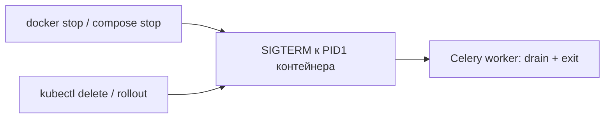
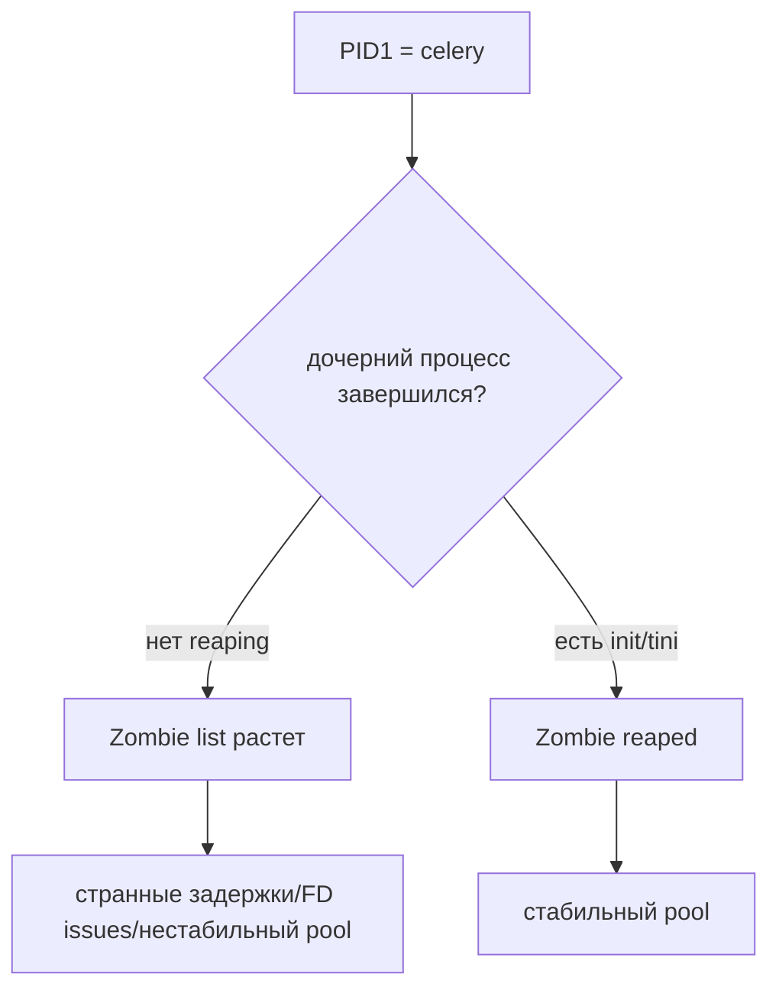
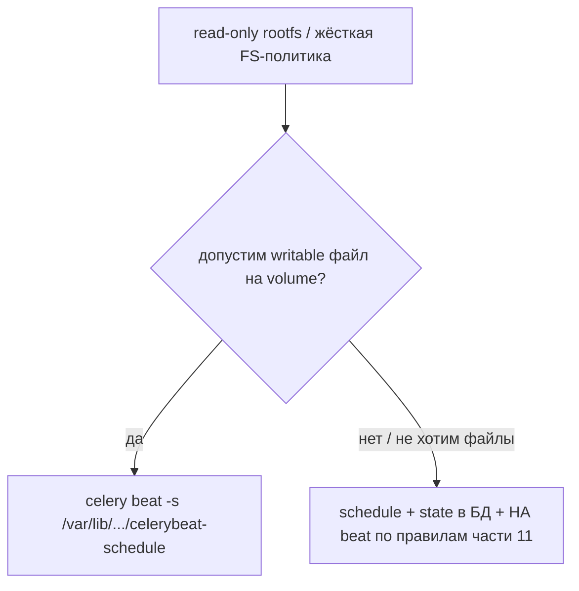
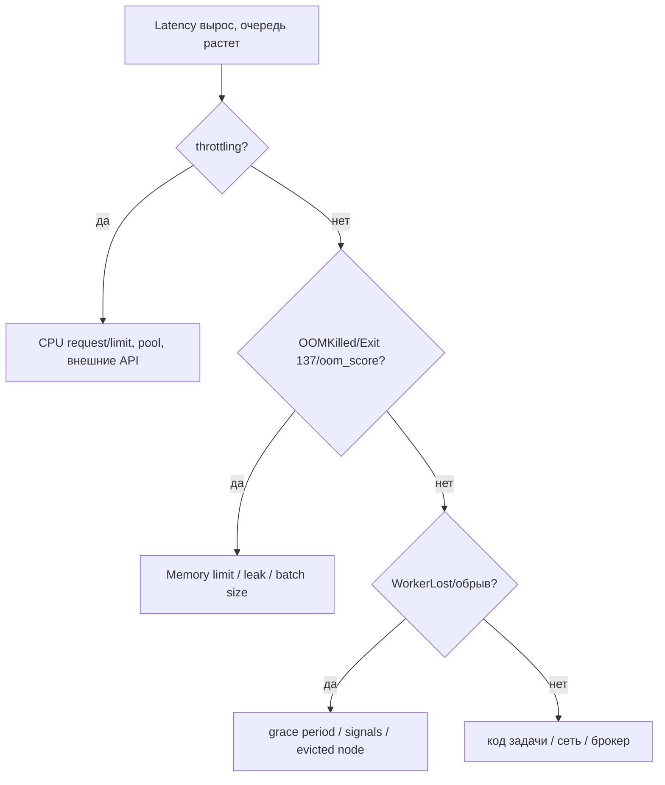
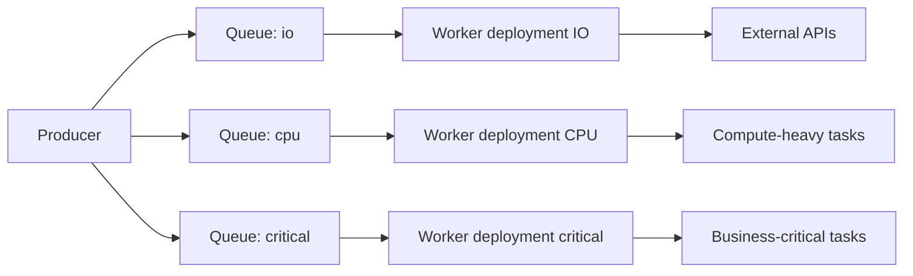
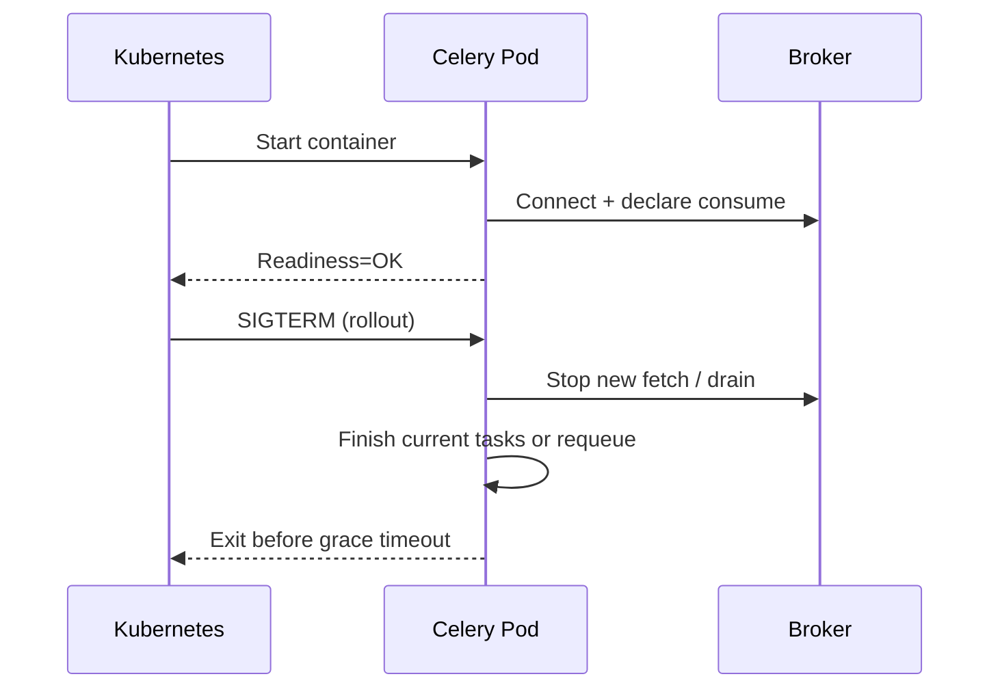
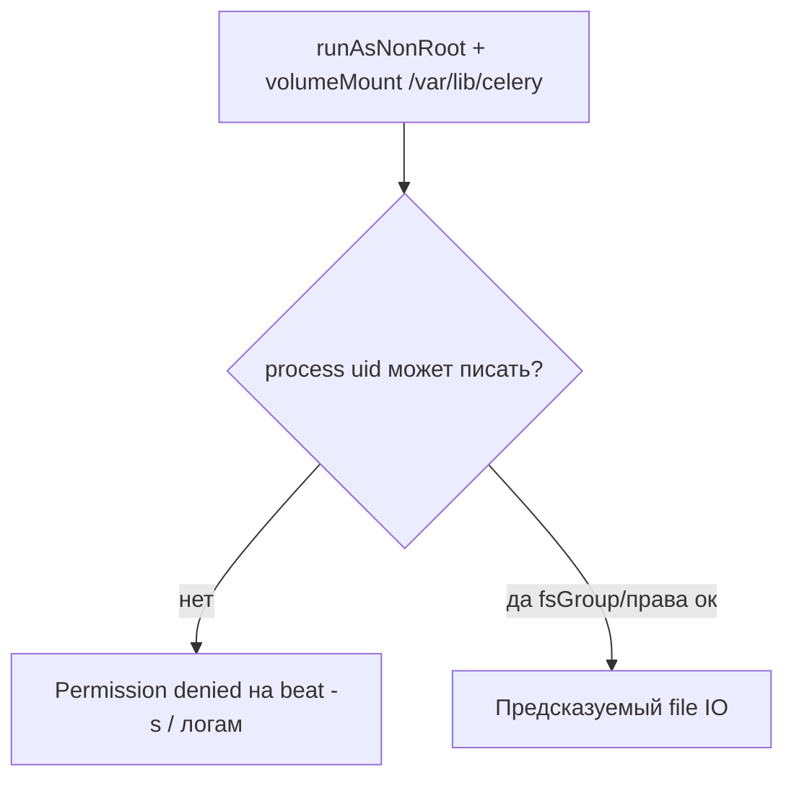

[← Назад к индексу части](index.md)
[↑ К глобальному плану](../../mastery_plan.md)

## 41.3 Контейнеры и оркестраторы

### Цель раздела

Научиться запускать Celery в Docker/Kubernetes так, чтобы worker корректно стартовал, проверялся, обновлялся и завершался без потерь и лавины retries.

### В этом разделе главное

- container lifecycle должен совпадать с lifecycle worker-а;
- PID 1, сигналы, readiness/liveness и graceful shutdown критичны;
- rollout без drain-стратегии часто вызывает "ложные" инциденты Celery.

#### Проверь себя: введение в 41.3

1. Что означает тезис «lifecycle контейнера = lifecycle worker» на практике при `kubectl delete pod`?
2. Почему **rollout** в «главном» стоит отдельной строкой, если уже есть graceful shutdown?
3. Как PID 1 связан с **prefork**-деревом процессов?

<details><summary>Ответ</summary>

1. Остановка pod должна совпасть с drain worker-а: иначе задачи обрываются платформой, а не бизнес-логикой.
2. Shutdown — поведение процесса; rollout — как кластер **снимает емкость** и пересоздаёт pod; без стратегии первое не успевает.
3. PID1 определяет, кто получает сигналы и кто reap-ит детей prefork; ошибка здесь ломает pool и graceful stop.

</details>

### Термины

| Термин                       | Значение                                                        |
| ---------------------------- | --------------------------------------------------------------- |
| **PID 1**                    | Первый процесс контейнера с особым поведением сигналов/reaping. |
| **Readiness probe**          | Проверка, готов ли pod принимать работу.                        |
| **Liveness probe**           | Проверка, жив ли процесс; при провале pod перезапускается.      |
| **PreStop hook**             | Действие перед остановкой контейнера для graceful drain.        |
| **Termination grace period** | Время, которое дается pod на мягкое завершение.                 |

#### Проверь себя: термины 41.3

1. Чем **Readiness** принципиально отличается от **Liveness** для очереди задач?
2. Почему **PreStop** не заменяет **Termination grace period**, а дополняет его?
3. В какой ситуации **Liveness** может навредить, если сделать её «проверкой брокера»?

<details><summary>Ответ</summary>

1. Readiness отвечает на вопрос «можно ли слать работу»; liveness — «нужно ли убить pod и пересоздать».
2. `preStop` — короткий хук действий; grace задаёт верхнюю границу времени на завершение после сигнала остановки.
3. Временная недоступность брокера приведёт к рестартам healthy процессов и лавине reconnect/ретраев, хотя worker «жив».

</details>

### Теория и правила

1. **Правильный entrypoint**  
   Используй init-процесс (например, `tini`) или корректный process manager, чтобы сигналы и reaping работали предсказуемо.

2. **Readiness > Liveness для запуска задач**  
   Worker может быть "жив" (liveness ok), но не готов к реальной обработке (например, нет связи с broker/backend). Readiness должна учитывать это.

3. **Graceful shutdown и drain**  
   При rollout worker должен перестать принимать новые задачи и корректно завершить текущие, либо безопасно вернуть их в очередь по стратегии.

4. **Rolling update и concurrency**  
   Массовый rollout без контроля maxUnavailable/maxSurge может резко снизить емкость consume и вызвать backlog spike.

5. **Разделение worker-пулов по типу задач**  
   В оркестраторе проще управлять надежностью, когда IO-heavy и CPU-heavy задачи запускаются в отдельных deployment/queue.

#### Проверь себя: теория контейнеров и оркестраторов

1. Почему «container lifecycle = worker lifecycle» важнее идеального Dockerfile?
2. Как правило про **readiness vs liveness** связано с ложными инцидентами «очередь есть, а consume нет»?
3. Зачем в одном списке правил стоят и **graceful drain**, и **maxUnavailable/maxSurge**?

<details><summary>Ответ</summary>

1. Потому что оркестратор стартует/убивает процессы по своему графику; если worker не укладывается в эти переходы, теряются задачи и растёт шум retries независимо от образа.
2. Liveness может быть зелёным при «процесс жив», но без связи с брокером worker не должен считаться готовым; трафик/очередь при этом выглядят «сломанными».
3. Drain задаёт _поведение внутри_ pod при остановке, а параметры rollout задают _сколько_ емкости кластер снимет одновременно — оба влияют на backlog при деплое.

</details>

### Docker и Compose (без Kubernetes): те же PID1, сигналы и «мягкая» остановка

<a id="docker-i-compose-bez-kubernetes"></a>

**Зачем отдельный подпункт:** часть команд долго живёт на **single-host Docker / `docker compose`** до появления k8s. Правила **не меняются**: первый процесс в контейнере, `SIGTERM` при `docker stop`, reaping детей `prefork`, writable пути для beat — это всё тот же platform-слой, только «оркестратор» проще.

**Практика (минимум, который стоит зафиксировать в compose):**

- **`init: true`** в Compose v2 (включает маленький init для reaping/сигналов) **или** явный `ENTRYPOINT` с `tini`/`dumb-init` — не полагаться на «случайно получится PID1 правильным».
- **`stop_grace_period`** (Compose) / время `docker stop` — согласовать с реальным worst-case временем задачи + Celery shutdown (аналог мысленного `terminationGracePeriodSeconds` в k8s).
- **`STOPSIGNAL` в Dockerfile** (если кастомный базовый образ): по умолчанию часто `SIGTERM`, но если база менялась, проверь, что worker реально получает ожидаемый сигнал.
- **`healthcheck` в compose** — та же идея, что readiness/liveness: «процесс жив» ≠ «есть связь с брокером»; для worker чаще нужен exec/ping брокера (как в примере `health_worker.py` ниже по файлу).

**Идея `docker-compose.yml` (фрагмент):**

```yaml
services:
  worker:
    image: myapp/celery:latest
    init: true
    stop_grace_period: 120s
    command: ["celery", "-A", "app", "worker", "-l", "INFO"]
    healthcheck:
      test: ["CMD", "python", "/app/health_worker.py"]
      interval: 15s
      timeout: 3s
      retries: 5
```

**Mermaid: `docker stop` и rollout в k8s сходятся в одной точке**



#### Проверь себя: Docker без k8s

1. Чем `stop_grace_period` в compose смыслово близок к настройкам Kubernetes из этой части?
2. Почему `init: true` или `tini` важны не только «для красоты», а для `prefork`?
3. Почему в compose **healthcheck** с `python /app/health_worker.py` предпочтительнее проверки «процесс celery жив»?

<details><summary>Ответ</summary>

1. Это окно времени, в которое оркестратор ждёт корректного завершения после `SIGTERM`, прежде чем эскалировать к жёсткой остановке; по смыслу близко к `terminationGracePeriodSeconds` + политике остановки pod.
2. Потому что в `prefork` есть дочерние процессы; без корректного reaping/forwarding сигналов страдает стабильность pool и graceful shutdown.
3. Потому что PID может существовать при уже «битом» контуре к брокеру; exec-проверка ближе к readiness и снижает ложное ощущение здоровья сервиса.

</details>

### PID1, reaping, init-wrapper

<a id="pid1-reaping-init-wrapper"></a>

**Почему это важно:** worker Celery (особенно `prefork`) — это дерево процессов. В контейнерах дочерние процессы, которые завершаются, должны **корректно "собираться" (reap)**, иначе получают **zombie processes**, а PID 1 (ваш `celery ...`) вынужден неожиданно играть роль init-системы.

**Типовое решение:** запускать worker через `tini` или `dumb-init` как "маленький init", который:

- нормально **прокидывает сигналы** в child-процессы;
- **reap'ит** зомби;
- снижает сюрпризы в Kubernetes/Docker, где "настоящего init" нет.

Пример (идея, не "единственно верный" синтаксис):

```bash
tini -g -- celery -A app worker -l INFO
```

**Диаграмма: что ломается без init-wrapper**



#### Проверь себя: PID1

1. Почему zombie-процессы — это не "косметика", а потенциальный operational-риск?
2. Зачем `tini -g` иногда важнее, чем "просто поставить tini"?
3. Почему при **PID1 = celery** reaping зомби — не «задача ядра Linux в контейнере», а проблема конкретного процесса?

<details><summary>Ответ</summary>

1. Потому что накопление зомби и неправильная обработка сигналов приводит к деградации процесса, росту сложностей в pool и неожиданным сбоям на длинном аптайме.
2. Потому что важен корректный forwarding/группировка сигналов на процессы, иначе shutdown остается "ломким" при вложенных shell/cmd цепочках.
3. Потому что в контейнере нет полноценной init-системы; PID1 обязан выполнять обязанности родителя, и если это не его роль — таблица процессов разъезжается.

</details>

### Read-only rootfs, tmp и файлы schedule

<a id="read-only-rootfs-tmp-и-файлы-schedule"></a>

**Read-only root filesystem** (часто в security-hardened K8s) означает: **любой** файл, который Celery/beat пытается записать "рядом с кодом" или "по дефолту", начнет падать: schedule DB, `pidfile`, временные сокеты, иногда `celery` cache.

**Что сделать практично:**

- **tmp:** смонтировать `emptyDir` в `/tmp` (или выставить `TMPDIR`) — чтобы любые библиотеки имели куда писать временно.
- **beat schedule / statedb:** задать явный путь в writable volume (часто `/var/lib/celery/...` или dedicated PVC) и **не** надеяться, что CWD в контейнере "удобен".
- **лог-файлы** (если пишутся в файл): тоже только в volume.

> Связь с частью `11` (scheduling/beat): если beat не может сохранить schedule state, у тебя ломается не "одна задача", а _воспроизводимость_ расписаний/последних запусков.

**Важно (это прямо из документации по periodic tasks / beat):** `celery beat` хранит last run times в локальном файле БД расписания (по умолчанию `celerybeat-schedule`), и поэтому **должен иметь право писать** в текущую директорию, либо ты задаешь **кастомный путь** для файла расписания. См. [Periodic Tasks](https://docs.celeryq.dev/en/stable/userguide/periodic-tasks.html#starting-the-scheduler).

Пример команды, который обычно "спасает" read-only rootfs (идея):

```bash
celery -A proj beat -s /var/lib/celery/celerybeat-schedule
```

Дополнительно (тоже file IO): если используешь `pidfile`/`--pidfile` для beat/worker, путь к pidfile тоже должен быть **writable**.

> Ещё один смысловой мост в часть `11`: должен существовать **ровно один** планировщик для одного и того же расписания, иначе появляются дубли. Это логически "параллельно" read-only, но на практике часто всплывает в Kubernetes при ошибочном `replicas: 2` на beat Deployment.

**Альтернатива файловому `celerybeat-schedule` (когда read-only / compliance давит сильнее):** хранить расписание и last-run state в **БД**, а не в локальном файле на диске. В Django-мире это часто `django-celery-beat` (см. части **`11`** и **`18`**): platform-выигрыш — нет обязательного writable path под `-s`, но появляются **другие** контракты: миграции схемы расписания, стратегия HA/лидерства beat, транзакционные границы при обновлении расписаний.

**Mermaid: read-only + beat — выбор модели состояния**



**ASCII-подсказка:**

```text
readOnlyRootFS
  + writable PVC for beat state
  + emptyDir for /tmp
= предсказуемый file IO
```

#### Проверь себя: read-only

1. Как read-only rootfs проявляется в логах: как системная ошибка или как "Celery плохой"?
2. Почему beat особенно чувствителен к read-only, даже если worker "пишет в БД"?
3. Почему "смонтировали volume" может быть недостаточно, если CWD в контейнере указывает в read-only?
4. В каком случае **DB-backed** расписание (см. части `11/18`) может быть предпочтительнее, чем гонять `celerybeat-schedule` на PVC?

<details><summary>Ответ</summary>

1. Обычно как `OSError: Read-only file system` или `Permission denied` на write — это внешняя среда, а не движок задач.
2. Потому что beat ведет собственные метаданные/состояние расписания, и без записи оно деградирует/становится нестабильным.
3. Потому что по умолчанию beat пишет schedule рядом с рабочей директорией/текущим каталогом; без `-s`/`--schedule` (или смены working dir) путь остается "внутри" read-only слоя.
4. Когда политика безопасности/операционный контур не хочет **никаких** локальных файлов состояния beat (или их слишком дорого сопровождать), а состояние расписаний уже живёт в управляемой БД с миграциями и аудитом — тогда модель "расписание в БД" часто проще согласовать, чем отдельный PVC под `-s`.

</details>

### Throttling, OOMKilled, restart-политика vs `max_memory_per_child`

<a id="throttling-oomkilled-restart-политика-vs-max_memory_per_child"></a>

**Три разных "тормоза" в Kubernetes, которые путают:**

1. **CPU throttling** — процесс _жив_, но _медленный_; задачи "висят", растет latency, растет очередь.
2. **OOMKilled** — Linux OOM killer или cgroup OOM: процесс/контейнер _убит_; это похоже на worker lost/обрыв.
3. **`worker_max_memory_per_child`** — это _внутренняя ротация_ child-процесса в Celery, чтобы не копить RSS; это **не** замена OOM-политике Kubernetes, но важно для долгих worker-ов.

**Mermaid-диагностика: от симптома к слою**



**Ключевой вывод:** в Kubernetes "перезапуск pod" != "retry в Celery" — сравни метрику restarts, events (`kubectl describe pod`) и Celery-статусы.

#### Проверь себя: throttling/oom

1. Чем отличается throttling от OOMKilled в симптомах для диспетчера очереди?
2. Когда `worker_max_memory_per_child` помогает, а когда маскирует проблему?
3. Почему по mermaid-диагностике ветка **WorkerLost** может указывать на **signals/grace**, а не на «брокер умер»?

<details><summary>Ответ</summary>

1. Throttling: медленно, но живо; OOM: процесс исчез/перезапущен, чаще внезапно и с системным событием.
2. Помогает от фрагментации/утечек в долгом prefork; маскирует, если бизнес-логика реально требует столько же памяти — тогда OOMKilled останется, просто реже/позже.
3. Потому что обрыв без явного сетевого сбоя часто совпадает с жизненным циклом pod (SIGKILL по таймауту, eviction, рестарт) — это платформенный слой, а не очередь.

</details>

#### Проверь себя: mermaid «от симптома к слою»

1. Зачем в triage сначала отделять **throttling**, если метрика CPU визуально «в норме»?
2. Почему ветка «код задачи / сеть / брокер» в диаграмме — **последняя**, а не первая?
3. Какие два артефакта k8s ты сопоставишь с `WorkerLost` в Celery, прежде чем менять retry-политику?

<details><summary>Ответ</summary>

1. Потому что quota может резать time slice без «100%» на графике utilization; рост duration и queue lag при «живом» процессе — типичный след throttle.
2. Потому что платформенные причины (CPU/mem/pid/signals) гораздо чаще дают похожие симптомы на очереди; лезть в код без исключения cgroup — дорогая ошибка.
3. `kubectl describe pod` (events: OOMKilled, eviction) и счётчики рестартов + корреляция по времени с деплоем; иногда ещё node conditions и cgroup метрики.

</details>

### Архитектурная схема: разделение worker-ов по профилю нагрузки



#### Проверь себя: разделение deployment по очередям

1. Почему одна deployment-группа на все типы задач ломает **SLO критичной** очереди?
2. Как разделение по очередям упрощает выставление **разных limits/probes**?
3. Чем схема на mermaid отличается от «просто поднять concurrency» в одном worker?

<details><summary>Ответ</summary>

1. Потому что IO-heavy хвост latency и throttle «ядовит» критичные задачи в общем пуле процессов и общем CPU budget.
2. Разные профили → разные `resources`, `prefetch`, таймауты и политика rollout; изоляция снижает coupling инцидентов.
3. Concurrency в одном процессе не разделяет failure domain: одна тяжёлая задача/утечка влияет на всех потребителей очереди; отдельные deployment ограничивают blast radius.

</details>

### Мини-runbook для rollout без потерь

1. Заморозить autoscaling на время контролируемого rollout (если нужно).
2. Убедиться, что readiness у старых pod еще `True`, пока новые не готовы.
3. Проверить queue lag до и после старта нового ReplicaSet.
4. Выполнить canary rollout на части worker-ов.
5. Отслеживать `WorkerLost`, `task runtime`, `consumer reconnects` в первые минуты.
6. Только после стабилизации продолжать полный rollout.

#### Проверь себя: мини-runbook rollout

1. Зачем в пункте 1 замораживать **autoscaling**, если rollout «и так короткий»?
2. Почему важно смотреть **readiness старых** pod до готовности новых?
3. Что именно в пункте 5 должен показать всплеск `consumer reconnects`?

<details><summary>Ответ</summary>

1. Потому что autoscaler может убрать/добавить pod в середине контролируемого окна и сломать предположения о доступной емкости во время выката.
2. Чтобы не получить окно, где новые pod ещё не принимают трафик/задачи, а старые уже выведены — это классический backlog spike.
3. Кратковременные разрывы связи с брокером при пересоздании pod и смене consumer group; помогает отличить «сеть умерла» от «нормальный шум деплоя».

</details>

### Диаграмма: жизненный цикл worker в Kubernetes



#### Проверь себя: lifecycle worker в Kubernetes

1. Почему на диаграмме **Readiness=OK** стоит только после шага к брокеру?
2. Чем рискован `SIGTERM` без явного «Stop new fetch / drain» на стороне приложения?
3. Как по последовательности объяснить инцидент «новый pod Ready, но задачи ещё у старого»?

<details><summary>Ответ</summary>

1. Потому что «поднялся контейнер» ≠ «worker может стабильно consume»; readiness должна отражать критичные зависимости.
2. Оркестратор всё равно остановит процесс; без drain задачи обрываются или уходят в redelivery хаотично.
3. Rolling strategy может держать старый ReplicaSet, пока новый не станет готов; это нормальная фаза, но её надо учитывать в метриках lag и в политике maxUnavailable.

</details>

### Пошагово: безопасный containerized запуск

1. Настрой entrypoint с корректной обработкой сигналов.
2. Реализуй readiness, которая проверяет критичные зависимости.
3. Задай `terminationGracePeriodSeconds`, соответствующий времени задач.
4. Добавь `preStop` для остановки consume/дренирования.
5. Проверь поведение на staging во время rolling update.

#### Проверь себя: безопасный containerized запуск

1. Почему `terminationGracePeriodSeconds` должен опираться на **worst-case** задачи, а не на средний runtime?
2. Зачем **preStop**, если Celery «и так ловит SIGTERM»?
3. Что именно нужно воспроизвести на staging, чего нет в «локальном docker run»?

<details><summary>Ответ</summary>

1. Потому что именно хвост p99 определяет, успеет ли worker завершиться до SIGKILL; среднее вводит в заблуждение.
2. `preStop` даёт точку для дополнительных шагов (например, снять membership из LB, подсказать sidecar, логировать фазу drain) до жёстких дедлайнов остановки.
3. Реальный rolling update, нагрузку на брокер, те же probes/limits и тайминги, что в prod; иначе staging не валидирует platform-контракт.

</details>

### Простыми словами

Оркестратор — это "диспетчер", который постоянно двигает процессы. Если Celery не умеет правильно разговаривать с этим диспетчером, он будет терять контекст при каждом деплое.

### Картинка в голове

```text
K8s says: "Stop"
Good worker: "Ок, завершаю корректно"
Bad worker: "Падаю сейчас" -> retries/backlog/шум
```

### Как запомнить

**Container-ready Celery = сигналы + probes + graceful drain + аккуратный rollout.**

### Pod SecurityContext и запись в volume

<a id="pod-securitycontext-и-запись-в-volume"></a>

В Kubernetes **жёсткий** `securityContext` (часто `runAsNonRoot: true`, `readOnlyRootFilesystem: true`, `allowPrivilegeEscalation: false`) — это не "security ради галочки", а **платформенный контракт на файловую систему**: не-root процесс должен иметь право писать туда, куда Celery/beat реально пишет (`/tmp`, `-s` для beat, лог-файлы).

**Типовой triage:**

- **`Permission denied` на volume**, хотя PVC смонтирован: проверь **`runAsUser`/`fsGroup`** у pod и права/ownership каталога в образе; часто лечится `securityContext.fsGroup` на pod-level или корректным `initContainer`, который `chown`-ит каталог под ожидаемый uid.
- **`readOnlyRootFilesystem: true` без writable mount** для `/tmp`/`TMPDIR`: получишь сюрпризы даже у библиотек, которые пишут временные файлы.
- **Слишком агрессивный `capabilities.drop: [ALL]`** без проверки: иногда ломает специфичные сетевые/FS операции зависимостей — лечится точечным allowlist **только** после измерения, а не "отключим всё сразу в проде без теста".

**Mermaid: non-root + volume — где ломается запись**



#### Проверь себя: SecurityContext

1. Почему `Permission denied` на PVC **не** опровергает гипотезу read-only rootfs «автоматически»?
2. Зачем на pod иногда выставляют `fsGroup`, если контейнер уже монтирует volume?
3. Почему `capabilities.drop: [ALL]` без измерений может сломать worker, хотя образ «минимальный и безопасный»?

<details><summary>Ответ</summary>

1. Потому что отказ может быть из-за **ownership/режима** каталога для non-root uid, а не из-за read-only слоя образа.
2. Чтобы смонтированный volume получил групповые права, совместимые с uid процесса, и запись в `/var/lib/...` стала предсказуемой без запуска от root.
3. Потому что зависимости могут требовать редких syscall/возможностей; security hardening без профилирования превращается в скрытый denylist.

</details>

### Примеры

Фрагмент Deployment (упрощенно):

```yaml
spec:
  strategy:
    rollingUpdate:
      maxUnavailable: 1
      maxSurge: 1
  terminationGracePeriodSeconds: 120
  containers:
    - name: worker
      image: myapp/celery:latest
      command: ["tini", "--", "celery", "-A", "app", "worker", "-l", "INFO"]
      securityContext:
        readOnlyRootFilesystem: true
      volumeMounts:
        - name: tmp
          mountPath: /tmp
        - name: celery-data
          mountPath: /var/lib/celery
      env:
        - name: TMPDIR
          value: /tmp
      lifecycle:
        preStop:
          exec:
            command: ["sh", "-c", "echo 'draining worker'"]
      readinessProbe:
        exec:
          command: ["sh", "-c", "python /app/health_worker.py"]
      resources:
        requests:
          cpu: "500m"
          memory: "512Mi"
        limits:
          cpu: "1000m"
          memory: "1Gi"
  volumes:
    - name: tmp
      emptyDir: {}
    - name: celery-data
      emptyDir: {}
```

Если `celery beat` запускается **отдельным** pod/container (частая схема), то read-only rootfs бьет по тем же file IO точкам: schedule DB + (опционально) pidfile. Пример _идеи_ (не "единственный" compose):

```yaml
containers:
  - name: beat
    image: myapp/celery:latest
    command:
      [
        "tini",
        "--",
        "celery",
        "-A",
        "app",
        "beat",
        "-l",
        "INFO",
        "-s",
        "/var/lib/celery/celerybeat-schedule",
      ]
    securityContext:
      readOnlyRootFilesystem: true
    volumeMounts:
      - name: tmp
        mountPath: /tmp
      - name: celery-data
        mountPath: /var/lib/celery
    env:
      - name: TMPDIR
        value: /tmp
volumes:
  - name: tmp
    emptyDir: {}
  - name: celery-data
    emptyDir: {}
```

Базовая идея `health_worker.py`:

```python
import os
import sys
from redis import Redis

try:
    r = Redis.from_url(os.environ["BROKER_URL"], socket_timeout=1)
    r.ping()
except Exception:
    sys.exit(1)
sys.exit(0)
```

#### Проверь себя: health_worker и примеры Deployment

1. Почему в `health_worker.py` важен **`socket_timeout=1`**, а не бесконечное ожидание?
2. Чем рискован readiness probe, который всегда возвращает 0, если процесс `celery` в списке процессов есть?
3. Зачем в YAML рядом с `readOnlyRootFilesystem: true` явно монтировать **`/tmp` и `TMPDIR`**, если worker «не пишет файлы сам»?

<details><summary>Ответ</summary>

1. Потому что при деградации брокера probe не должен висеть дольше бюджета readiness; иначе оркестратор застревает в неопределённости «готов/не готов».
2. Процесс может существовать при уже сломанном контуре к Redis/RabbitMQ; тогда трафик направят на «здоровый» pod, который не consume-ит.
3. Потому что библиотеки и временные артефакты (даже косвенно) могут требовать writable temp; read-only root без `/tmp` даёт неочевидные `OSError` в рантайме.

</details>

### Практика / реальные сценарии

- **Инцидент "пики retries на каждом деплое":** не хватает graceful period, pod убивается до завершения задач.
- **Инцидент "worker alive, но задачи не берутся":** liveness есть, readiness не отражает связь с broker.
- **Инцидент "после autoscaling latency растет":** новые pod-ы стартуют медленно, но scheduler уже перераспределил нагрузку.
- **Инцидент "`docker compose down`/`docker stop` режет задачи":** дефолтный grace слишком мал или нет `init: true`/`tini`, сигналы не доходят до дерева `prefork` (см. [Docker и Compose](#docker-i-compose-bez-kubernetes)).

#### Проверь себя: практика по контейнерам

1. Как отличить **слишком короткий grace** от **плохого readiness** по симптомам в первые минуты после деплоя?
2. Почему autoscaling может усугубить latency **после** успешного rollout?
3. Почему compose-сценарий с **sidecar/reverse proxy** часто «режет» worker раньше, чем `docker stop` дойдёт до Celery?

<details><summary>Ответ</summary>

1. Короткий grace даёт всплеск `WorkerLost`/redelivery синхронно с остановкой pod; плохой readiness даёт «pod Running, но consume нет» без массовых kill-событий.
2. Новые pod долго проходят прогрев (образ, импорты, коннект к брокеру), а autoscaler уже снял емкость со старых — растёт хвост очереди.
3. Потому что внешний компонент может закрыть соединение/маршрут по своим таймаутам; сигнал остановки Celery приходит позже или в другом порядке.

</details>

### Типичные ошибки

- запускать worker как PID 1 без init и без проверки сигналов;
- ставить слишком агрессивный liveness probe;
- использовать слишком короткий termination grace period;
- в Compose не задавать `stop_grace_period` / не включать `init: true` и удивляться обрывам при остановке контейнера;
- включить `runAsNonRoot`/`readOnlyRootFilesystem`, но не продумать **`fsGroup`/права** на PVC → `Permission denied` на `-s`/логах при «идеально смонтированном» volume;
- смешивать разные классы задач в одном deployment без queue isolation.

### Что будет, если...

- **...не настроить graceful shutdown?**  
  Увеличится число незавершенных задач и redelivery под деплойной нагрузкой.

- **...сделать probes формальными?**  
  Оркестратор будет считать worker "здоровым", хотя он не способен надежно обрабатывать задачи.

### Проверь себя

1. Почему readiness и liveness нельзя делать одинаковыми?
2. Какие параметры rollout особенно важны для Celery worker deployment?
3. Зачем нужен `preStop`, если есть `SIGTERM`?

<details><summary>Ответ</summary>

1. Liveness отвечает за "процесс жив", readiness — за "процесс готов работать с зависимостями". Это разные смыслы.
2. `maxUnavailable`, `maxSurge`, `terminationGracePeriodSeconds`, стратегия autoscaling и queue isolation.
3. `preStop` дает шанс выполнить дополнительные шаги перед остановкой и уменьшить риск резкого обрыва consume.

</details>

### Запомните

В контейнерах Celery должен быть оркестратор-дружественным, иначе деплой превращается в источник нестабильности.

---

<a id="414-ресурсные-лимиты"></a>
