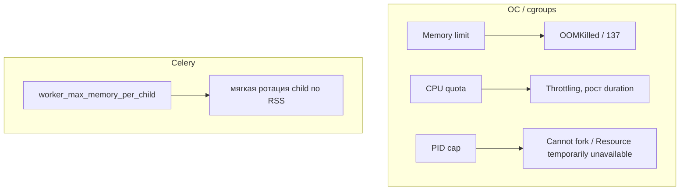

[← Назад к индексу части](index.md)
[↑ К глобальному плану](../../mastery_plan.md)

## 41.4 Ресурсные лимиты

### Цель раздела

Научиться связывать настройки Celery с лимитами CPU/memory/pids, чтобы получить предсказуемый throughput без OOM и throttling-ловушек.

### В этом разделе главное

- concurrency без учета лимитов почти всегда дает ложные ожидания;
- OOM и CPU throttling меняют модель доставки и время выполнения задач;
- правильная емкость считается по workload-профилю, а не по "красивым цифрам".

#### Проверь себя: введение в 41.4

1. Почему «красивые цифры» concurrency опасны без профиля workload?
2. Как OOM меняет **модель доставки** сообщений, а не только «память процесса»?
3. Чем throttle отличается от OOM с точки зрения **очереди** задач?

<details><summary>Ответ</summary>

1. Потому что число не привязано к CPU/mem/pids бюджету и часто ухудшает tail latency вместо throughput.
2. Процесс может исчезнуть; задачи уходят в redelivery/WorkerLost и меняют статистику успешности без изменения кода.
3. Throttle замедляет прогресс, но consumer обычно жив; OOM рвёт исполнение и провоцирует перезапуски.

</details>

### Термины

| Термин                    | Значение                                                    |
| ------------------------- | ----------------------------------------------------------- |
| **CPU quota**             | Лимит времени CPU, доступного контейнеру.                   |
| **Memory limit**          | Верхняя граница памяти процесса/контейнера.                 |
| **PIDs limit**            | Максимум процессов/потоков в контейнере.                    |
| **Throttling**            | Принудительное ограничение CPU при превышении quota.        |
| **Head-of-line blocking** | Задержка задач из-за очередности при ограниченных ресурсах. |

#### Проверь себя: термины 41.4

1. Почему **PIDs limit** — отдельный класс проблем, не сводимый к memory/CPU?
2. Как **CPU quota** связан с наблюдаемым «CPU 100%» в дашборде?
3. Приведи пример, когда **head-of-line blocking** усиливается из-за `prefetch`, а не из-за медленного брокера.

<details><summary>Ответ</summary>

1. Потому что prefork создаёт дочерние процессы; низкий pid cap ломает fork ещё до OOM/throttle.
2. Дашборд часто показывает utilization внутри cgroup; при throttle «100%» может сосуществовать с низкой реальной прогрессией задач.
3. Крупная задача в начале prefetch-блока задерживает старт следующих задач в том же worker, хотя брокер отдаёт сообщения быстро.

</details>

### Теория и правила

1. **Связка `concurrency` и CPU**  
   Для CPU-bound задач завышенный `concurrency` приводит к контекстным переключениям без роста throughput.

2. **Память на процесс**  
   Prefork-модель означает несколько процессов. Память потребляется суммарно, а утечки умножаются на число воркеров.

3. **`prefetch` и лимиты**  
   Большой prefetch при жестких лимитах может накапливать работу в памяти процесса и усиливать лаг.

4. **OOM как operational signal**  
   OOMKill — не "случайная беда". Это признак несоответствия профиля задач и memory budget.

5. **PIDs и процессная модель**  
   Низкий лимит PID может привести к невозможности создать дочерние процессы и внезапным ошибкам запуска задач.

#### Проверь себя: теория ресурсных лимитов

1. Почему завышенный `concurrency` при **фиксированном** CPU quota не даёт линейного роста throughput?
2. Как **prefetch** усиливает head-of-line blocking при жёстком memory limit?
3. Почему OOMKill полезно трактовать как **сигнал дизайна**, а не как «шум кластера»?

<details><summary>Ответ</summary>

1. Потому что процессы делят ограниченный CPU time; рост параллелизма увеличивает переключения и время на задачу без новых циклов CPU.
2. Prefetch заранее удерживает несколько задач в памяти worker-а; при лимите памяти очередь внутри процесса блокирует прогресс и удлиняет хвост latency.
3. Потому что он указывает на несоответствие batch/concurrency и cgroup budget; исправление — пересчёт ёмкости и профиля, а не бесконечные рестарты.

</details>

**Mermaid: три разных "ограничителя" — путай и получишь неверный triage**



**Как читать схему на практике:** OOMKilled — это _внешний предел_ cgroup; throttling — _заморозка прогресса_ без "логичной" бизнес-ошибки; `worker_max_memory_per_child` — _внутренняя_ политика Celery, не заменяющая лимит Kubernetes.

#### Проверь себя: mermaid «три ограничителя»

1. Почему ветка **PID cap** на схеме не лечится увеличением `worker_concurrency`?
2. Как по симптомам отличить **throttling** от **OOM** без доступа к коду задачи?
3. Зачем на одной диаграмме рядом cgroup и блок **CeleryConf**?

<details><summary>Ответ</summary>

1. Потому что исчерпание pid лимита блокирует создание дочерних процессов prefork; это потолок ОС, а не настройка «сколько задач взять».
2. Throttle даёт рост duration и очереди при живом процессе; OOM даёт рестарты/137 и обрывы без плавного замедления.
3. Чтобы не смешивать **внутреннюю ротацию** Celery с **внешним убийством** cgroup; иначе лечат OOM настройкой `max_memory_per_child` и не попадают в root cause.

</details>

### ulimits, fd, `worker_max_memory_per_child` vs OOMKilled

<a id="ulimits-fd-worker_max_memory_per_child-vs-oomkilled"></a>

**`ulimit` / file descriptors (fd):** каждое TCP-соединение, много сокетов к брокеру, лог-агент, DNS, иногда `select/poll` — все это "ест" fd.  
Если `ulimit -n` маленький, на пике ты увидишь "рандомные" сбои, которые не похожи на логичную бизнес-ошибку.

**Практика triage в Linux-контейнере/VM:**

```bash
ulimit -n
cat /proc/sys/fs/file-nr
```

**`worker_max_memory_per_child` (Celery):** полезный рубильник "не допустить, чтобы child-процесс рос вечно" (утечки, фрагментация, кеши библиотек).  
Но это **не** то же самое, что OOM-политика Kubernetes: если child превысит cgroup memory, **ядро все равно** может убить процесс, даже если Celery "хотел" мягкую ротацию.

**Как думать раздельно (очень важно):**

- **Celery memory settings** = защитная ротация внутри поведения worker-а
- **cgroup OOMKilled** = "потолок" ОС, который важен для SLO и для предотвращения noisy neighbor

#### Проверь себя: ulimits

1. Почему проблема fd часто "проявляется только на пике"?
2. Как `worker_max_memory_per_child` соотносится с memory limit в Kubernetes?
3. Почему `cat /proc/sys/fs/file-nr` полезно смотреть вместе с `ulimit -n` на **хосте/ноде**, а не только внутри одного pod?

<details><summary>Ответ</summary>

1. Потому что пул соединений и параллелизм сначала влезают, а на пике исчерпание fd становится каскадом ошибок.
2. `max_memory_per_child` — внутренняя эвристика ротации; k8s limit — внешний "железобетонный" предел RSS cgroup.
3. Потому что исчерпание может быть глобальным для ноды (много pod/сервисов); локальный `ulimit` не покажет pressure на уровне ОС.

</details>

### NUMA / CPU pinning (когда и зачем)

<a id="numa--cpu-pinning-когда-и-зачем"></a>

**NUMA** обычно всплывает на больших физических серверах: "правильные" CPU для процесса и "память рядом" влияют на latency. В типичных Kubernetes node это скрыто, но на bare metal/мощных data-plane машинах бывает важно.

**CPU pinning** — ниша, но полезно знать:

- когда **CPU-bound** задачи "прыгают" между core и теряют cache locality;
- когда включены агрессивные **power saving** политики;
- когда SLO на p99 "жесткий" и у тебя доказуемо виден scheduler jitter.

**Практично:** в Kubernetes смотри `cpuset`/`static CPU manager`, Guaranteed QoS, `topologySpreadConstraints` (это ближе к SRE, чем к коду). Для 95% продуктов важнее сначала **throttling/limits/queue split**.

**Картинка в голове:**

```text
NUMA = "память дальше, если ты не на своем CPU"
Pinning = "закрепи спортсмена на своей дорожке"
```

#### Проверь себя: NUMA

1. Когда тюнинг NUMA/pinning оправдан раньше, чем "просто добавить воркеров"?
2. Почему в Kubernetes про NUMA думают не так, как на bare metal?
3. Почему в тексте NUMA отнесён к **нише** для большинства продуктов на k8s?

<details><summary>Ответ</summary>

1. Когда p99 latency "шумит" на больших нодах и профилирование показывает memory locality/scheduler, а не брокер/сеть.
2. Потому что планировщик и cgroup часто "абстрагируют" hardware, и правильнее сначала вылечить throttling, oversubscription и topology constraints.
3. Потому что чаще узкое место — quota, memory limit и сеть до брокера; NUMA всплывает на крупных нодах и специфичных CPU-bound профилях.

</details>

### Практичная матрица `workload -> настройки`

| Профиль задач    | Стартовый подход к `concurrency`                   | Prefetch               | Дополнительно                                     |
| ---------------- | -------------------------------------------------- | ---------------------- | ------------------------------------------------- |
| **CPU-heavy**    | Ближе к числу vCPU на pod                          | `1`                    | Изоляция в отдельной очереди, контроль throttling |
| **IO-heavy**     | Выше, чем для CPU-heavy, но только после измерений | `1-4` по факту latency | Timeouts, retry budget, контроль внешних API      |
| **Memory-heavy** | Ниже среднего, чтобы избежать OOM                  | `1`                    | `max_tasks_per_child`, ограничение размера batch  |
| **Mixed**        | Декомпозиция по двум очередям                      | Раздельно по queue     | Нельзя оптимизировать одним универсальным числом  |

#### Проверь себя: матрица workload → настройки

1. Почему для **IO-heavy** prefetch «1–4 по факту», а для **CPU-heavy** почти всегда старт с `1`?
2. Что в строке **Memory-heavy** общего с рекомендациями по read-only beat из `41.3`?
3. Почему **Mixed** в таблице — аргумент против одного deployment на все очереди?

<details><summary>Ответ</summary>

1. IO-bound выигрывает от небольшого буфера задач, если внешние вызовы имеют latency; CPU-bound быстрее упирается в quota и кэш, большой prefetch только раздувает память без выигрыша.
2. Оба случая требуют жёстко контролировать **сколько работы заранее зарезервировано** в процессе (prefetch/batch) и куда пишется state/временные данные.
3. Потому что смешанный профиль требует разных `concurrency`/prefetch/лимитов; одно число оптимально для одного класса и почти всегда вредит другому.

</details>

### Грубая формула стартовой оценки емкости

```text
effective_concurrency ~= min(
  cpu_limit_cores / cpu_cost_per_task,
  memory_limit_mb / peak_memory_per_task_mb
)
```

Это не "точная математика", а стартовая оценка. Ее обязательно корректируют метриками p95/p99 и реальным queue lag.

#### Проверь себя: грубая формула емкости

1. Почему в формуле используется **min** из CPU и памяти, а не сумма?
2. Что в формуле сломается, если `cpu_cost_per_task` взять по среднему runtime, а не по p95?
3. Зачем в знаменателе по памяти фигурирует именно **peak**, а не средний RSS?

<details><summary>Ответ</summary>

1. Потому что реальная параллельность ограничивается самым узким ресурсом; второй ресурс не «докупит» throughput.
2. Среднее занижает стоимость хвоста; pod начнёт throttle/OOM на пиках, хотя «средняя формула» выглядела безопасной.
3. Потому что OOM и pressure определяются пиковым потреблением; средний RSS маскирует кратковременные всплески batch/сериализации.

</details>

### Пошагово: расчет стартовой емкости

1. Классифицируй задачи: CPU-heavy, IO-heavy, memory-heavy.
2. Оцени средний и p95 runtime + пиковый memory footprint.
3. Определи стартовый `concurrency` для каждого класса worker-а.
4. Настрой `prefetch`, `max_tasks_per_child`, при необходимости `task_acks_late`.
5. Сними метрики (lag, runtime, RSS, throttling, OOM events) и проведи итерацию.

#### Проверь себя: расчёт стартовой емкости

1. Зачем в шаге 1 классифицировать задачи **до** выбора `concurrency`?
2. Почему шаг 4 явно связывает `prefetch` с `task_acks_late` как «при необходимости»?
3. Что должно измениться после шага 5, если метрики показали рост throttling без OOM?

<details><summary>Ответ</summary>

1. Потому что CPU/IO/memory профили требуют разных стартовых точек; одно число concurrency без класса почти всегда неверно.
2. Потому что больший prefetch и поздний ack меняют риск потери работы при обрыве; это operational компромисс, а не «включить всем».
3. Снизить concurrency или CPU-bound параллелизм, пересмотреть requests/limits и внешние таймауты; память может быть зелёной, а прогресс «морожен» quota.

</details>

### Простыми словами

Лимиты — это размер "комнаты", в которой живут worker-процессы. Если поселить туда слишком много "жильцов" (concurrency), они начнут мешать друг другу и система станет медленнее, а не быстрее.

### Картинка в голове

```text
Больше concurrency != всегда быстрее
Если CPU/memory fixed:
  перегрузка -> throttling/OOM -> retries -> еще больше перегрузка
```

### Как запомнить

**Сначала профиль нагрузки и лимиты, потом concurrency. Не наоборот.**

### Примеры

Конфиг для memory-утечек и контролируемой ротации процессов:

```python
worker_concurrency = 4
worker_prefetch_multiplier = 1
worker_max_tasks_per_child = 200
# ВАЖНО: значение в KiB (1024 байта), не "в байтах" и не "в мегабайтах как число 200".
# Пример: ~500MB на child (подбирай по фактическому RSS и p95 профилю задач).
worker_max_memory_per_child = 500_000
task_acks_late = True
task_reject_on_worker_lost = True
```

Пример раздельных worker-ов по очередям:

```bash
celery -A app worker -Q io -c 8 --prefetch-multiplier=4 -n io@%h
celery -A app worker -Q cpu -c 2 --prefetch-multiplier=1 -n cpu@%h
```

Проверка cgroup-лимитов в контейнере (Linux):

```bash
cat /sys/fs/cgroup/memory.max
cat /sys/fs/cgroup/cpu.max
cat /sys/fs/cgroup/pids.max
```

**Заметка про cgroup v1 vs v2:** пути выше — типичный **cgroup v2** внутри современного Linux-контейнера. На старых хостах/особых runtime встречается **v1**, где лимиты читаются из других файлов (например, `memory.limit_in_bytes`, `cpu.cfs_quota_us`). Если команда `cat .../memory.max` не находится — не делай вывод «лимитов нет», сначала определи версию cgroup и mount layout.

#### Проверь себя: cgroup v1 vs v2 в контейнере

1. Почему отсутствие файла `memory.max` **не** доказывает отсутствие memory limit?
2. Какие два шага triage выполнишь, если `cat /sys/fs/cgroup/memory.max` вернул `No such file`?
3. Почему один и тот же YAML k8s может вести себя по-разному на кластерах с разной версией cgroup на node?

<details><summary>Ответ</summary>

1. Потому что путь и интерфейс зависят от версии cgroup и mount layout; лимит может быть в v1-файлах или в другом mount namespace.
2. Проверить версию cgroup (`stat -fc %T /sys/fs/cgroup` и документацию рантайма), затем искать эквивалентные лимиты (`memory.limit_in_bytes`, `cpu.max` vs `cpu.cfs_quota_us`).
3. Потому что node OS и container runtime определяют, какие файлы видит pod; метрики throttle/OOM всё равно есть, но пути для ручной диагностики различаются.

</details>

### Практика / реальные сценарии

- **Инцидент "lag растет, CPU 100%":** concurrency завышен для CPU-bound workload, нужен перерасчет и queue split.
- **Инцидент "периодически исчезают worker-процессы":** OOMKill на memory-heavy задаче с большим batch.
- **Инцидент "новые задачи почти не стартуют":** head-of-line blocking + слишком большой prefetch.

#### Проверь себя: практика по лимитам

1. Как по симптомам отличить **head-of-line blocking** от **CPU throttle**?
2. Почему инцидент «периодически исчезают worker-процессы» чаще ведёт в **OOM/batch**, а не в «брокер отвалился»?
3. Зачем в примере конфига рядом с `worker_max_memory_per_child` явно напоминают про **KiB**?

<details><summary>Ответ</summary>

1. HOL блокирует старт новых задач из-за очереди крупных задач в prefetch; throttle растягивает **все** задачи равномерно из-за нехватки CPU time.
2. Потому что OOMKill даёт внезапное исчезновение процесса/child без сетевой ошибки; брокер при этом часто жив, а симптом — рестарты и 137.
3. Потому что ошибка единиц (KiB vs байты vs «MB числом») даёт неверный порог ротации и ложное чувство защиты от OOM.

</details>

### Типичные ошибки

- назначать concurrency "по умолчанию" без профилирования;
- игнорировать p95/p99 memory usage;
- держать один тип worker-а для всех типов задач;
- не мониторить throttling и events OOM на уровне node/pod.

### Что будет, если...

- **...перегрузить CPU quota?**  
  Рост latency, таймаутов, нестабильный throughput, больше retries.

- **...не учитывать memory spikes?**  
  Резкие OOMKill в пиках и "случайные" недозавершенные задачи.

### Проверь себя

1. Почему увеличивать `worker_concurrency` при CPU throttle часто вредно?
2. Как `worker_prefetch_multiplier` связан с риском memory pressure?
3. Какие метрики обязательны для capacity-тюнинга Celery?

<details><summary>Ответ</summary>

1. Потому что процессам не хватает CPU time slice, растут переключения и общее время выполнения.
2. Больший prefetch удерживает больше задач в памяти worker-а до фактического выполнения.
3. Queue lag, task runtime (avg/p95), RSS memory, CPU throttling, OOM events, broker round-trip latency.

</details>

### Запомните

Ресурсные лимиты — это часть дизайна Celery, а не постфактум-тюнинг.

---

<a id="415-локали-и-время"></a>
