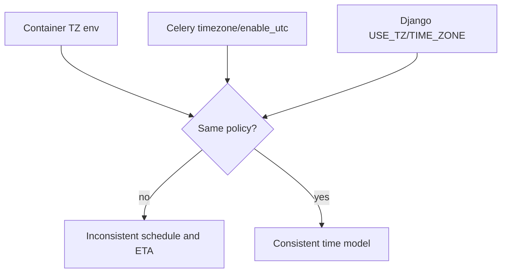
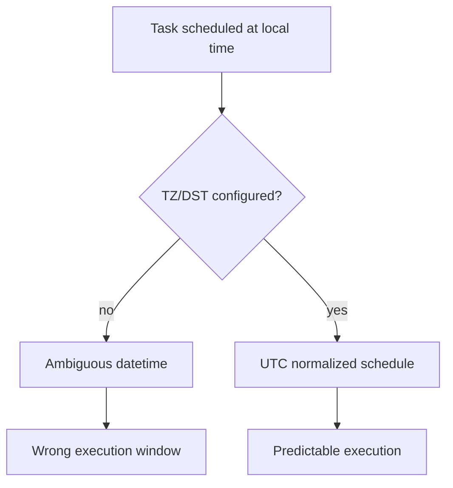

[← Назад к индексу части](index.md)
[↑ К глобальному плану](../mastery_plan.md)

## 41.5 Локали и время

### Цель раздела

Сформировать надежную модель работы со временем и локалями в Celery, чтобы убрать ошибки расписаний, дедлайнов и форматирования данных.

### В этом разделе главное

- внутреннее время планирования и дедлайнов безопаснее вести в UTC;
- локаль и timezone должны быть явными и согласованными во всех средах;
- DST и clock drift — реальные источники инцидентов, а не "редкие экзотики".

#### Проверь себя: введение в 41.5

1. Почему UTC «внутри» не отменяет необходимость явной политики для **beat**?
2. Как **локаль** ломает интеграции, если команда думает только про часовые пояса?
3. Чем **clock drift** опасен для **логов** по сравнению с ошибками расписания?

<details><summary>Ответ</summary>

1. Beat публикует по календарным правилам; нужна согласованная TZ-политика и тесты DST, иначе UTC в данных не спасёт.
2. Локаль меняет строковые форматы чисел/дат и сортировку — ломается контракт JSON/CSV между сервисами.
3. События на разных нодах становятся несопоставимыми; triage затягивается даже если задачи выполняются «логически верно».

</details>

### Термины

| Термин                      | Значение                                              |
| --------------------------- | ----------------------------------------------------- |
| **UTC**                     | Универсальная временная шкала без сезонных сдвигов.   |
| **Timezone-aware datetime** | Дата/время с явной информацией о временной зоне.      |
| **Naive datetime**          | Дата/время без timezone-контекста.                    |
| **DST**                     | Переход на летнее/зимнее время с изменением смещения. |
| **Clock drift**             | Расхождение часов между машинами/контейнерами.        |

#### Проверь себя: термины 41.5

1. Почему **naive datetime** опаснее, чем «просто забыли указать TZ строкой»?
2. Чем **DST** отличается от смены **offset** вручную админом?
3. Как **timezone-aware datetime** помогает при сравнении `eta` между worker и producer?

<details><summary>Ответ</summary>

1. Naive время неоднозначно при DST и разных окружениях; ошибка проявляется редко, но катастрофично для периодики.
2. DST — повторяемые календарные переходы с закономерной неоднозначностью локальных моментов; ручной сдвиг — другой класс ошибок конфигурации.
3. Оба конца сравнения приводятся к одной шкале (обычно UTC), исчезают скрытые смещения между сервисами.

</details>

### Теория и правила

1. **UTC внутри, локаль на краю**  
   Храни и считай время в UTC, а локальное представление делай на уровне UI/отчетов.

2. **Timezone-aware объекты обязательны**  
   Naive datetime в задачах и расписаниях порождает двусмысленность и баги при DST.

3. **Согласованная конфигурация TZ**  
   `CELERY_ENABLE_UTC`, `timezone` в Celery, системная TZ образа и TZ в приложении должны быть синхронизированы.

4. **Monotonic clock для интервалов**  
   Для измерения длительностей/таймаутов используй монотонные часы, а не wall clock.

5. **Локаль и форматные эффекты**  
   Форматы чисел/дат/десятичного разделителя могут менять payload и downstream-обработку.

6. **`eta` / `countdown` / `expires` в Celery**  
   Эти параметры должны строиться из timezone-aware времени и единой TZ-политики. Иначе "просрочка", "ранний запуск" и "запуск не в окно" будут выглядеть как случайные баги.

7. **Один beat-лидер на расписание**  
   Если несколько независимых beat-процессов обслуживают один и тот же набор schedule без coordination, легко получить дубли периодических задач.

#### Проверь себя: теория времени и локалей

1. Почему правило «UTC внутри, локаль на краю» не отменяет необходимость **явного** `timezone` в Celery?
2. Как пункты 6 и 7 вместе объясняют инцидент «периодика дублируется после scale-out»?
3. Почему `LC_ALL` влияет на **интеграции**, даже если API «вроде JSON»?

<details><summary>Ответ</summary>

1. Потому что Celery/Django должны знать, как нормализовать `eta`/beat относительно политики проекта; UTC в данных не заменяет конфиг планировщика.
2. Пункт 6 требует согласованных timezone-aware моментов; пункт 7 — что публикацию расписания должен вести один лидер; scale-out без лидерства даёт дубли при корректных датах.
3. Потому что локаль меняет строковое представление чисел/дат и сортировку; контракт «одинаковый JSON» ломается на границе сервисов.

</details>

### `TZ` и `LC_*`: как не "переопределить" самого себя

<a id="tz-и-lc_как-не-переопределить-самого-себя"></a>

**Проблема, которую легко сделать в Docker/K8s:** контейнер получает:

- `TZ=...` (env);
- `LANG` / `LC_ALL` (локаль);
- а приложение (Celery) получает _свой_ `timezone = ...` в конфиге;
- плюс Django/ORM могут вводить третье "время" на уровне `USE_TZ` и `TIME_ZONE` (см. части `11/18`).

**Правило, которое лечит 80% "магии":** выбери _один_ источник истины:

- **внутренняя логика** (beat/ETA/сравнения дат) — **UTC** + IANA-зона через `zoneinfo`/`pytz` (как принято в вашем стеке);
- `TZ` в контейнере либо **согласован** с выбранной политикой, либо **не используется** для бизнес-логики.

**Локаль (`LC_ALL`)** — не "только про текст в консоли": она влияет на сортировку, формат чисел, иногда на поведение библиотек в edge cases. Для JSON-контрактов payload придерживайся инвариантов:

- `UTF-8`
- `C.UTF-8` / `en_US.UTF-8` (явно и консистентно), если нужно.

**Mermaid: три источника времени, которые нельзя конфликтовать**



#### Проверь себя: три источника времени (mermaid)

1. Почему на схеме отдельно стоит **Django**, даже если «Celery уже в UTC»?
2. Что означает ветка `Same policy? -> no` для **дедлайнов** задач, а не только для beat?
3. Какой минимальный артефакт runbook заставит команду не забыть про третий источник времени?

<details><summary>Ответ</summary>

1. Потому что Django вводит `USE_TZ`/`TIME_ZONE` и ORM-семантику дат; Celery и Django должны согласоваться, иначе ETA в задачах и записи в БД расходятся.
2. `expires`/сравнения «сейчас» станут двусмысленными: задача может считаться просроченной или наоборот выполниться вне окна.
3. Таблица «источник истины»: контейнер `TZ`, `CELERY_ENABLE_UTC`/`timezone`, Django time settings — с владельцем и процедурой изменения.

</details>

#### Проверь себя: TZ

1. Почему "просто поставим `TZ=UTC`" может не спасти, если приложение сравнивает naive datetime?
2. Зачем отдельно договариваться про `LC_ALL` в контейнерах с числами/датами в строковом JSON?
3. В каком случае разумно **не** использовать `TZ` контейнера для бизнес-логики, даже если переменная задана?

<details><summary>Ответ</summary>

1. Потому что `TZ` влияет на часть библиотек/системных вызовов, но не заменяет дисциплину `timezone-aware` дат в коде.
2. Потому что локаль влияет на строковое представление (десятичные разделители, форматы), что ломает downstream-парсинг и "одинаковый JSON".
3. Когда вся бизнес-логика явно в UTC + `zoneinfo`, а `TZ` нужна только для удобства логов/утилит; тогда важно не смешивать её с расчётами ETA в коде.

</details>

### NTP, drift, "плавающие" расписания

<a id="ntp-drift-плавающие-расписания"></a>

**Wall clock** должен быть согласован на всех node: не потому, что Python "не умеет время", а потому что:

- **логи** корреляционно читают люди/лог-агрегаторы;
- **beat** (часть 11) планирует по времени;
- **ретраи** с backoff могут "наезжать" друг на друга при рассинхроне, если внешние системы сравнивают timestamp.

**Практично в Kubernetes:** смотри не только "внутри pod", но и:

- time sync на **node**;
- эффекты `clock skew` в multi-region (редко, но больно).

**Простыми словами:** если node "живет вчера", расписания и "что больше сейчас" начинают расходиться, а дебаг превращается в детектив.

#### Проверь себя: NTP

1. Какие симптомы time drift в распределенной системе, которые путают с "багом брокера"?
2. Как wall clock влияет на корреляцию логов при triage incident?
3. Почему в k8s важно смотреть **time sync на node**, а не только `date` внутри одного pod?

<details><summary>Ответ</summary>

1. Непредсказуемый порядок артефактов, странные "ранние" expire/ETA, эффекты "почему сейчас" в сравнениях.
2. События в разных сервисах смещены, trace/log correlation ломается, кажется, что "задача стартовала до publish".
3. Потому что pod наследует часы ноды; рассинхрон на уровне node даст одинаково «кривой» `date` во всех контейнерах и сломает beat/сравнения между pod на разных нодах.

</details>

### Диаграмма: риск дублей при multi-beat


Ключевой вывод: периодика требует явной стратегии лидерства/блокировок, а не только "правильной cron-строки".

#### Проверь себя: multi-beat

1. Почему `replicas: 2` на beat Deployment опаснее, чем два worker-а на одной очереди?
2. Чем **логический** дубль периодики отличается от **at-least-once** доставки обычной задачи?
3. Какие два механизма (кроме «поставить replicas=1») упоминаются как направление решения в тексте вокруг диаграммы?

<details><summary>Ответ</summary>

1. Потому что оба beat будут публиковать одни и те же периодические сообщения в брокер, создавая мультипликативную нагрузку и дубли side-effects.
2. At-least-once предполагает идемпотентность одной логической операции; дубль периодики создаёт **две разные** постановки одной и той же доменной работы в окне времени.
3. Лидерство/блокировки и явная координация расписания (см. часть 11), плюс дисциплина «один планировщик на расписание».

</details>

### Диаграмма: где возникают ошибки времени



#### Проверь себя: naive vs normalized schedule

1. Почему ветка **Ambiguous datetime** неизбежна, если расписание строится от «локальных часов пользователя» без TZ?
2. Чем **Wrong execution window** опасен для финансовых/комплаенс отчётов по сравнению с простым «сдвигом на час»?
3. Как связаны узлы `TZ/DST configured?` и тесты на переход DST из чеклиста ниже?

<details><summary>Ответ</summary>

1. Потому что локальное время без tz-контекста неоднозначно в моменты DST и при смене offset; система не знает, какую мгновенную точку на шкале UTC выбрать.
2. Окно может «исчезнуть» или «удвоиться»; это не линейный сдвиг, а изменение множества моментов исполнения и отчётных границ.
3. Тесты проверяют, что ветка `yes` реально достижима: конфиг TZ + нормализация в UTC дают предсказуемую ветку `Predictable execution`.

</details>

### Пошагово: time hygiene в Celery

0. **Если у тебя `python:slim` / минимальные образы:** установи `tzdata` (или используй base image, где IANA-зона гарантирована). Иначе `Europe/Moscow` и подобные имена зон легко "не находятся" в рантайме, даже если `TZ` выставлен.
1. Зафиксируй UTC как внутренний стандарт.
2. Переведи задачи и хранилища на timezone-aware datetime.
3. Проверь `CELERY_ENABLE_UTC=True` и явный `timezone`.
4. Добавь тесты на DST-переходы для периодических задач.
5. Проверь NTP/clock sync на всех узлах.

#### Проверь себя: time hygiene checklist

1. Почему шаг 0 (`tzdata`) стоит **до** фиксации UTC в конфиге?
2. Как шаг 4 (тесты DST) связан с правилом про **timezone-aware** объекты?
3. Что пойдёт не так, если выполнить шаги 1–3, но пропустить шаг 5 в multi-node кластере?

<details><summary>Ответ</summary>

1. Потому что без IANA-данных имена зон и часть преобразований недоступны; `timezone="Europe/..."` в конфиге «ломается» ещё на старте образа.
2. Тесты DST ловят ошибки нормализации и граничные моменты, которые не видны при unit-тестах «средним днём».
3. Логика в UTC будет согласована внутри кода, но события между нодами и внешними системами останутся сравнимыми некорректно; beat и корреляция логов продолжат «плавать».

</details>

Пример (идея) для `Dockerfile` на debian-slim:

```dockerfile
RUN apt-get update && apt-get install -y --no-install-recommends tzdata && rm -rf /var/lib/apt/lists/*
ENV TZ=UTC
```

#### Проверь себя: tzdata в образе

1. Почему `ENV TZ=UTC` без установки `tzdata` может быть недостаточно для **не-UTC** зон?
2. Зачем чистить `apt` cache в примере Dockerfile рядом с установкой `tzdata`?
3. Как проверить в CI, что образ реально знает нужную IANA-зону?

<details><summary>Ответ</summary>

1. Потому что для имени вроде `Europe/Moscow` нужны zoneinfo файлы; UTC может обойтись минимальным набором, но бизнес-зоны — нет.
2. Чтобы уменьшить размер образа и поверхность атаки; `tzdata` нужна как данные, а не как бессмысленный bloat кеша.
3. Запустить короткий `python -c` с `ZoneInfo("...")` или `date` в контейнере на этапе сборки/тестового job.

</details>

### Простыми словами

Время — это как "координаты". Если у разных систем разные карты, то они встретятся не там и не тогда, где ты ожидал.

### Картинка в голове

```text
UTC = общий язык времени
Локальное время = перевод для человека
```

### Как запомнить

**Считай в UTC, показывай в локали, измеряй интервал монотонными часами.**

### Примеры

Базовая настройка времени:

```python
timezone = "UTC"
enable_utc = True
```

Пример безопасного планирования с `eta` и `expires`:

```python
from datetime import datetime, timedelta, timezone

eta = datetime.now(timezone.utc) + timedelta(minutes=10)
expires = eta + timedelta(minutes=30)
task.apply_async(args=[...], eta=eta, expires=expires)
```

Python-пример timezone-aware:

```python
from datetime import datetime, timezone

now_utc = datetime.now(timezone.utc)
```

Измерение **длительности ожидания** внутри задачи (не путать с календарным временем): `time.monotonic()` не прыгает при NTP/DST и подходит для локальных таймаутов/циклов ожидания.

```python
import time

deadline = time.monotonic() + 30.0  # «длина ожидания» на monotonic-оси, не календарь
while time.monotonic() < deadline:
    # polling внешнего условия: сокет, файл, флаг в Redis, готовность воркера...
    time.sleep(0.2)
```

Проверка timezone в контейнере:

```bash
date
python -c "from datetime import datetime, timezone; print(datetime.now(timezone.utc))"
```

#### Проверь себя: примеры `eta` и monotonic

1. Почему в примере с `apply_async` поле **`expires` привязано к `eta`**, а не к «сейчас + константа» без связи?
2. Зачем в одном разделе показаны и `datetime.now(timezone.utc)`, и `time.monotonic()`?
3. Чем опасно вычислять `eta` через «локальное now» без `timezone` у объекта datetime?

<details><summary>Ответ</summary>

1. Потому что окно жизни задачи должно оставаться согласованным относительно запланированного момента запуска, а не плавать, если между постановкой и исполнением прошло время.
2. Первое — для календарных моментов в UTC; второе — для ожиданий и таймаутов внутри задачи, чтобы NTP/DST не ломали цикл polling.
3. Локальное now без tz часто naive или привязано к неверной политике; при переносе в контейнер с другим `TZ` ETA смещается непредсказуемо.

</details>

### Практика / реальные сценарии

- **Инцидент "ночная задача запускается дважды":** переход DST, неучтенные локальные часы.
- **Инцидент "дедлайн истек раньше времени":** часть сервисов в UTC, часть в локальной TZ.
- **Инцидент "формат даты ломает интеграцию":** локаль контейнера изменила формат сериализуемых строк.
- **Инцидент "периодика дублируется после scale-out beat":** два beat-процесса публикуют одну и ту же задачу.

#### Проверь себя: практика по времени

1. Почему инцидент «формат даты ломает интеграцию» ближе к **`LC_*`**, чем к `timezone` в Celery?
2. Как отличить **clock drift** от ошибки **DST** по наблюдаемым симптомам?
3. Почему «дедлайн истек раньше времени» часто оказывается рассинхроном **UTC vs локальная TZ между сервисами**, а не багом `expires`?

<details><summary>Ответ</summary>

1. Потому что меняется строковое представление и парсинг на границе контракта, даже если мгновенная точка на шкале UTC была бы корректной.
2. Drift даёт постоянный сдвиг/«плавание» между нодами; DST даёт скачки/дубли в конкретные календарные даты перехода.
3. Потому что разные сервисы по-разному интерпретируют naive строки или локальные clock; `expires` лишь проявляет уже существующий разрыв политик времени.

</details>

### Типичные ошибки

- использовать naive datetime в scheduling-логике;
- хранить business deadlines в локальном времени без нормализации;
- не тестировать DST-переходы;
- думать, что TZ контейнера "и так правильная";
- измерять «сколько ждали» через `datetime.now()` без monotonic, а потом удивляться скачкам при синхронизации часов.

### Что будет, если...

- **...смешивать UTC и локальное время без явных преобразований?**  
  Появятся трудноуловимые ошибки дедлайнов, ретраев и периодики.

- **...игнорировать clock drift?**  
  Таймауты и порядок событий станут непредсказуемыми в распределенной системе.

### Проверь себя

1. Почему naive datetime опасен в Celery beat?
2. Чем wall clock отличается от monotonic clock в диагностике timeout?
3. Как связаны DST и "двойной запуск" периодической задачи?
4. Почему для **ожидания N секунд** внутри задачи чаще правильнее `time.monotonic()`, чем сравнение `datetime.now()` с «дедлайном»?

<details><summary>Ответ</summary>

1. Он не содержит TZ-контекст, поэтому при DST/разных окружениях время трактуется неоднозначно.
2. Wall clock может скакать из-за синхронизации времени, monotonic clock идет только вперед и подходит для интервалов.
3. При смене времени локальная отметка может повториться или быть пропущенной, если расписание не нормализовано в UTC.
4. Потому что `datetime.now()` отражает календарь/политику TZ и может сдвинуться из-за NTP/step; `monotonic()` измеряет прошедшую длительность ожидания без «прыжков назад».

</details>

### Запомните

Ошибки времени и локали выглядят "мистическими", но лечатся строгой дисциплиной UTC/TZ и проверками на DST.

---

<a id="справочник-по-части"></a>
