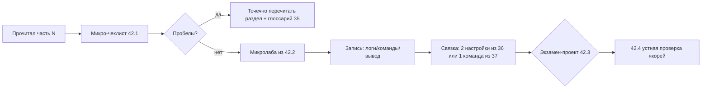

[← Назад к индексу части](index.md)
[↑ К глобальному плану](../../mastery_plan.md)

## Сквозная схема: от чтения к навыку

**Простыми словами:** сначала быстро «прощупываешь» понимание чеклистом, потом **доказываешь** руками лабой, потом **склеиваешь** экзаменом, потом **снимаешь иллюзию** устными якорями.

**Как запомнить:** *читать → чеклист → лаба → склейка → честность.*

#### Проверь себя: сквозной цикл на схеме

1. Почему после микролабы явным шагом стоит **«запись логов/команд»**, а не сразу экзамен?
2. В каком случае стрелка «Пробелы? → да» ведёт **не** к перечитыванию главы, а к **другой** лабе той же части?
3. Что в цикле отвечает за **честность самооценки** без новых артефактов?

Ответ

1. Артефакт — **доказательство** для будущего себя и для связки с 36/37; без записи экзамен легко строится на иллюзии «я это уже делал».
2. Если пробел не в тексте, а в **процедуре** (забыл команду inspect) — иногда быстрее точечная лаба из 42.2, чем перечитывание длинной главы.
3. Узел **42.4 устная проверка якорей** — он проверяет формулировки без IDE и ловит «узнавание вместо понимания».

---
