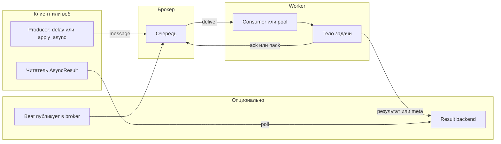
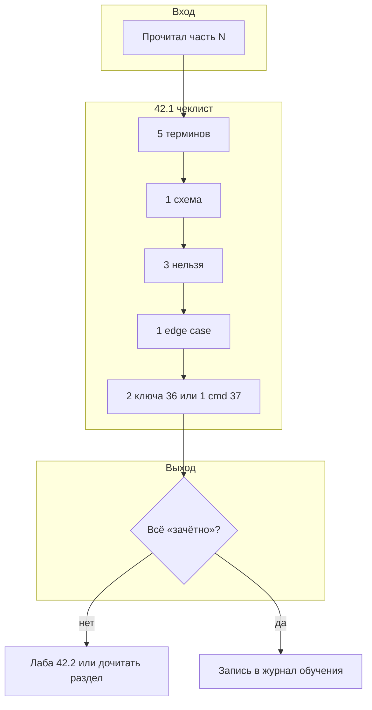

[← Назад к индексу части](index.md)
[↑ К глобальному плану](../../mastery_plan.md)

## 42.1 Универсальный микро-чеклист после любой части

### Цель раздела

Сделать завершение каждой учебной части **измеримым**: чтобы через 20–30 минут после чтения у тебя был небольшой, но **проверяемый** артефакт понимания.

### В этом разделе главное

Пять пунктов из глобального плана **42.1** — это минимальный «контракт» между тобой и материалом:

1. **5 терминов** из части 35 (глоссарий), которые стали однозначными *именно в контексте этой части*.
2. **1 схема потока** (стрелки): кто кому что отправил.
3. **3 вещи, которые нельзя в проде** по этой теме.
4. **1 edge case** и как его диагностировать.
5. **Связка с инструментами:** **2 имени настроек** из части 36 *или* **1 команда** из части 37.

#### Проверь себя: пять пунктов контракта 42.1

1. Почему пункт **«3 нельзя»** идёт **раньше** произвольного списка «best practices» из главы, а не после него?
2. Зачем требовать термины **именно из части 35**, если формулировки уже есть в тексте прочитанной главы?
3. В какой ситуации честнее выбрать **одну команду из 37**, чем два имени из 36?

Ответ

1. Запреты задают **красные линии** под риск продакшена; длинный список советов размывает фокус и хуже запоминается под стрессом.
2. Часть **35** — общий глоссарий; привязка к нему унифицирует язык с курсом и не даёт «переизобрести» термины в каждой главе заново.
3. Когда тема главы — **операции** (inspect, beat, worker): одна правильная команда часто информативнее двух абстрактных ключей из середины матрицы 36.

### Термины

| Термин | Зачем в чеклисте |
| ------ | ---------------- |
| **Active recall** | Вспоминание без подсказки; чеклист его принуждает. |
| **Интерпретируемая схема** | Схема, где подписаны *роли* и *имена сообщений/очередей*, а не «коробочки». |
| **Edge case** | Ситуация на границе контракта: рестарт, duplicate delivery, split-brain beat. |
| **Конфигурационная связка** | Явное имя настройки из реального `Celery` conf — якорь к продакшену. |

#### Проверь себя: термины чеклиста

1. Чем **интерпретируемая схема** отличается от «красивой диаграммы в презентации»?
2. Почему **active recall** важнее, чем перечитать определение в глоссарии сразу после чеклиста?
3. Приведи пример, когда **конфигурационная связка** выбрана неудачно (имя есть, смысла нет).

Ответ

1. На схеме должны быть **роли, очереди, типы сообщений, ack/retry** — то, что можно сопоставить с логом; декоративные блоки без подписей не помогают в инциденте.
2. Перечитывание — **узнавание**; чеклист без подглядывания выявляет, что ты **не вспоминаешь** термин в нужном контексте.
3. Например: вписать `broker_url` после главы про **beat**, только потому что «это тоже настройка» — связка должна менять поведение именно **по теме части**.

### Теория и правила

**Правило 1 — честность уровней.** Если ты не можешь заполнить пункт без копипаста — отметь «не знаю» и вернись к части: чеклист — **диагностика**, не отчёт для «галочки».

**Правило 2 — одна схема, но «в движении».** Недостаточно нарисовать «producer → broker → worker». Нужно указать, **где** появляется риск дубликата, **где** пишется результат, **где** ack.

**Правило 3 — запреты важнее советов.** Три «нельзя» учат дисциплине сильнее, чем десять «лучше так».

**Правило 4 — диагностика edge case = симптом + инструмент + гипотеза.** Не «иногда падает», а «при SIGKILL во время работы вижу X в логах → проверяю Y командой → интерпретирую как Z».

#### Проверь себя: правила 1–4

1. Как **правило 1** защищает от «красивого, но пустого» чеклиста?
2. Почему **правило 2** требует явно отметить **место ack** на схеме, а не «подразумевается»?
3. Сформулируй **одну** фразу, связывающую правила 3 и 4 (запреты и edge case).

Ответ

1. Оно разрешает писать «не знаю» и возвращаться к главе — чеклист становится **диагностикой**, а не имитацией успеха.
2. Без ack на схеме невозможно честно обсуждать **redelivery**, потерю задач и настройки `acks_late` — это ядро модели Celery.
3. Запреты задают **где не наступать на мины**, а edge case с тройкой симптом→инструмент→гипотеза учит **узнавать мину по следам**, если всё же наступили.

### Эталонная схема message flow (подсказка для пункта «одна схема»)

Когда в чеклисте просят **стрелки**, можно опереться на общий каркас ниже и **добавить** к нему свою очередь, свой result backend и место beat.

**Простыми словами:** схема чеклиста должна отличаться от этой **конкретикой**: именами очередей, тем, **где** стоит риск дубля, и тем, **когда** ack относительно `T`.

#### Проверь себя: эталон message flow

1. Зачем на общей схеме оставлен блок **«Опционально»** с result backend и beat?
2. Какая **одна** доработка эталона обязательна после главы про **только** fire-and-forget без чтения результатов?
3. Почему стрелка `R -->|poll| RB` важна для честного чеклиста по части **13**?

Ответ

1. Чтобы не забывать два частых слоя: **хранение результатов** и **периодическая публикация** — без них «полная картина» часто ложно упрощается до «веб → брокер → воркер».
2. Явно подписать, что **клиент не опрашивает** result backend и что **нет** долгоживущих `AsyncResult` — иначе схема врёт о контракте системы.
3. Часть **13** про срок жизни и состояние результатов: без poll/TTL на схеме легко недооценить нагрузку на Redis и UX «протухшего» `task_id`.

### Пошагово

1. Закрой PDF/вкладку с текстом части.
2. Заполни блок **терминов** по памяти; затем сверься с **35** и исправь только то, где ошибся *в смысле*, не в букве.
3. Нарисуй схему на бумаге за **≤7 минут**.
4. Сформулируй **3 запрета**; каждый должен начинаться с глагола: «не смешивать…», «не хранить…», «не полагаться на…».
5. Выбери edge case из раздела «граничные случаи» части или придумай из опыта; опиши цепочку диагностики.
6. Открой **36** и **37**, найди **два** параметра/команды, которые реально относятся к теме (не «наугад»).

#### Проверь себя: пошаговый ритуал

1. Зачем шаг 1 требует **закрыть** вкладку с текстом части, а не просто «не смотреть»?
2. На каком шаге чаще всего ломается **честность** чеклиста и почему?
3. Почему шаг 6 — последний, а не первый?

Ответ

1. Визуальное «краем глаза» всё равно даёт подсказку; закрытие увеличивает цену **active recall**.
2. На шаге **схемы** или **36/37**: тянет нарисовать общие кубики или вписать знакомые имена настроек без связи с темой.
3. Сначала нужно **собственное** воспроизведение; иначе подбор настроек превращается в «что красиво легло в таблицу 36».

### Простыми словами

Чеклист — это **мини-экзамен сразу после урока**, пока память свежая, но уже без подсказок текста.

### Картинка в голове

**Швейцарский нож после похода:** ты раскладываешь инструменты и проверяешь, что каждый реально открывается, а не «вроде есть».

### Как запомнить

**5-1-3-1-2/1:** пять терминов, одна схема, три запрета, один edge case, два имени настроек *или* одна команда.

#### Проверь себя: мнемоника 5-1-3-1-2/1

1. Почему в конце **«2/1»**, а не всегда «2 и 1»?
2. Что произойдёт с полезностью чеклиста, если выполнить **только** «5 терминов» и пропустить схему?
3. Как **одной** фразой объяснить коллеге мнемонику без цифр?

Ответ

1. План курса допускает **альтернативу**: либо два якоря конфигурации, либо одна команда CLI — что сильнее бьёт по теме.
2. Термины без схемы часто остаются **списком слов** без модели потока; в инциденте первой нужна картина движения сообщения.
3. «Слова, картинка, три красные линии, один страшный случай, связка с реальными рычагами».

### Пример заполнения (иллюстрация для «Части 8 — worker, пулы»)

| Блок | Пример заполнения |
| ---- | ----------------- |
| 5 терминов | `prefork`, `concurrency`, `prefetch_multiplier`, `acks_late`, `pool` |
| Схема | `broker --(deliver)--> worker consumer --(route)--> pool child --(execute)--> task` + отдельной стрелкой `ack → broker` |
| 3 «нельзя» | Не ставить `prefetch=64` «на всякий случай» без анализа времени задачи. Не путать `concurrency` потоков с CPU-ядрами без измерений. Не игнорировать fork-safety при C-расширениях. |
| Edge case | Worker получил SIGKILL mid-task при `acks_late=True` → задача может быть redelivered → нужна идемпотентность; диагностика: логи обрыва, дубликаты в БД по business-key. |
| Связка 36/37 | `worker_prefetch_multiplier`, `task_acks_late`; команда `celery -A proj inspect stats` |

### Второй пример чеклиста (иллюстрация — «Часть 9 — надёжность и идемпотентность»)

| Блок | Пример заполнения |
| ---- | ----------------- |
| 5 терминов | `idempotency key`, `autoretry_for`, `retry_backoff`, `MaxRetriesExceededError`, `acks_late` |
| Схема | Клиент кладёт задачу → брокер → worker; при падении после частичного side-effect **стрелка возврата** «ещё одна доставка» → тот же worker/другой worker → **идемпотентная** ветка в БД |
| 3 «нельзя» | Не делать ретрай на `ValueError` бизнес-валидации без явной классификации. Не хранить в аргументах задачи «сырой» ORM-объект. Не считать «у нас retry=5, значит данные согласованы». |
| Edge case | Двойной commit: HTTP уже ответил OK, а задача ещё раз доставлена → дубликат платежа; диагностика: уникальный ключ в БД + лог `task_id` + поиск второго вызова с тем же business-key. |
| Связка 36/37 | `task_acks_late`, `task_default_retry_delay` (или используемые тобой ключи ретрая); команда `celery -A proj inspect reserved` (смотреть зарезервированные) |

**Простыми словами:** чеклист по надёжности должен пахнуть **дублями и границами транзакций**, а не только декораторами.

### Третий пример чеклиста (иллюстрация — «Часть 11 — scheduling и beat»)

| Блок | Пример заполнения |
| ---- | ----------------- |
| 5 терминов | `beat_schedule`, `crontab`, `interval`, `overlap`, `last_run_at` (или аналог в БД-расписании) |
| Схема | `beat (тик)` → `публикация сообщения в broker` → `worker` → `задача`; отдельно: **второй** beat (ошибка) → двойной fire без координации |
| 3 «нельзя» | Не запускать **два** beat с одним и тем же файловым `schedule` (файл состояния beat) без блокировок. Не полагаться на «раз в минуту» для задачи, которая может идти час. Не смешивать wall-clock бизнеса и UTC деплоя без явной политики TZ. |
| Edge case | DST: «пропавший» час или удвоенный локальный интервал → задачи сдвигаются; диагностика: логи beat с UTC timestamp + сверка `TZ` в контейнере и в приложении (см. часть **41**). |
| Связка 36/37 | `beat_schedule`, `timezone` (если используешь); команды `celery -A app beat -l info` и проверка env `CELERY_TIMEZONE` / флагов из **37** |

#### Проверь себя: три примера чеклиста (8, 9, 11)

1. Что **общего** в трёх примерах по структуре полей таблицы и зачем это повторять?
2. Чем **главный риск** в примере части **9** отличается от примера части **8** на уровне данных, а не декораторов?
3. Почему в примере **11** в схеме обязательно появляется **второй beat** как ошибка?

Ответ

1. Везде одинаковые **пять блоков** чеклиста — учит шаблону; различаются только «наполнители» под тему главы.
2. В **9** центр тяжести — **дубли побочных эффектов** и границы транзакций; в **8** — **prefork/prefetch/acks** и ресурсы воркера.
3. Потому что классический production-риск beat — **двойной планировщик** и overlap; без второго beat на схеме легко забыть про координацию и время.

### Печатный шаблон чеклиста (скопируй в заметки)

| Поле | Моя запись |
| ---- | ---------- |
| **Часть плана / файл pact** | |
| **Дата** | |
| **5 терминов (из 35), теперь однозначных в контексте темы** | 1. … 2. … 3. … 4. … 5. … |
| **Схема потока (кто → кому → что)** | (вставь рисунок или ссылку на файл) |
| **3× «нельзя в проде»** | 1. … 2. … 3. … |
| **Edge case + диагностика** | Симптом: … → Команда/метрика: … → Гипотеза: … |
| **2 настройки из 36** | `…`, `…` |
| **или 1 команда из 37** | `…` |

### Критерии «зачётно» по каждому пункту 42.1

| Пункт | «Зачётно» | «Незачётно» |
| ----- | --------- | ----------- |
| 5 терминов | Ты можешь **устно** за 20 сек объяснить разницу между двумя из них | Список слов из главы без различения соседних понятий |
| Схема | Есть **ack**, **retry/redelivery**, **result** (если релевантно) | Три прямоугольника без подписанных сообщений |
| 3 «нельзя» | Каждый запрет **привязан к теме части** и к риску в проде | Общие морали про кодстайл |
| Edge case | Триада **симптом → инструмент → гипотеза** заполнена | «Бывает странно» без проверки |
| 36/37 | Имена **реально влияют** на описанную тему | Случайные ключи из середины матрицы |

#### Проверь себя: критерии «зачётно»

1. Почему для схемы в колонке «зачётно» упомянуты **retry/redelivery**, даже если в части «про другое»?
2. Чем «незачёт» по **3 нельзя** отличается от слабого, но тематичного запрета?
3. Как бы ты за **30 секунд** проверил строку таблицы по **edge case** у себя в заметке?

Ответ

1. Потому что at-least-once — **сквозная** реальность Celery; схема без redelivery часто врёт о надёжности системы.
2. «Незачёт» — это **общие морали** («пишите чистый код»), не привязанные к рискам Celery конкретной части.
3. Прочитать вслух триаду симптом→инструмент→гипотеза: если одно звено «мыслимо, но не проверялось» — незачёт.

### Диаграмма: один цикл после главы

#### Проверь себя: диаграмма цикла после главы

1. Зачем в выходе цикла явно разведены ветки **«лаба 42.2»** и **«журнал обучения»**?
2. В каком случае узел **«всё зачётно»** всё равно ведёт к лабе, а не к журналу?
3. Что потеряется, если убрать из диаграммы узел **«2 ключа 36 или 1 cmd 37»**?

Ответ

1. «Незачёт» по чеклисту почти всегда означает **нужна рука** (лаба или дочитывание); «зачёт» — **зафиксировать** прогресс, чтобы не повторять ту же главу вслепую.
2. Когда зачёт формальный: тема закрыта по чеклисту, но ты **сознательно** хочешь закрепить моторику лабой той же части.
3. Связь с **операционкой** продакшена: без этого шага чеклист остаётся «про слова», а не про настройки и команды.

### Практика / реальные сценарии

- **Сценарий A (junior):** после каждой главы заводишь файл `notes/celery_checks/part_XX.md` и копируешь туда только **свои** ответы.
- **Сценарий B (команда):** на ретро раз в спринт каждый приносит **одну** схему из чеклиста по зоне ответственности (routing, beat, security).

#### Проверь себя: практика A/B

1. Чем сценарий **B** для команды отличается от индивидуального чеклиста по нагрузке на людей?
2. Почему в сценарии **A** файл заметок лучше называть по **номеру части**, а не по дате?
3. Какой минимальный артефакт доказывает, что сценарий **A** реально выполнялся?

Ответ

1. Ретро требует **короткого** фокуса (одна схема), иначе превращается в долгие статусы; индивидуальный чеклист может быть глубже.
2. Номер части **стыкуется с планом и pact**; дата не помогает вернуться к источнику знания через полгода.
3. Хотя бы одна **собственная** схема или заполненный шаблон с датой в шапке — не пустой файл.

### Типичные ошибки

- Писать «изучил» вместо **схемы**.
- Выбирать «нельзя» из разряда общих истин («нельзя плохо кодить») — это не учит Celery.
- Подменять **свою** формулировку edge case цитатой из текста без цепочки диагностики.

### Что будет, если пропустить чеклист

Знание останется **узнаваемым**: на созвоне узнаешь слова, в инциденте не сможешь быстро выбрать команду и гипотезу.

#### Проверь себя: риски пропуска и типичные провалы

1. Какая связка между ошибкой «изучил вместо схемы» и разделом **42.4** этого же файла?
2. Почему цитата edge case **из текста главы** без цепочки диагностики почти бесполезна в on-call?
3. Что изменится в поведении через месяц, если регулярно пропускать блок **36/37** в чеклисте?

Ответ

1. Обе ловят **иллюзию знания** без стрелок и имён: в 42.4 якоря заставляют устно воспроизвести модель; схема в 42.1 — письменный аналог.
2. В инциденте нужны **симптом, команда, интерпретация**; чужая цитата не подсказывает, что запустить в **твоём** стенде первым.
3. Знание останется на уровне **метафор** без рычагов конфигурации и CLI — именно их спрашивают в проде и на собеседованиях.

### Проверь себя

1. Почему в чеклисте именно **пять** терминов, а не «все важные»?
2. Чем плоха схема только из трёх слов «клиент — брокер — воркер»?
3. Зачем требовать **имена** настроек, а не «включить надёжность»?

Ответ

1. Пять — достаточно, чтобы поймать дыру в лексике, но не превратить упражнение в переписывание глоссария; это баланс времени и пользы.
2. Она не фиксирует **моменты риска** (результат, ack, retry, visibility) и не помогает в инциденте.
3. «Надёжность» не исполняется компьютером; в проде меняются конкретные ключи конфигурации и флаги CLI.

### Запомните

Чеклист 42.1 — это **мост** между чтением pact-файла и эксплуатацией: он заставляет перевести абстракции в **имена** и **стрелки**.

---
