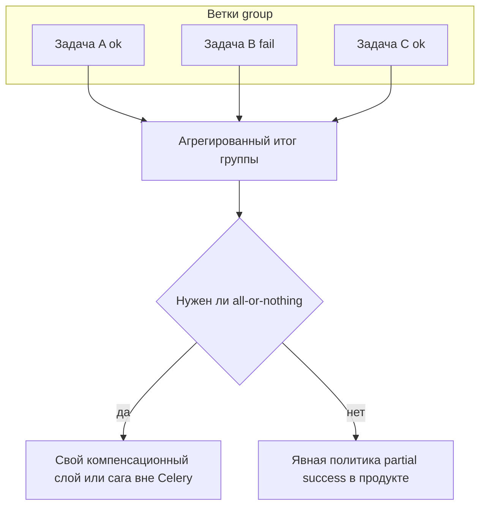
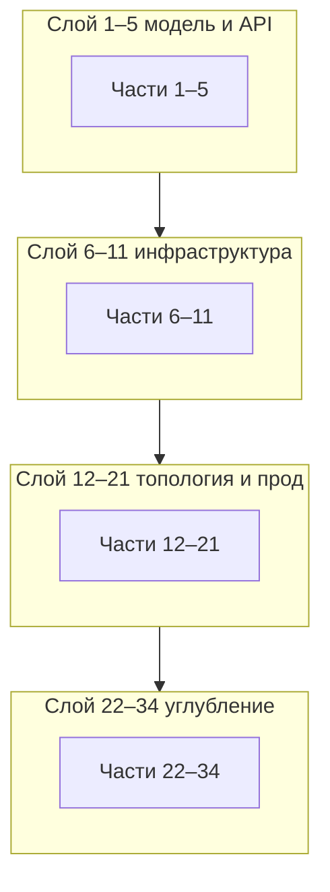

[← Назад к индексу части](index.md)
[↑ К глобальному плану](../../mastery_plan.md)

## 42.2 Матрица «часть плана → мини-практика» (части 1–34)

### Цель раздела

Дать **конкретную** микролабу на каждую **часть 1–34 глобального плана** (`mastery_plan.md`): что сделать руками за **≤30 минут**, что считать успехом, какие артефакты сохранить.

### В этом разделе главное

Таблица ниже — **не дубль теории** частей, а **минимальный практический контур**: одна лаба = один вечер после работы.

#### Проверь себя: цель и роль матрицы 42.2 (1–34)

1. Почему «одна лаба ≤30 мин» — это **ограничение сверху**, а не обещание «уложишься всегда»?
2. Чем матрица **дополняет**, а не заменяет, большой «практический контур» из плана курса?
3. Зачем вводить колонку **«Артефакт»**, если DoD уже однозначен?

Ответ

1. Оно задаёт **дизайн** упражнения: если раздувается — режем на два визита, иначе теряется измеримость.
2. Матрица даёт **частые короткие доказательства** по каждой части плана; большой контур — про сквозные сценарии и интеграции, они не умещаются в 30 минут каждая.
3. Артефакт — **внешний след** (файл, лог, тикет); без него DoD превращается в субъективное «вроде сделал».

### Термины

| Термин | Смысл в матрице |
| ------ | ---------------- |
| **Стенд** | Локальный `docker compose` с broker + worker или нативный Redis/RabbitMQ. |
| **Артефакт** | Лог, скрин команды, файл с выводом, git commit с воспроизводимым шагом. |
| **DoD** | Условие «лаба сделана». |

### Теория и правила

- **Одна лаба — один фокус.** Если тянет на два часа — разрежь на два визита.
- **Фиксируй версии** Celery/broker в заметке к лабе.
- **Не «улучшай» код сверх задачи** — иначе потеряешь измеримость.

#### Проверь себя: правила матрицы лаб

1. Зачем фиксировать **версии** Celery и брокера в заметке к лабе, если «и так работает»?
2. Приведи пример, как «улучшить код сверх задачи» **сломает** обучение даже при зелёных тестах.
3. Почему правило «один фокус» важнее, чем «сделать лабу посложнее для гордости»?

Ответ

1. Иначе через месяц невозможно понять, **почему** воспроизводилось поведение; апгрейд сломает сравнение «до/после».
2. Например: добавить к лабе **12** полноценный outbox и мониторинг — ты перестаешь измерять именно **routing**, а меряешь другой дизайн.
3. Сложность без фокуса маскирует **дыру** в базовой теме: мозг запоминает случайный успех, а не процедуру части N.

### Связь с «практическим контуром» глобального плана

В `mastery_plan.md` матрица 42.2 названа **дополнением к практическому контуру**: это значит, что микролабы **не заменяют** большие сценарии из других частей (Django/outbox, полный деплой, нагрузочное тестирование), а **подпирают** их **короткими доказательствами**. Если у тебя в команде уже есть «сквозной лабораторный стенд», привяжи каждую строку таблицы ниже к **одному тикету** в трекере: название = «Лаба: часть N», описание = DoD из таблицы.

#### Проверь себя: связь с практическим контуром плана

1. В каком случае микролаба **может** опираться на уже существующий командный стенд вместо локального `docker compose`?
2. Что потеряется, если считать микролабы **полной** заменой практического контура курса?
3. Зачем в описании упомянуты **тикеты** с DoD из таблицы?

Ответ

1. Когда стенд **доступен** ученику и воспроизводим; тогда артефакт — ссылка на job/PR в том же контуре.
2. Пропадут **длинные** сценарии (миграции, деплой, нагрузка, безопасность в связке) — микролабы слишком коротки, чтобы заменить их целиком.
3. Тикет фиксирует **контракт времени и результата** в командной памяти, а не только в личных заметках.

### Картинка в голове

**Огнетушитель на стене:** маленький, рядом с каждой зоной склада; не один гигантский резервуар в подвале.

#### Проверь себя: метафора «огнетушитель»

1. Что в метафоре соответствует **«зона склада»** в курсе Celery?
2. Почему «резервуар в подвале» — плохая модель для **30-минутной** лабы?
3. Как метафора объясняет, зачем **34** разные лабы, а не одна «большая интеграционная»?

Ответ

1. **Одна часть плана 1–34** или один слой A/B/C/D — зона, где нужен быстрый доступ к практике.
2. Большой резервуар — редкое, долгое вмешательство; оно не тренирует **частоту** и не ловит дыры по отдельным темам.
3. Пожар тушат **рядом с очагом**; одна гигантская лаба маскирует, какая именно тема из 34 не усвоена.

### Соответствие «часть плана» → основной файл `pact`

Номер **Ч.** в таблице ниже — это **номер части в `mastery_plan.md`** (разделы `## Часть 1` … `## Часть 34`). В папке `pact` префиксы файлов **чаще всего совпадают**, но не всегда отражают полное название темы; ориентир по имени файла:

| Ч. плана | Кратко тема | Файл `pact` (входная точка) |
| -- | -- | -- |
| 1 | Контекст и границы | `01_kontekst_naznachenie_i_granitsy_celery.md` |
| 2 | Фундамент очередей | `02_fundament_raspredelennykh_zadach_i_ocheredei_celery.md` |
| 3 | Быстрый старт | `03_bystryy_start_i_pervyy_rabochiy_kontur.md` |
| 4 | Архитектура компонентов | `04_arkhitektura_celery_komponenty_i_ikh_vzaimodeystvie.md` |
| 5 | Модель задач и API | `05_model_zadach_i_api_celery.md` |
| 6 | Broker и result backend | `06_broker_i_result_backend_vybor_nastroika_kompromissy.md` |
| 7 | Конфигурация и проект | `07_konfiguraciya_celery_i_organizaciya_proekta.md` |
| 8 | Worker, пулы | `08_worker_zhiznennyy_tsikl_puly_i_ispolnenie.md` |
| 9 | Надёжность, идемпотентность | `09_nadezhnost_idempotentnost_i_obrabotka_oshibok.md` |
| 10 | Canvas | `10_canvas_kompoziciya_i_orchestration.md` |
| 11 | Scheduling, beat | `11_scheduling_i_periodicheskie_zadachi.md` |
| 12 | Роутинг и topology | `07_…` + `08_…` + `20_prakticheskie_arkhitekturnye_patterny.md` (роутинг размазан по конфигу, воркеру и паттернам) |
| 13 | Результаты и состояния | `06_…` + `39_sostoyaniya_zadach_isklyucheniya_i_telo_soobshcheniya.md` |
| 14 | Наблюдаемость | `14_nablyudaemost_monitoring_i_diagnostika.md` |
| 15 | Тестирование | `15_testirovanie_celery.md` |
| 16 | Производительность | `16_proizvoditelnost_throughput_i_masshtabirovanie.md` |
| 17 | Безопасность | `17_bezopasnost_celery.md` |
| 18 | Django | `18_integraciya_s_django.md` |
| 19 | FastAPI/Flask | `19_integraciya_s_fastapi_flask_i_drugimi_python_servisami.md` |
| 20 | Архитектурные паттерны | `20_prakticheskie_arkhitekturnye_patterny.md` |
| 21 | Production-эксплуатация | `21_ekspluataciya_v_production.md` |
| 22 | Внутреннее устройство | `22_vnutrennee_ustroystvo_celery.md` |
| 23 | Расширение | `23_rasshirenie_celery_i_kastomizaciya.md` |
| 24 | Edge cases | `24_edge_cases_redkie_scenarii_i_tonkie_mesta.md` |
| 25 | Сравнение с альтернативами | `25_sravnenie_celery_s_alternativami_i_sosednimi_instrumentami.md` |
| 26 | Современные практики | `26_sovremennye_praktiki_i_napravleniya_razvitiya.md` |
| 27 | Экосистема и сборка | `27_ekosistema_celery_zavisimosti_i_sborka.md` |
| 28 | CLI и операции | `28_cli_i_operacionnyy_kontur.md` |
| 29 | Транспорты и URL | `29_transporty_kombu_url_brokera_i_dialekty.md` |
| 30 | Версии и миграции | `30_versioning_migracii_i_sovmestimost.md` |
| 31 | Комплаенс и данные | `31_komplaens_dannye_audit_i_politiki.md` |
| 32 | Ниши и среды | `32_nishi_specialnye_sredy_i_nestandartnye_integracii.md` |
| 33 | Каталог инструментов | `33_katalog_instrumentov_bibliotek_i_integracii.md` |
| 34 | Индустрия и экономика | `34_industrialnyy_kontekst_standarty_i_ekonomika_ocheredey.md` |

#### Проверь себя: карта «часть плана → файл pact»

1. Почему для частей **12** и **13** в таблице **несколько** файлов, и как это читать при планировании лабы?
2. Что делать, если номер файла `pact` **не совпадает** с номером части в глобальном плане?
3. Зачем вообще держать отдельную таблицу соответствия, если «почти всегда» совпадает префикс `NN_`?

Ответ

1. Потому что тема плана **размазана** по нескольким большим учебникам (роутинг, результаты); лаба должна указать **входную точку**, но читатель может заглянуть в соседние файлы по ссылкам курса.
2. Ориентир — **смысл части плана** и строка таблицы, а не слепой префикс; при расхождении версий репозитория сверяйся с актуальным `pact/index` или списком файлов.
3. «Почти» — не «всегда»; таблица снимает ложную уверенность и экономит часы поиска «где же глава про routing».

### Микролабы (части 1–34 плана)

Каждая строка — **одна** микролаба. Колонка **Артефакт** — что положить в журнал (папка `notes`, git, wiki команды), чтобы через месяц было доказательство, что ты не «проходил глазами».

| Ч. | Микролаба (≤30 мин) | DoD (что должно получиться) | Артефакт |
| -- | ------------------- | --------------------------- | -------- |
| **1** | Написать от руки: 3 сценария «Celery уместен / не уместен» + 1 фраза «чем отличается от asyncio». | Текст ≤1 страницы; есть ссылка на at-least-once как реальность. | `notes/lab01_context.md` |
| **2** | Нарисовать (бумага/Mermaid) цепочку at-least-once: где появляется дубликат. | Схема с подписанными стрелками ack/retry. | Файл `.md` с mermaid или фото бумаги |
| **3** | Поднять минимальный проект: `celery -A app worker -l info` и отправить `delay()`; сохранить вывод. | В логе виден `received`, задача завершилась; есть `task_id`. | Лог-фрагмент + версии в `requirements.txt` |
| **4** | Нарисовать **полную** архитектурную схему: producer, broker, очереди, worker (pool), beat (если в продукте есть), result backend, клиент `AsyncResult`; отметить сетевые границы (хост/контейнер). | На схеме видно, где fire-and-forget **без** backend допустим, а где клиенту нужен result store. | Диаграмма + 5 буллетов «граница ответственности» |
| **5** | Создать задачу с `bind=True`; залогировать `self.request.id`, `retries`. | Лог содержит поля; ты можешь устно объяснить `request`. | Gist/snippet + вывод лога |
| **6** | Поднять Redis **или** RabbitMQ; объяснить одной таблицей плюс/минус для *твоего* кейса. | Таблица 3×2 (latency, ops, стоимость ментально); выбран один брокер «для лабы». | Таблица в markdown + URL брокера |
| **7** | Вынести настройки в `config_from_object`; один параметр менять через env. | Доказательство: два запуска с разным env и разным видимым эффектом (например, `task_default_queue`). | Два лога diff или скрин |
| **8** | Запустить worker с `--pool=prefork` и `--pool=solo` (если доступно); сравнить стартовые логи. | Заметка: когда solo уместен, когда вреден. | Таблица сравнения 5 строк |
| **9** | Задача с `autoretry_for`, `retry_backoff=True`; вызвать исключение из `tries` лимита. | В логах видна лесенка backoff; ты знаешь, где остановилось. | Лог с таймстемпами попыток |
| **10** | Собрать `chain(a, b)` и `group(t1, t2, t3)`; в заметке — **абзац** про частичный фейл одной ветки `group`. **Второй заход той же темы (ещё одна ≤30-мин сессия в другой день):** мини-`chord(group(...), aggregate)` на 3 коротких задачах + **одна** таблица замеров (время до готовности body; грубая оценка обращений к result backend). Если chord не успеваешь — пометь «закрою в экзамене, модуль 4» и всё равно выполни chain+group. | Chain+group работают; текст про partial failure есть; для chord либо таблица замеров, либо явная отсылка к 42.3 модуль 4 с датой. | Код + markdown-заметка с замерами/отсылкой |
| **11** | Настроить `beat_schedule` с `crontab` (например, раз в минуту в dev); убедиться по логам beat+worker, что периодика бьёт. | Лог beat + worker; отдельно **письменно**: что будет, если задача дольше интервала (overlap). | Фрагменты логов + политика overlap |
| **12** | Ввести `task_routes` (или `queue=` в вызове) и поднять **два** worker с разными `-Q`; отправить задачи в `celery` и `heavy`. | `inspect active_queues` показывает разные подписки; задачи не смешиваются в одном воркере. | Вывод `inspect` + две командные строки worker |
| **13** | Настроить `result_expires` (или эквивалент для твоей версии); создать результат, подождать, показать исчезновение/недоступность; прочитать `AsyncResult.state`. | Заметка: связь TTL результата с нагрузкой на Redis и с UX «старый task_id». | Скрипт/лог до-после TTL |
| **14** | Включить базовые метрики или хотя бы структурированный JSON-лог + **один** correlation id из kwargs. | Пример лога с id; grep по нему находит и веб, и задачу. | Две строки лога с одним `correlation_id` |
| **15** | Написать `pytest` с eager-режимом: в Celery 5+ чаще `task_always_eager` / `task_eager_propagates` в конфиге приложения; в старых туториалах встречалось `CELERY_ALWAYS_EAGER` — **сверься с докой твоей версии**. | Тест зелёный; комментарий в коде: чем eager отличается от реального worker. | Файл теста + версия Celery в комментарии |
| **16** | Искусственно настроить `soft_time_limit` / `time_limit` и поймать soft timeout в коде (`SoftTimeLimitExceeded`). | Лог/исключение зафиксированы; понятна разница soft/hard. | Trace + пояснение одной таблицей |
| **17** | Переключить serializer на `json` (если не дефолт) и показать, что **не** сериализуется (`datetime` → строка и т.д.). | Заметка: правила payload; запрет pickle обоснован. | Пример «до/после» сериализации |
| **18** | Мини Django (или заготовка): `shared_task` + `transaction.on_commit(lambda: task.delay())`. | Доказательство: без on_commit ловишь race (показать/описать). | Два сценария: с on_commit и без |
| **19** | FastAPI/Flask endpoint вызывает `delay`; проверить, что HTTP быстро возвращается. | `curl` timings или лог uvicorn; задача в фоне. | Вывод `curl -w '%{time_total}\n'` |
| **20** | Спроектировать on/outbox **на бумаге** для одной бизнес-операции (без полной реализации, если долго). | Диаграмма + риски дубля + место идемпотентного ключа. | PNG/diagram + 10 строк текста |
| **21** | Прописать systemd **или** compose restart policy + `stop_grace_period`; симулировать SIGTERM. | Заметка: сколько секунд даёшь задаче завершиться. | Фрагмент unit/compose + тайминг остановки |
| **22** | Прочитать исходник одного bootstep/signal **только** на уровне «что вызывается при старте worker»; составить 5 пунктов. | Список без копипасты: своими словами. | Список + ссылка на файл исходников |
| **23** | Добавить кастомный `Task` subclass с `on_failure` логированием. | Лог при ошибке содержит доменный контекст. | Лог ошибки + фрагмент кода |
| **24** | Составить список из 5 «редких» симптомов из части 24 и сопоставить каждому **первую** команду диагностики. | Таблица симптом → команда/метрика. | Таблица markdown |
| **25** | Таблица Celery vs **один** конкурент (RQ/Temporal/Arq) по 5 критериям твоего продукта. | Честный вывод «где Celery проигрывает». | Таблица + вывод в 3 предложения |
| **26** | Найти в release notes **одну** тему (Celery/Kombu) и написать: «как это влияет на мой деплой». | Пара абзацев + ссылка на версию. | Ссылка на GitHub release |
| **27** | `pipdeptree` / `pip freeze` → выписать версии `celery kombu billiard vine amqp redis`. | Снимок зависимостей в репозиторий заметок. | Зафиксированный `pip freeze` |
| **28** | Выполнить `celery -A app inspect ping` и `inspect active` на живом worker. | Сохранён вывод; понятно, что означает пустой active. | Текстовый дамп команд |
| **29** | Сравнить два URL транспорта (`redis://` vs `amqp://`) в плане **семантики** (не только синтаксис). | Текст: что меняется для routing/persistence на уровне интуиции. | Таблица сравнения брокеров |
| **30** | Симулировать «в очереди старые сообщения»: описать план dual consumer / версия поля payload. | Документ на 10–15 строк: стратегия без кода ок. | `ADR`-заметка или issue-текст |
| **31** | Политика retention для result backend: срок хранения + PII (письменно). | Мини policy; согласовано с GDPR-интуицией. | Политика на полстраницы |
| **32** | Выбрать один нишевый сценарий (GPU/WSL/гео) и написать «нужен ли мне он». | Решение go/no-go с причиной. | Текст решения |
| **33** | Поднять Flower **или** альтернативу из части 33 и объяснить, какую **операционную** боль снимает. | Скрин/описание + ограничение инструмента. | Скрин или ссылка на dashboard |
| **34** | Оценить «стоимость очереди» для dev/stage: broker + worker час × день (грубо). | Числа order-of-magnitude; вывод про FinOps mindset. | Табличка с цифрами |

#### Визуал к лабе **10**: частичный фейл в `group` (почему это не «как в unit-тесте»)

В `group` ветки **независимы**: одна может завершиться ошибкой, остальные — успехом. Для чеклиста и лабы важно **письменно** зафиксировать: что происходит с агрегатом, если нужен «все или никто»; где идемпотентность по веткам; как это стыкуется с `chord` (body может не получить полный набор результатов — поведение зависит от версии и обработки ошибок).

**Типичная ошибка учебника:** нарисовать `group` как «одну коробку», внутри которой либо всё зелёное, либо всё красное — в жизни чаще **пятнистый** результат.

#### Проверь себя: визуал частичного фейла `group` (лаба 10)

1. Почему «all-or-nothing» в диаграмме ведёт не в настройки Celery, а в **внешний** компенсационный слой?
2. Чем **пятнистый** исход `group` связан с **идемпотентностью** по веткам?
3. Зачем в DoD лабы **10** явно требовать **второй** короткой сессии под `chord`?

Ответ

1. Потому что Celery **не даёт** распределённой семантики «все ветки или откат» как у БД-транзакции; это зона **домена и саг**.
2. Успешные ветки могли записать эффекты до падения соседней; без идемпотентности **частичный успех** ломает инварианты.
3. `chord` добавляет **result backend** и fan-in — отдельный навык и нагрузка; один заход легко оставляет ложное чувство, что «canvas уже понятен».

### Карта «слои курса» и микролабы (куда смотреть глазами)

Ниже не новый план, а **компас**: как группировать 34 лабы в голове, чтобы не учить номера вслепую.

| Слой | Части | Интуиция |
| ---- | ----- | -------- |
| **A** | 1–5 | Зачем Celery, как устроен контур, как вызвать задачу и что в `request` |
| **B** | 6–11 | Брокер, конфиг, worker, надёжность, canvas, beat |
| **C** | 12–21 | Очереди/результаты/метрики/тесты/perf/безопасность/интеграции веба/паттерны/prod |
| **D** | 22–34 | Внутренности, расширения, сравнения, экосистема, CLI, транспорты, миграции, комплаенс, ниши, инструменты, экономика |

#### Проверь себя: компас слоёв A–D

1. Почему **слой B** (6–11) логично идёт сразу после **A** (1–5), а не перемешивается с D?
2. Назови **одну** тему из слоя **C**, которая почти всегда страдает, если пропущен слой **B**.
3. Зачем в компасе **четыре** слоя, а не «просто номера 1–34 по порядку»?

Ответ

1. **B** кладёт фундамент брокера, воркера, надёжности и beat; без него слои C/D превращаются в «магические» слова без исполняемой базы.
2. Например **routing и очереди (12)** без понимания **worker и prefetch (8)** дают ложную уверенность в изоляции нагрузки.
3. Четыре слоя — **ментальная сжатка**: проще выбрать «с чего продолжить после перерыва», чем вспоминать 34 номера вслепую.

### Прогресс по микролабам (шаблон журнала)

Скопируй в `notes/celery_labs_progress.md` и отмечай строку после каждой лабы:

| Ч. | Лаба сделана (да/нет) | Дата | Ссылка на артефакт |
| -- | --------------------- | ---- | ------------------- |
| 1 | | | |
| … | | | |
| 34 | | | |

**Простыми словами:** без журнала легко «щёлкнуть» те же три любимые лабы и не заметить дыру в **31–34**.

#### Проверь себя: журнал прогресса лаб

1. Зачем вести **ссылку на артефакт**, если лаба «очевидно простая»?
2. Почему в шаблоне есть колонка **дата**, а не только галочка «сделано»?
3. Как журнал помогает не застрять на **31–34**, если они «скучные»?

Ответ

1. Простая лаба через месяц **не восстанавливается по памяти**; ссылка — доказательство и экономит время при повторении курса.
2. Дата показывает **ритм**: можно увидеть, что слой D не трогали месяцами, хотя цель — равномерность.
3. Пустые строки 31–34 визуально **стыдят** и напоминают про FinOps, комплаенс и миграции — зоны реальных сюрпризов в проде.

### Простыми словами

Это **расписание тренировок**: каждая строка — один подход к снаряду, не весь спортзал за раз.

### Типичные ошибки

- Ставить лабы «подряд без сна» — мозг перестаёт учиться; лучше 3 лабы в неделю стабильно.
- Делать лабу «как в проде» с первой минуты — **30 минут** превращаются в многоэтапный проект.

### Что будет, если игнорировать матрицу

Ты будешь **знать названия файлов**, но не воспроизведёшь **процедуры** on-call/SRE и разработки.

### Проверь себя

1. Почему для части **20** допустима лаба «только на бумаге»?
2. Какая одна лаба из таблицы лучше всего коррелирует с **инцидентами** в проде?
3. Что делать, если для части **18** нет готового Django-проекта под рукой?

Ответ

1. Архитектурные паттерны сначала проверяются **рассуждением** и диаграммой; полный outbox может занять дни — это не цель 30-минутки.
2. Субъективно сильные кандидаты: **28** (inspect), **21** (shutdown), **9** (retry/идемпотентность), **14** (корреляция) — они ближе к реальному тушению пожара.
3. Сократить до минимального Django starter или заменить на письменный trace транзакции + псевдокод `on_commit`; цель — понять границу транзакции, не красоту репозитория.

### Проверь себя (матрица 42.2)

1. Зачем в одной таблице и **DoD**, и **Артефакт**, если формально достаточно галочки «сделано»?
2. Почему части **12–13** в карте файлов даны **несколькими** входными `pact`-файлами, а не одним `12_*.md`?
3. Какой смысл у **слоя D** (части 22–34) для микролаб, если ты пока только «пишешь задачи»?

Ответ

1. DoD говорит *что считать успехом*, артефакт — *что можно показать коллеге или себе через месяц*; без артефакта высок риск иллюзии «я это точно делал».
2. Потому что в репозитории курса **роутинг** и **состояния/результаты** разнесены по нескольким большим главам; матрица отражает **смысл части плана**, а не только имя одного файла.
3. Слой D тренирует **эксплуатацию, эволюцию и стоимость** — без него инженер остаётся в «локальной лабе», но ломается на апгрейде, комплаенсе и инцидентах «вокруг» Celery.

### Запомните

Матрица 42.2 для 1–34 — это **каталог коротких доказательств**, что ты не только прочитал pact, но и **воспроизвёл** поведение или честно смоделировал его на бумаге.

---
