[← Назад к индексу части](index.md)
[↑ К глобальному плану](../../mastery_plan.md)

## 42.3 Финальный экзамен-проект (блоками)

### Цель раздела

Собрать **единый учебный сервис**, в котором одновременно проверяются: брокер, результаты, идемпотентность, routing, canvas+chord, beat, инцидентная диагностика, миграционное мышление и наблюдаемость.

### В этом разделе главное

Восемь модулей из плана **42.3** — это **не** восемь несвязанных домашек, а **слои одного мини-продукта** (например, «сервис рассылки уведомлений» или «обработчик загрузок»).

### Приёмочная матрица (все 8 модулей одним взглядом)

<a id="exam-acceptance-matrix"></a>

Используй как **Definition of Done** всего экзамена: пока строка не закрыта, не объявляй курс «склеенным».

| Модуль | Наблюдаемый результат (что именно должно существовать) | Минимальный артефакт |
| ------ | ------------------------------------------------------ | --------------------- |
| **1** | Worker отвечает на `inspect ping`, `AsyncResult.get()` возвращает значение | Лог + дамп inspect + `task_id` |
| **2** | ≥2 попытки задачи, **одна** запись по business-key в хранилище | Лог ретраев + скрин/дамп БД |
| **3** | Два worker, разные `-Q`, задачи исполняются на «своих» воркерах | `inspect active_queues` × 2 |
| **4** | Рабочий `chord` + текстовый отчёт «узкое место» при росте N | Заметка + замеры |
| **5** | Beat бьёт по расписанию + описан overlap и анти-overlap | Логи beat/worker + политика |
| **6** | Таймлайн инцидента **только** из inspect/логов до фикса | Таблица симптом→команда→вывод→гипотеза (см. [#exam-incident-loop](#exam-incident-loop)) |
| **7** | 5 шагов деплоя с версией payload и rollback | ADR или issue |
| **8** | Один `correlation_id` сквозь web и worker + одна метрика | Логи + `/metrics` или экспортёр |

#### Проверь себя: приёмочная матрица экзамена

1. Почему колонка **«Минимальный артефакт»** неизбежна для честной самооценки?
2. Какой **один** модуль в матрице чаще всего «ломает иллюзию», что экзамен почти сдан после модулей 1–3?
3. Зачем в строке модуля **6** явно сказано «только из inspect/логов **до** фикса»?

<details><summary>Ответ</summary>

1. Без внешнего следа остаётся субъективное «я помню, что работало»; артефакт можно показать коллеге или себе через месяц.
2. Обычно **4** (`chord` + нагрузка на result backend) или **6** (операционная диагностика): там всплывают пробелы, которые модули 1–3 маскируют.
3. Иначе легко **сначала** «починить» и потерять педагогику таймлайна — цель модуля в процедуре расследования, а не в скорости починки.

</details>

### Сквозной запрос: HTTP → задача (sequence для экзамена)

<a id="exam-http-sequence"></a>

Схема задаёт **общий язык** для модулей **1, 3, 8**: где появляется id, куда он должен дойти.

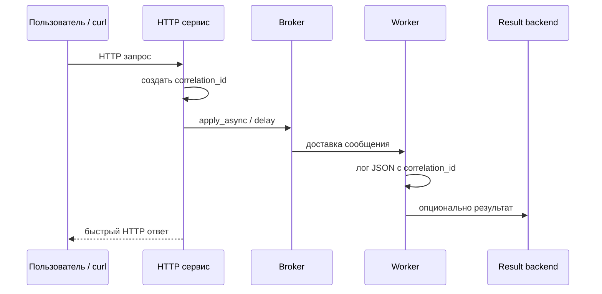

#### Проверь себя: sequence HTTP → задача

1. Почему в диаграмме HTTP отвечает пользователю **до** завершения задачи в воркере?
2. Где на схеме **рождается** идея **correlation_id**, и зачем это важно для модуля **8**?
3. Почему стрелка в result backend помечена как **опциональная**?

<details><summary>Ответ</summary>

1. Типичный контракт Celery — **асинхронная постановка**: HTTP не должен ждать тяжёлой работы; иначе теряется смысл фона.
2. В **HTTP-сервисе** при постановке задачи; без этого нельзя склеить лог веба и лог воркера одной цепочкой расследования.
3. Fire-and-forget и часть сценариев **не читают** результат через backend; важно не нарисовать ложную обязательность.

</details>

### Сквозная архитектура экзамена (Mermaid)

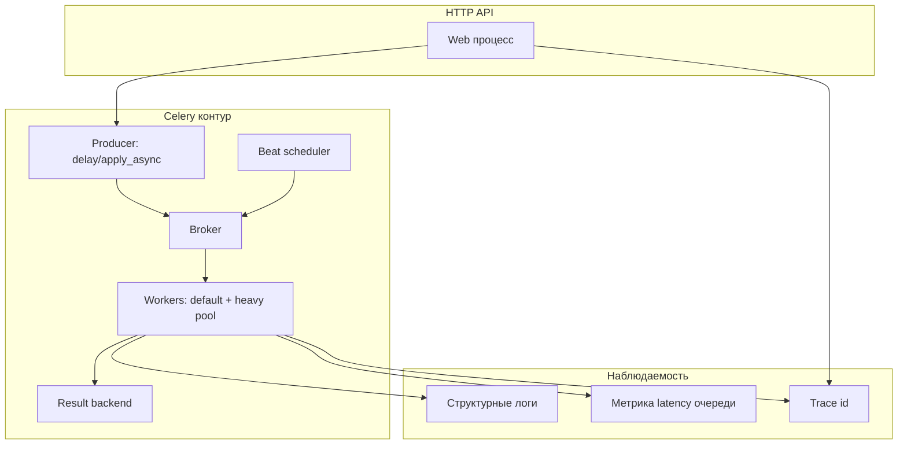

#### Проверь себя: архитектурная схема экзамена

1. Зачем на одной картинке совместить **Celery контур** и блок **наблюдаемости**?
2. Почему **beat** нарисован отдельно от **web процесса**, хотя оба «публикуют работу»?
3. Какая связь между **двумя пулами воркеров** на схеме и модулями **3** и **4**?

<details><summary>Ответ</summary>

1. Чтобы не учить Celery «в вакууме»: эксплуатация требует **логи/метрики/trace** на тех же стрелках, что и задачи.
2. Beat — отдельный **процесс планирования** с другими failure mode (двойной beat, TZ), его нельзя сливать с HTTP API.
3. Пулы отражают **изоляцию очередей** (модуль 3) и дают фон для нагрузки **canvas/chord** (модуль 4) на broker и result backend.

</details>

### Выбор одного «сквозного» домена для экзамена

Чтобы модули **не рассыпались**, зафиксируй **один** учебный продукт на весь экзамен, например:

- **«Мини-сервис уведомлений»:** HTTP принимает `user_id` и `channel`; фоном строится текст, шлётся внешнему API; beat раз в N минут подчищает «зависшие» статусы.
- **«Обработчик загрузок»:** файл попадает в объектное хранилище, метаданные в БД, превью — в `heavy`-очереди, агрегирование статистики — `chord`.

**Правило:** если в модуле 4 ты делаешь `chord` по картинкам, а в модуле 2 пишешь о платежах — мозгу сложнее удержать **единый контракт** данных.

#### Проверь себя: один сквозной домен

1. Приведи **один** признак, что выбранные домены «уведомления» и «загрузки» подходят под экзамен лучше, чем абстрактный «калькулятор».
2. Что ломается в голове, если **разные модули** экзамена используют **несовместимые** сущности данных?
3. Можно ли сменить домен после модуля **3**, не переписывая модули **1–2**?

<details><summary>Ответ</summary>

1. В них естественны **HTTP → фон**, **очереди heavy/default**, **beat-подчистка** и **агрегация** — все восьмерка модулей «цепляется» за реальные роли.
2. Ломается **контракт сообщения**: routing, идемпотентность и observability перестают быть сравнимыми между модулями.
3. Формально можно, но цена — **переписывание** схем данных и логов; на практике домен фиксируют **до** модуля 2, чтобы не платить дважды.

</details>

### Дорожная карта по модулям (ориентир по времени)

| Модуль | Зависит от | Реалистичный слот | Зачем именно такой порядок |
| ------ | ---------- | ----------------- | -------------------------- |
| 1 | — | 2–4 ч | Без живого контура остальное не стыкуется. |
| 2 | 1 | 3–6 ч | Идемпотентность осмысленна только при реальной доставке. |
| 3 | 1–2 | 2–4 ч | Роутинг — про **изоляцию нагрузки**, логично после базовой задачи. |
| 4 | 1–3 | 4–8 ч | Canvas нагружает и брокер, и backend — нужен устойчивый фундамент. |
| 5 | 1 | 2–4 ч | Beat проще отлаживать, когда worker-ы уже стабильны. |
| 6 | 1–5 | 2–3 ч | Инцидент учится на **готовой** системе, а не на черновике. |
| 7 | 1–4 | 2–5 ч (частично бумага) | Миграции мыслятся поверх реальных сообщений/полей. |
| 8 | 1–6 | 3–6 ч | Observability бессмысленна без потока, который есть что коррелировать. |

#### Проверь себя: дорожная карта модулей

1. Почему **модуль 5** в таблице зависит только от **1**, хотя beat «живёт» рядом с routing?
2. Зачем **модуль 6** ставить **после** 1–5, а не сразу после «поднял воркер»?
3. Какой смысл у строки «частично бумага» у модуля **7**?

<details><summary>Ответ</summary>

1. Для beat нужен **стабильный consumer/producer контур**; routing не обязателен, чтобы beat бил по расписанию — иначе смешиваются два разных класса проблем.
2. Инцидент учится на **реалистичной** системе: без ретраев, очередей, chord и beat таймлайн будет учебным, но не переносимым в прод-мышление.
3. Миграции полезно **проговорить** как ADR/issue даже без полного деплоя на каждом шаге; бумага фиксирует версию payload и rollback без затягивания экзамена.

</details>

### Граф зависимостей модулей (что от чего логически тянется)

<a id="exam-modules-graph"></a>

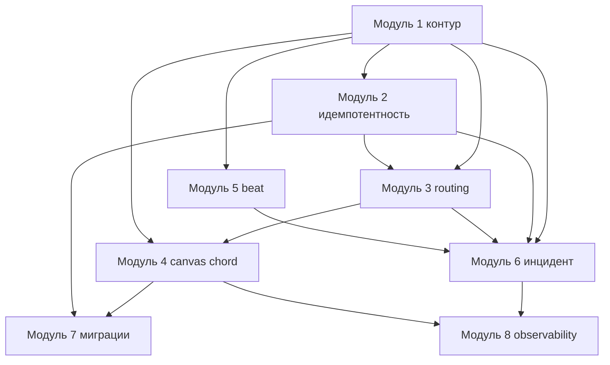

**Простыми словами:** модуль **8** опирается на «живой» поток из **1–6**; **7** можно параллелить с **5–6**, но не с пустым **1**.

#### Проверь себя: граф зависимостей модулей

1. Почему из **M1** идут стрелки сразу в **M4** и **M6**, хотя «логичнее» было бы только M1→M2→M3→…?
2. Какая пара модулей на графе **не** связана прямой стрелкой, но на практике почти всегда нужна вместе?
3. Зачем **M7** тянется и от **M4**, и от **M2**?

<details><summary>Ответ</summary>

1. Параллельные ветки отражают **разные оси риска**: canvas и инциденты опираются на живой контур раньше, чем «закрыты» все промежуточные модули в голове.
2. Часто **2 и 4**: chord при at-least-once без идемпотентности превращается в катастрофу данных.
3. **M7** — про эволюцию **сообщений и побочных эффектов**: и от агрегатов chord (M4), и от семантики повторной доставки (M2).

</details>

### Модуль 1 — базовый брокер + worker + результат

**Задача:** Поднять broker, worker с result backend, задачу `add`, убедиться, что `AsyncResult` отдаёт значение.

**DoD:**

- `celery -A proj inspect ping` отвечает.
- `result.get(timeout=...)` возвращает корректное число.
- В логе виден `task_id`.

**Пошагово (минимальный сценарий):**

1. Определи `CELERY_BROKER_URL` и `CELERY_RESULT_BACKEND` (часто Redis для обоих на учебном стенде).
2. Запусти брокер (`docker run` или compose).
3. Запусти worker в отдельном терминале с `-E` или явным `result_backend`, если нужно.
4. В третьем терминале: `python -c` или shell, вызови `add.delay(2,3)` и сохрани `task_id`.
5. Считай `AsyncResult(task_id).get(timeout=10)` и зафиксируй вывод.
6. Проверь `inspect ping` и сохрани вывод — это будущий «якорь» для модуля 6.

**Типичный провал:** backend недоступен из worker-контейнера (не та сеть Docker).

**Граничный случай:** web-процесс и worker в **разных** compose-сервисах — переменные с URL брокера должны совпадать побитово; иначе задача «уходит в никуда» или worker стартует с пустым broker.

<a id="exam-module1-topology"></a>

#### Визуал: три «комнаты» модуля 1 (где ломается Docker)

На экзамене полезно **нарисовать сеть**: producer и worker должны видеть **один и тот же** hostname брокера и (если включён) result backend. Иначе ты отлаживаешь Celery, а на самом деле у тебя **две разные вселенные URL**.

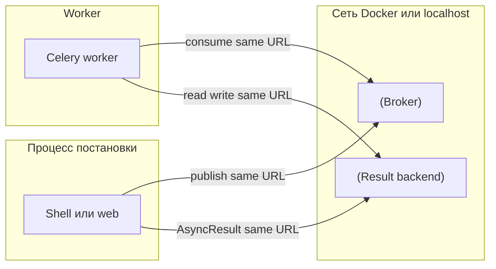

**Простыми словами:** три стрелки «один URL» — это минимальный **контракт стенда**; расхождение хотя бы в одной — классический провал модуля 1.

#### Проверь себя: модуль 1

1. Чем **DoD** модуля 1 отличается от «я запустил воркер и увидел зелёный лог»?
2. Почему типичный провал формулируется как **сеть Docker**, а не «Celery сломан»?
3. Зачем в шагах явно сохранять вывод **`inspect ping`** «на будущее»?

<details><summary>Ответ</summary>

1. DoD требует **замкнутого цикла**: брокер + worker + `task_id` + чтение результата через `AsyncResult` — иначе не доказан result backend из нужного процесса.
2. Симптомы те же (таймауты, «задачи не доходят»), но корень — **разные hostname/сеть** для producer и consumer; без этого диагноз уводит в ложный путь.
3. Это будущий **якорь инцидента** в модуле 6: привычка фиксировать «живость» контура до поломки.

</details>

---

### Модуль 2 — ретраи + идемпотентность + on_commit (по возможности)

**Задача:** Задача, которая пишет в БД/файл по **business-key**; при повторном запуске **не** создаёт дубликат; retry с backoff на транзиентную ошибку.

**DoD:**

- Искусственно вызвать 2 попытки; в хранилище **одна** запись на ключ.
- Если используешь Django — продемонстрировать `transaction.on_commit`.

**Простыми словами:** ты доказываешь, что понимаешь **at-least-once** как жизненную угрозу, а не как аббревиатуру.

**Пошагово:**

1. Выбери «бизнес-ключ» (например `order_id` или имя файла).
2. Реализуй запись в SQLite/Postgres/файл с **уникальным ограничением** или `INSERT … ON CONFLICT` / upsert.
3. Добавь в задачу искусственный `ConnectionError`/`OSError` на первой попытке (через счётчик в Redis или глобаль в dev-only).
4. Включи `autoretry_for` только на транзиентные типы; ограничь `max_retries`.
5. Докажи логами: было ≥2 вызова тела задачи, но **одна** финальная строка в БД.
6. (Опционально Django) Оберни `delay` в `transaction.on_commit`; покажи, что без этого задача может стартовать до commit.

**Типичные ошибки:** ретрай на любое исключение (включая бизнес-ошибку) → бесконечные повторы; идемпотентность только «в голове» без уникального ключа в хранилище.

**Что будет, если пропустить модуль 2:** модули **4** (chord с побочными эффектами) и **7** (старые сообщения) начнут порождать **немые** баги в данных.

**Диаграмма: идемпотентный write как «предохранитель»**

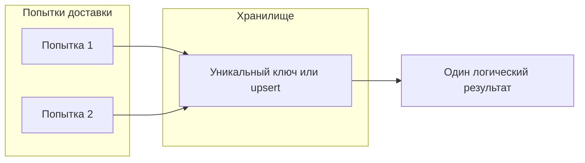

<a id="exam-on-commit-visual"></a>

#### Визуал: граница транзакции и `on_commit` (Django-стек)

Смысл модуля 2 — не «вызвать задачу из view», а **не поставить работу до фикса данных**. Без `on_commit` сообщение может уйти в брокер **раньше**, чем транзакция закоммитится; воркер читает «старый» или отсутствующий ряд — классический race.

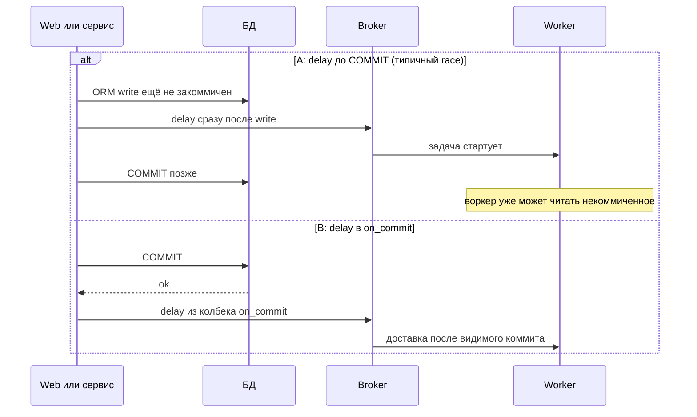

#### Проверь себя: модуль 2

1. Почему **уникальный ключ/upsert** важнее комментария «задача идемпотентна»?
2. Чем **autoretry_for** на транзиентных типах отличается от «ретраить всё подряд» с точки зрения бизнес-данных?
3. В каком случае **`on_commit`** не нужен, даже если есть БД?

<details><summary>Ответ</summary>

1. At-least-once **гарантирует** повторные вызовы тела; только хранилище с инвариантом даёт доказуемый исход «одна запись на ключ».
2. Бизнес-исключения при повторе не должны превращаться в бесконечный шум; иначе вы **размножите** побочные эффекты и «залипшие» ретраи.
3. Если постановка задачи происходит **вне** транзакции, меняющей данные, или пишете не Django/нет границы commit — тогда race другого класса.

</details>

---

### Модуль 3 — routing + две очереди + отдельный worker

**Задача:** `task_routes` или явные `queue=`; один worker слушает `celery`, второй — `heavy`.

**DoD:**

- Две команды запуска worker с `-Q` различаются; задачи попадают в правильные логи.

**Диагностика:** `inspect active_queues`.

**Пошагово:**

1. Объяви две очереди в конфиге (`task_default_queue`, `task_queues` или эквивалент).
2. Назначь тяжёлой задаче маршрут в `heavy` (`task_routes` или `apply_async(..., queue="heavy")`).
3. Запусти worker A: `-Q celery` (или твой default).
4. Запусти worker B: `-Q heavy`.
5. Отправь по одной задаче каждого типа; убедись по **логам**, что тяжёлая не исполняется на A.
6. Сохрани вывод `inspect active_queues` для обоих воркеров.

**ASCII-схема потока:**

```
producer --queue=celery--> [Worker A: default]
producer --queue=heavy---> [Worker B: heavy pool]
         \--task_routes---^ (если маршрутизация по имени задачи)
```

**Граничный случай:** задача ушла в `heavy`, но воркер B **не запущен** — очередь растёт «тихо»; учись видеть это через `inspect active` и длину очереди в брокере.

<a id="exam-module3-routing-visual"></a>

#### Визуал: две очереди у одного брокера и **разные** подписчики

ASCII выше — про **имена** очередей; ниже — про **роли**: один брокер хранит две логические «корзины», а consumer-ы подписаны на разные `-Q`. Тяжёлая работа не должна «забивать» слоты воркера, который обслуживает латентные дефолтные задачи.

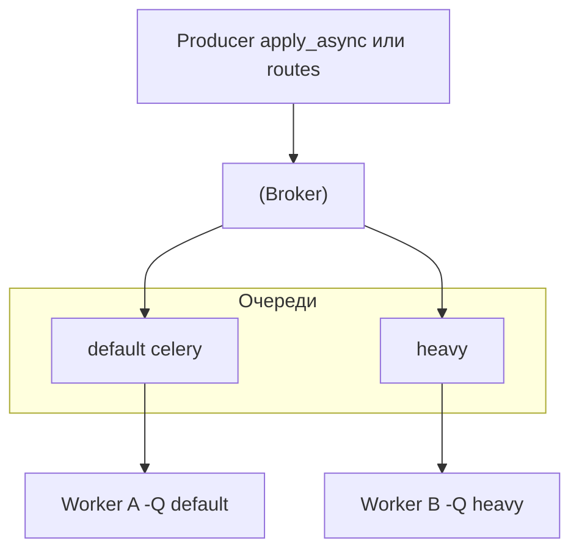

**Типичная ошибка:** два воркера с **одинаковым** `-Q`, но разные `task_routes` в голове — маршрутизация решается **в момент публикации** и подписках, а не «само рассосётся».

#### Проверь себя: модуль 3

1. Почему недостаточно «назвать очередь в коде», если воркер запущен без нужного **`-Q`**?
2. Чем **`inspect active_queues`** полезнее, чем смотреть только лог «task received»?
3. Опиши симптом «задача в `heavy`, воркер B не запущен» — что увидит оператор?

<details><summary>Ответ</summary>

1. Очередь — это **подписка consumer-а**; без подписчика сообщения копятся в брокере, даже если producer публикует «правильно».
2. `active_queues` показывает **факт подписки** процесса на имена очередей; лог может быть у «не того» воркера или вовсе отсутствовать при зависании доставки.
3. Рост длины очереди в брокере, пустой `active` на нужном воркере, отсутствие прогресса в логах — классическая «тихая» очередь.

</details>

---

### Модуль 4 — canvas + chord с измерением backend

**Задача:** `chord(group(...), aggregate)`; замерить время, оценить нагрузку на result backend при большом header.

**DoD:**

- Письменный отчёт на полстраницы: где узкое место (брокер vs backend vs CPU задач).

**Картинка в голове:** chord — **фан-ин**; фан-ин почти всегда дороже фан-аута.

**Пошагово:**

1. Сделай `group` из N однотипных задач (N начни с 10, потом 100 если выдерживает стенд).
2. Оберни в `chord(..., summarize.s())` где `summarize` читает результаты группы.
3. Замерь wall-clock до завершения **всего** chord (в клиенте или логом в callback).
4. Включи мониторинг Redis (`INFO`, `MONITOR` в dev осторожно) или метрики latency result backend.
5. В отчёте ответь: при росте N что растёт быстрее — CPU воркера, round-trips к Redis, или очередь у брокера?

**Мини-пример каркаса (псевдокод, имена задач подставь свои):**

```python
from celery import chord, group

# header: много лёгких задач; body: агрегирует результаты
header = group(mini_task.s(i) for i in range(N))
result = chord(header)(summarize.s())
```

**Типичные ошибки:** забыть result backend для chord; не обработать частичный фейл header — тогда body может не сработать или зависнуть в ожидании (зависит от версии и настроек).

**Граничный случай:** одна задача header падает **после** того как другие уже записали побочные эффекты — твой отчёт должен явно сказать, как доменная логика это переживает (компенсация, идемпотентность, saga — на уровне идеи).

#### Визуал: `chord` как fan-in (почему страдает result backend)

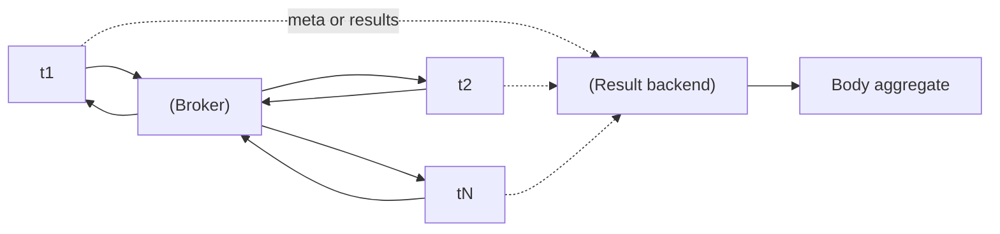

**Простыми словами:** `group` раздувает **поверхность параллелизма**, а `chord` заставляет **сойтись** результаты в одну точку — эта точка часто упирается в Redis/брокер и в то, как ты читаешь промежуточные результаты.

#### Проверь себя: модуль 4

1. Почему в DoD модуля 4 требуется **текстовый отчёт**, а не только «chord отработал»?
2. Как **частичный фейл** в header связан с модулем **2**?
3. Что в отчёте должно измениться при росте **N** с 10 до 100 — один пример метрики или наблюдения?

<details><summary>Ответ</summary>

1. Цель — увидеть **узкое место** (брокер vs result backend vs CPU); «зелёный chord» не доказывает понимание стоимости fan-in.
2. Повторные попытки и частично выполненный header дают **дубли побочных эффектов** без идемпотентности — chord усиливает риск модуля 2.
3. Например рост round-trips к Redis, рост latency callback, рост глубины очереди у брокера — в отчёте должно появиться **сравнимое** «что растёт быстрее».

</details>

---

### Модуль 5 — beat + overlap policy

**Задача:** Периодическая задача каждые N секунд; ввести политику anti-overlap: **внешняя блокировка** (Redis `SETNX` с TTL, advisory lock в БД) **или** штампы / `stamped_headers` в Celery (если твоя версия и сценарий это покрывают) **или** сократить интервал + жёсткий `time_limit` — выбрать **одну** понятную стратегию и задокументировать поведение при overlap.

**DoD:**

- Текстом описан сценарий «задача дольше интервала» и что произойдёт.

**Пошагово:**

1. Добавь в `beat_schedule` задачу раз в 30–60 секунд (в dev можно чаще).
2. Сделай тело задачи **намеренно** медленнее интервала (sleep или внешний вызов).
3. Включи выбранную anti-overlap стратегию (например, advisory lock в БД по ключу `cron:jobname` или Redis `SETNX` с TTL).
4. Наблюдай логи: второй тик не должен «ломать» инвариант (или должен **явно** отбрасываться — как ты задокументировал).
5. Зафиксируй, что произойдёт при **двух** beat-процессах без координации (как анти-пример).

**Сравнение стратегий (кратко):**

| Стратегия | Плюс | Минус |
| ---------- | ----- | ----- |
| Блокировка в БД/Redis | Понятная семантика в распределённой среде | Нужна инфраструктура и дизайн TTL lock |
| Штампы Celery (`stamped_headers` и связанные механизмы, см. доку твоей версии) | Дедуп/координация на уровне сообщения без отдельного хранилища lock | Нужно понимать протокол и ограничения брокера |
| «Ничего не делать» | Дёшево в коде | Overlap → двойные списания, двойные отчёты, rate limit внешних API |

<a id="exam-beat-topology"></a>

#### Визуал: один beat-контур vs «два планировщика» (анти-пример к модулю 5)

**Норма:** один процесс beat публикует в брокер по расписанию; воркеры забирают сообщения. **Анти-пример:** два beat с одинаковым расписанием без координации — два потока тиков, **двойные** срабатывания и гонки overlap даже при «правильной» задаче.

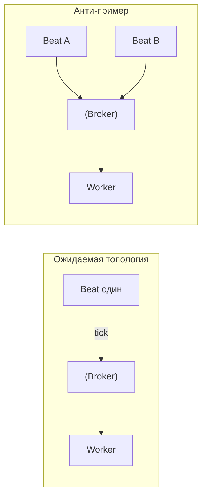

**Простыми словами:** второй beat — это не «резерв», а **второй будильник** на ту же минуту, если нет явной координации.

#### Проверь себя: модуль 5

1. Чем **overlap** периодической задачи отличается от «долго выполняется одна задача по запросу»?
2. Зачем в DoD явно требовать **анти-пример с двумя beat**?
3. Почему стратегия «ничего не делать» из таблицы — не «лень», а **осознанный риск**?

<details><summary>Ответ</summary>

1. Overlap — это **новый тик расписания**, пока предыдущий ещё не закончился; растёт риск двойных побочных эффектов и давления на внешние API.
2. Чтобы отделить **эксплуатационный** класс ошибок (двойной планировщик) от багов в теле задачи.
3. Если инвариант «двойной запуск допустим» — ок; иначе это скрытая поломка SLA и данных, которую надо явно задокументировать.

</details>

---

### Модуль 6 — инцидент + inspect-only диагностика

**Задача:** Сымитировать проблему (например, остановить worker mid-flight, переполнить prefetch, закрыть порт брокера) и **только** командами `inspect`/логами (без «починил кодом не глядя») построить цепочку гипотез.

**DoD:**

- Таймлайн инцидента: **симптом → команда → вывод → обновлённая гипотеза** (минимум четыре строки, без дублирования «вывод» подряд).

**Каталог сценариев (выбери один на экзамен):**

| Сценарий | Симптом для пользователя | Первая команда / действие |
| -------- | ------------------------ | ------------------------- |
| Брокер недоступен | Все задачи «висят», HTTP может ещё жить | `inspect ping` + проверка TCP до брокера |
| Worker убит mid-task | Часть задач «исчезла» из прогресса | Логи обрыва + `inspect reserved/active` |
| Неверный `-Q` | Задачи не исполняются, очередь растёт | `inspect active_queues` vs ожидаемые имена |
| Result backend переполнен/медленен | chord/group «зависают» на финале | latency Redis + размер ключей |

**Пошагово:**

1. Зафиксируй **нулевое состояние:** вывод `inspect ping`, `inspect stats`.
2. Включи сценарий (например `docker pause` на контейнере брокера или `kill -9` worker child).
3. Наблюдай 2–3 минуты; собирай **только** inspect + логи.
4. Заполни таблицу таймлайна минимум из **4 строк**.
5. Только после этого разреши себе «починку» (restart контейнера) и сравни, что изменилось в inspect.

**Ограничение учебной честности:** не открывать веб-дашборд Flower как первый инструмент — сначала CLI, потом можно свериться с Flower как «вторым мнением».

<a id="exam-incident-loop"></a>

#### Визуал: цикл **inspect-first** (модуль 6)

Цель — не «угадать с первой команды», а **сузить конус неопределённости**: каждая итерация добавляет наблюдаемый факт. Правка кода до заполнения таймлайна **запрещена** учебным контрактом модуля.

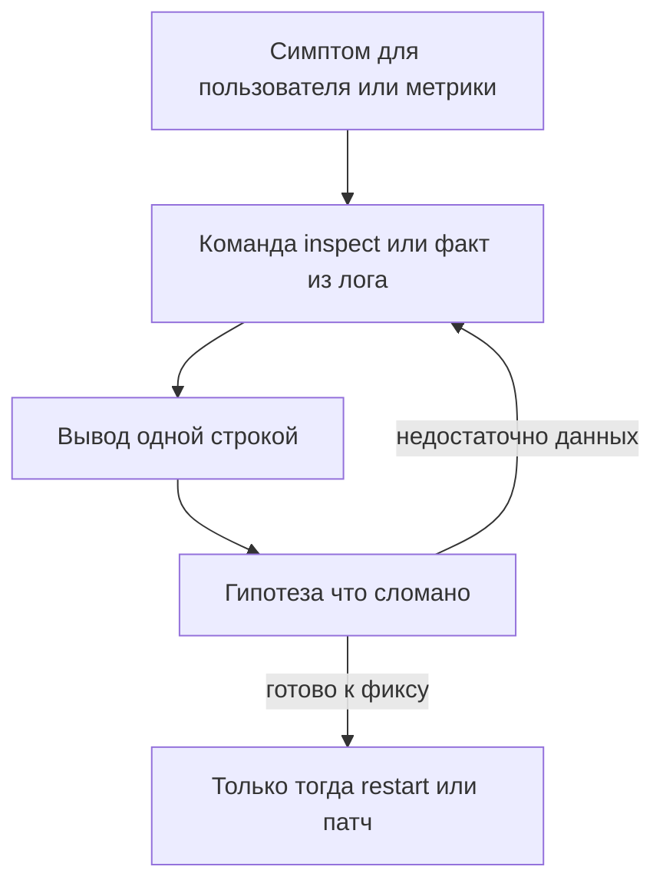

**Типичная ошибка:** первая же команда «перезапустить всё» — ты закрыл симптом и **не оставил** артефакт таймлайна для DoD.

#### Проверь себя: модуль 6

1. Почему **Flower** отодвинут на второй план относительно CLI?
2. Чем строка таймлайна **«гипотеза»** отличается от строки **«вывод»**?
3. Приведи пример: какая **первая** команда из таблицы сценариев может **сразу** опровергнуть гипотезу «упал брокер»?

<details><summary>Ответ</summary>

1. На собеседовании и в минимальном SSH часто нет Flower; CLI **inspect** — переносимый минимум.
2. **Вывод** — факт из лога/inspect; **гипотеза** — интерпретация, которую можно проверить следующей командой без правки кода.
3. Например `inspect active_queues` показывает, что воркер подписан не на ту очередь — тогда корень не брокер, а **routing/подписка**.

</details>

---

### Модуль 7 — миграция версии с очередью сообщений

**Задача:** На бумаге + минимально в коде: «в очереди лежат сообщения старого формата» — план совместимости (поле `schema_version`, dual-read, drain старой очереди).

**DoD:**

- Чеклист из 5 шагов деплоя без простоя или с объяснённым downtime.

**Пошагово (документально):**

1. Опиши **два** формата тела kwargs (`v1` без поля, `v2` с полем `schema_version=2`).
2. Выбери стратегию: **dual-read** в worker (принимает оба) **или** новая очередь `tasks_v2` + drain старой.
3. Распиши порядок деплоя: сначала consumer, потом producer (или наоборот — обоснуй).
4. Добавь в коде **минимальную** ветку `if payload.get("schema_version") == 1: ...` как доказательство мысли.
5. Пропиши rollback: что делать, если после деплоя очередь забита невалидными сообщениями.

**Типичные ошибки:** «сначала деплоим producer на v2, а consumer ещё v1» без очереди-прослойки → мусор в обработчике.

<a id="exam-migration-deploy-visual"></a>

#### Визуал: два безопасных порядка деплоя (выбери и обоснуй в ADR)

Ось времени слева направо. «Старый» и «новый» — версии **сериализации** kwargs и кода воркера.

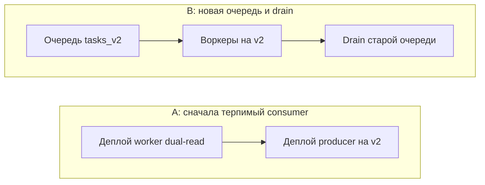

**Простыми словами:** либо **никто не публикует v2**, пока воркер не умеет читать оба формата, либо **v2 живёт в отдельной очереди**, пока старая не опустеет.

**Уточнение к схеме B:** стрелки — не буквальный CI-скрипт, а **логический** порядок: появляется изолированный поток для новой версии, затем воркеры стабильно обслуживают его, параллельно или после этого контролируемо **drain**-ите хвост старой очереди по метрикам «глубина очереди / age сообщения».

#### Проверь себя: модуль 7

1. Зачем в миграции полезны **два** формата payload, а не «сразу только v2»?
2. В чём разница **dual-read** и отдельной очереди **`tasks_v2`** с точки зрения **blast radius** при ошибке?
3. Что должно быть в **rollback**, кроме «откатить git»?

<details><summary>Ответ</summary>

1. В очереди всегда есть **хвост** старых сообщений; без совместимости вы получите необработанный мусор или downtime.
2. Dual-read меняет код воркера, но **одна** очередь — ошибка затрагивает весь поток; отдельная очередь изолирует v2, но добавляет операционную сложность drain.
3. Кто останавливает producer, что делаем с сообщениями «на полпути», как возвращаем consumer к чтению v1, какие метрики глубины очереди смотрим.

</details>

---

### Модуль 8 — наблюдаемость (метрики + лог + один trace id)

**Задача:** Прокинуть `correlation_id` из HTTP в kwargs задачи; логировать JSON; одна gauge/counter (хотя бы через `prometheus_client` в sidecar-подходе **или** через готовый exporter — по возможности стенда).

**DoD:**

- По одному grep можно найти **весь** путь запроса.

**Пошагово:**

1. В HTTP-слое сгенерируй `correlation_id` (UUID) и залогируй его в request log.
2. Передай тот же id в `task.apply_async(..., kwargs={..., "correlation_id": cid})` или через headers (если используешь propagation).
3. В `before_start`/`task_prerun` или в начале тела задачи залогируй JSON-строку с полями `task_id`, `correlation_id`, `queue`.
4. Добавь **одну** метрику: например счётчик вызовов задачи или гистограмму длительности через `prometheus_client` (экспорт на `/metrics` в dev).
5. Проведи учение: по одному `grep correlation_id` по логам web+worker найди полную цепочку.

**Граничный случай:** логи в JSON, но разные сервисы пишут в **разные** индексы без общего `correlation_id` — тогда «один grep» не работает; в отчёте опиши, как бы ты выровнял политику логирования.

<a id="exam-correlation-visual"></a>

#### Визуал: один `correlation_id` сквозь границу HTTP → задача

Идея модуля **8** — не «красивые логи», а **одна стыковочная плоскость** между процессами: `cid` создаётся в HTTP-слое → пересекает границу постановки задачи → оказывается в kwargs/headers и в JSON-логе воркера.

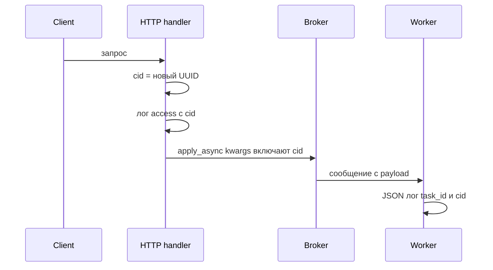

**Типичная ошибка:** положить `cid` только в **заголовок** HTTP-ответа или в ответ пользователю, но **не** передать в kwargs/headers задачи — тогда воркер «слепой» относительно запроса.

#### Проверь себя: модуль 8

1. Почему DoD формулируется как **«один grep»**, а не «красивый JSON»?
2. Зачем метрика **одна**, если в Prometheus обычно десятки?
3. Как **граничный случай** про «разные индексы логов» связан с модулем **1** (топология процессов)?

<details><summary>Ответ</summary>

1. Проверяется **сквозная склейка** сигнала между процессами; красивый JSON без propagation не лечит инциденты.
2. На экзамене важно доказать **путь измерения** (что считаем и где видим рост), а не построить полный дашборд.
3. Если web и worker пишут в разные стенды/индексы без общего id, вы снова получаете **две вселенные** наблюдаемости — как с разными URL брокера в модуле 1.

</details>

---

### Типичные ошибки экзамена

- Начать с модуля 4 без стабильного модуля 1 — получишь «магические» зависания.
- Смешать **несколько** продуктовых доменов — мозг не склеит паттерны.
- В модуле **8** включить метрику без **базового сценария** (непонятно, что именно изменилось при нагрузке) — снимай «до/после» одним и тем же `correlation_id`.
- В модуле **7** описать только happy-path деплоя и **не** написать rollback при откате версии — это не миграция, а фантазия.

#### Проверь себя: типичные ошибки экзамена

1. Почему «смешать домены» из этого списка **хуже**, чем просто «сложный код»?
2. Какая пара **модулей** одновременно ломается, если начать с **4** без стабильного **1**?
3. Зачем в пункте про метрику в модуле **8** упомянуты **до/после** и один `correlation_id`?

<details><summary>Ответ</summary>

1. Ломается **единый контракт** данных и логов — нельзя переносить выводы между модулями; сложность хотя бы локальна.
2. **4** требует устойчивого брокера/result backend и предсказуемых воркеров из **1**; иначе «зависания» chord списываются на canvas, а не на инфраструктуру.
3. Иначе метрика не привязана к **конкретному** сценарию нагрузки и превращается в декоративное число без интерпретации.

</details>

### Проверь себя

1. Почему модуль 6 требует **inspect-only**?
2. Какой модуль лучше всего проверяет понимание **части 39**?
3. Что общего у модулей 2 и 7?

<details><summary>Ответ</summary>

1. Чтобы тренировать **операционную** картину: в проде сначала смотрят снаружи, а не переписывают бизнес-логику.
2. Модуль 6 (инцидент) + модуль 2 (исключения/ретраи) напрямую опираются на модель состояний/ошибок; формально ближе всего **39**.
3. Оба про **совместимость во времени**: 2 — с повторной доставкой, 7 — с версиями сообщений при деплое.

</details>

### Проверь себя (приёмка экзамена)

4. Какая **одна** колонка приёмочной матрицы отвечает на вопрос «это было в реальности, а не в голове»?
5. Почему sequence «HTTP → broker → worker» полезен даже если твой экзамен — чистый CLI без браузера?
6. Можно ли сдать модуль **8**, не пройдя модуль **3**? Обоснуй.

<details><summary>Ответ</summary>

4. Колонка **«Минимальный артефакт»** — она требует внешнего следа (лог, дамп, метрика), а не самооценки.
5. Потому что в проде почти всегда есть **входная граница** (HTTP, gRPC, consumer), откуда в систему попадает работа; даже CLI-экзамен моделирует «точку постановки» и propagation id.
6. Формально можно записать лог с `correlation_id` в одном процессе, но без реалистичного **разделения** producer/consumer (как в модулях 1 и 3) легко получить «игрушечную» наблюдаемость, не переносимую в сервис.

</details>

### Запомните

Экзамен — это **интеграционный тест твоей головы**: отдельные главы работают только если работает цепочка.

---
