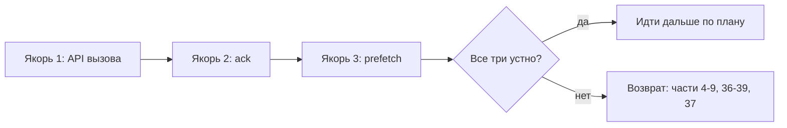
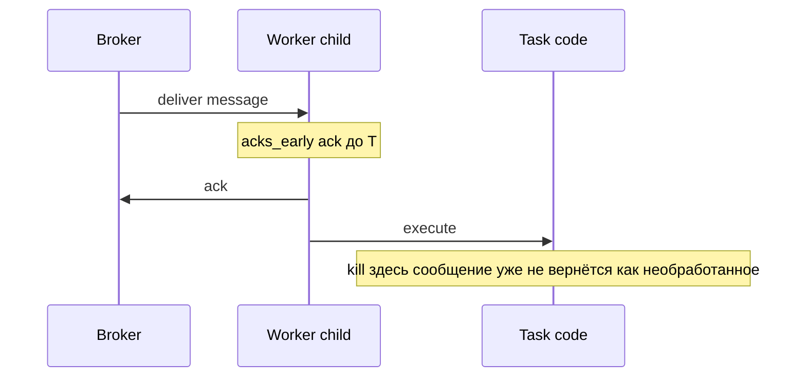
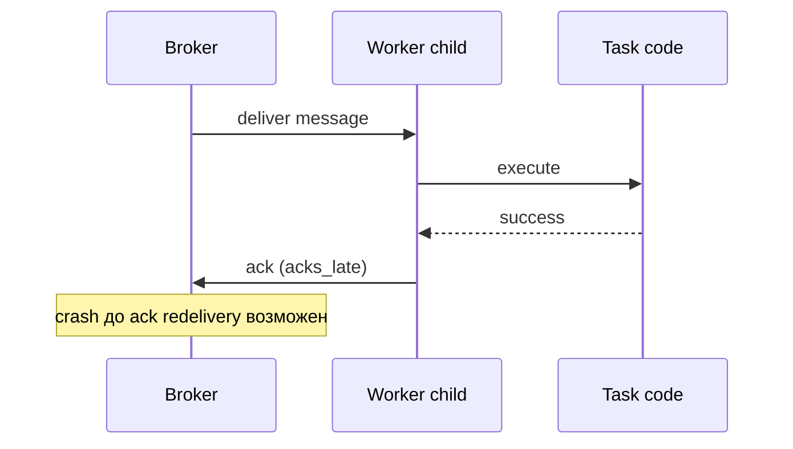
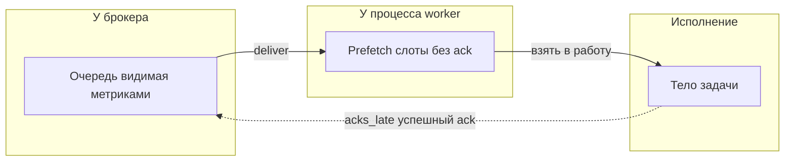
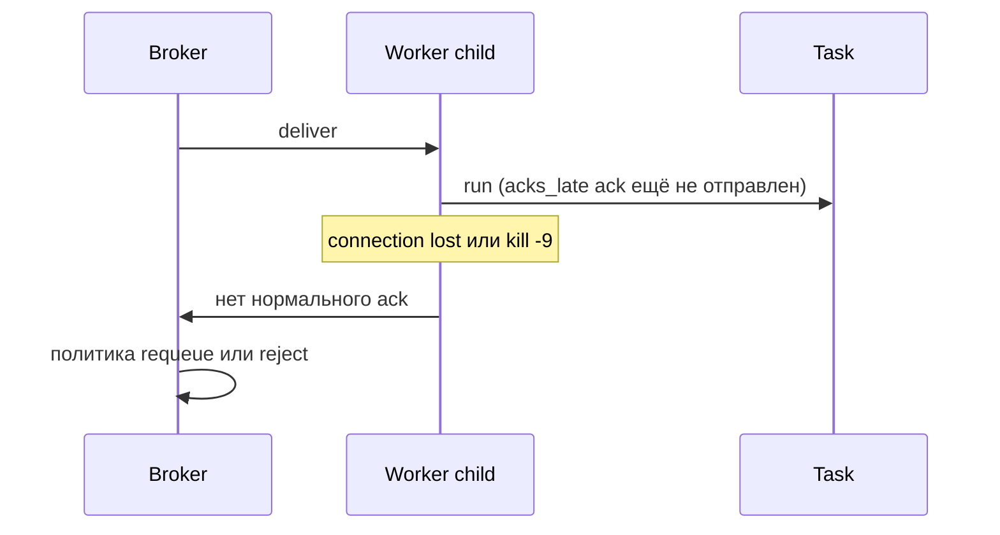
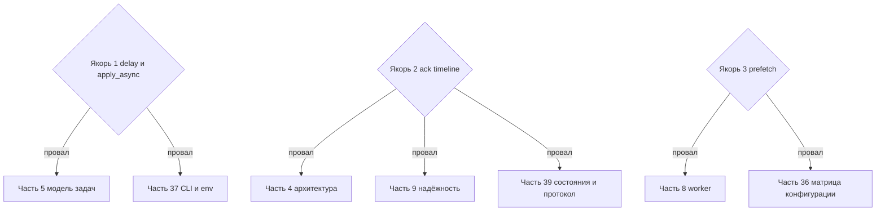

[← Назад к индексу части](index.md)
[↑ К глобальному плану](../mastery_plan.md)

## 42.4 Анти-«ложное чувство знания»

### Цель раздела

Поймать три «якорные» проверки из плана **42.4** и превратить их в **операционные навыки**, а не в факт из FAQ.

#### Проверь себя: цель 42.4

1. Чем **операционный навык** отличается от «знаю определение из FAQ»?
2. Почему в заголовке раздела фигурирует именно **«ложное чувство знания»**, а не «пробелы в теории»?
3. Как по одному признаку понять, что пора **остановиться** и прогнать якоря, а не читать следующую главу?

<details><summary>Ответ</summary>

1. Навык — это **действие под стрессом**: выбрать API вызова, нарисовать ack, объяснить prefetch при kill; FAQ — пассивное узнавание текста.
2. Теорию можно не знать честно; «ложное знание» — когда термины есть, а **предсказание поведения** системы ломается на инциденте.
3. Если на вопросы якорей ответ уходит в «ну в общем…» или противоречит сам себе через минуту — это сигнал вернуться к первичным частям, а не наращивать охват.

</details>

### В этом разделе главное

План честно говорит: если три проверки «не на пальцах», ты **ещё не закрыл** базовую модель исполнения — дальше бессмысленно наращивать «архитектурные» слова. Здесь ты получаешь **критерии провала**, **куда откатываться по главам** и **устный ритуал**, чтобы не обманывать себя.

#### Проверь себя: «в этом разделе главное»

1. Зачем в одном абзаце связаны **критерии провала** и **маршрут отката** по главам?
2. Почему «архитектурные слова» без якорей названы **бессмысленными**, а не просто «сложными»?
3. Что такое **устный ритуал** в контексте этого раздела — пересказ файла или что-то другое?

<details><summary>Ответ</summary>

1. Провал без маршрута превращается в стыд; с маршрутом это **диагностика**, куда открыть pact (5, 8, 9, 36–39…).
2. Архитектура без модели доставки/ack/prefetch не предсказывает поломки на стыке брокера и воркера — остаётся декоративный слой.
3. Короткая **самопроверка вслух** по трём якорям с примерами опций/стрелок ack/эффекта prefetch — без чтения шпаргалки.

</details>

### Термины

| Проверка | Что на самом деле проверяется |
| -------- | ------------------------------ |
| `delay` / `apply_async` | Понимание **signature**, опций доставки, совместимости с routing/countdown/expires. |
| Ack timeline | Связь **acks_early/acks_late**, `task_reject_on_worker_lost`, потерь и redelivery. |
| Prefetch-related | Как минимум: `worker_prefetch_multiplier`, взаимодействие с `acks_late`, одиночные задачи долгие vs короткие, fair dispatch. |

#### Проверь себя: таблица терминов 42.4

1. Почему в одной строке таблицы для **API вызова** упомянуты и **routing**, и **expires**?
2. Чем строка **Ack timeline** принципиально уже строки про prefetch?
3. Зачем в **Prefetch-related** явно сказано «длинные vs короткие» задачи?

<details><summary>Ответ</summary>

1. Потому что `apply_async` — это не только args, а **политика доставки сообщения** в брокер (куда, когда, до какого момента живёт).
2. Ack отвечает на «**когда** сообщение считается закрытым для брокера»; prefetch — на «**сколько** незакрытых сообщений может висеть у воркера».
3. Справедливость очереди и tail latency зависят от **смеси** длительностей при фиксированном prefetch — иначе multiplier кажется «просто числом».

</details>

### Цикл самопроверки трёх якорей (перед экзаменом или собеседованием)



**Как запомнить:** *API → подтверждение → предзагрузка* — порядок совпадает с тем, как обычно «ломается» система при инциденте: сначала спрашивают *как отправили*, потом *потерялись ли сообщения*, потом *кто держит хвост очереди*.

#### Проверь себя: цикл трёх якорей

1. Почему в графе при провале указан **узкий набор** глав (4–9, 36–39, 37), а не «прочитай всё с нуля»?
2. Как мнемоника **API → ack → prefetch** соотносится с типичным порядом вопросов на инциденте?
3. Что означает узел **«Все три устно?»** — дословный пересказ или что-то ещё?

<details><summary>Ответ</summary>

1. Провал якоря **локализуем**: нужны первичные главы, где эти механизмы определены формально, а не весь курс.
2. Сначала проверяют **как поставили** задачу, затем **потерю/redelivery**, затем **залипание хвоста** и несправедливость между задачами.
3. Умение за 30–60 секунд **сгенерировать** пример, стрелки и последствие kill без подглядывания — не чтение файла вслух.

</details>

### Теория и правила

#### 1) `delay()` vs `apply_async()`

<a id="anchor-delay-apply"></a>

- **`delay(*args, **kwargs)`** — сахар: «вызови задачу с этими позиционными/именованными аргументами» без дополнительных опций.
- **`apply_async(args=..., kwargs=..., **options)`** — полный контроль: `queue`, `routing_key`, `countdown`, `expires`, `serializer`, `headers`, `link`/`link_error` и др.

**Простыми словами:** `delay` — как кнопка «отправить»; `apply_async` — как форма с расширенными полями.

**Где ломается понимание:** думают, что это «разная скорость» или «разная надёжность». На уровне **доставки в брокер** разница не в «качестве», а в **контроле опций**.

**Мини-пример:**

```python
# Эквивалентные идеи (упрощённо):
add.delay(2, 3)
add.apply_async(args=(2, 3))

# То, что нельзя выразить delay-ом нативно «в одном вызове» без .si/.s:
add.apply_async(args=(2, 3), queue="heavy", countdown=10, expires=60)
```

**Куда вернуться:** pact-части **5** (модель задач) и **37** (CLI/env — как параметры попадают в runtime).

| Критерий | `delay` | `apply_async` |
| -------- | ------- | --------------- |
| **Сигнатура задачи** | Позиционные и именованные аргументы «как у функции» | Явные `args` / `kwargs` (удобно для программной сборки) |
| **Очередь routing ETA** | Дефолты приложения | `queue`, `routing_key`, `countdown`, `expires`, `headers`, … |
| **Когда хватает** | Быстрый вызов из кода без особых опций | Нужен контроль доставки и метаданных сообщения |
| **Типичный промах** | Спрятать сложность и забыть, что прод **всегда** задаёт очередь/таймауты где-то ещё | Перепутать порядок/имена аргументов у «обёрнутых» сигнатур — вернуться к части **5** |

#### Проверь себя: `delay` и `apply_async`

1. Почему в тексте подчёркнуто, что на «качество доставки в брокер» `delay` и `apply_async` **не разводят** магически?
2. Приведи **одну** опцию `apply_async`, которую нельзя выразить «чистым» `delay` без изменения сигнатуры задачи.
3. Когда **опаснее** использовать `delay` в проде — когда он «не хватает» или когда «хватает, но скрывает»?

<details><summary>Ответ</summary>

1. Оба ведут к **публикации сообщения**; разница в **контроле полей** сообщения и маршрута, а не в «более надёжном транспорте».
2. Например `queue="heavy"`, `countdown=…`, `expires=…`, `headers=…` — любой корректный пример из списка опций.
3. Когда «хватает», но команда **не осознаёт**, что очередь/таймауты задаются где-то ещё инфраструктурой — получаются скрытые дефолты.

</details>

#### 2) Ack timeline (временная линия подтверждения)

<a id="anchor-ack-timeline"></a>

Нарисуй для себя **две** линии: *acks early* и *acks late*.





**Как запомнить:** *ранний ack — «я уже забыл задачу» до конца работы; поздний — «подтверждаю только когда реально дожил до конца».*

**Связь с `task_reject_on_worker_lost`:** при потере воркера можно **отклонить** задачу так, чтобы брокер не считал её успешно завершённой; логика пересекается с тем, **когда** брокер должен считать сообщение обработанным. Детали зависят от брокера и настроек — поэтому проверка «на пальцах» обязана включать **что произойдёт при kill -9**.

**Куда вернуться:** **4, 9, 39** (надёжность + формальная модель).

#### Проверь себя: ack timeline

1. На диаграмме **acks_early**: где проходит граница «сообщение уже не вернётся как необработанное» при kill воркера?
2. Зачем к **ack timeline** привязан **`task_reject_on_worker_lost`**, а не только «настройки брокера»?
3. Почему устная проверка обязана включать **`kill -9`**, а не только «нормальное завершение»?

<details><summary>Ответ</summary>

1. После **раннего ack** до выполнения тела: брокер уже закрыл доставку с точки зрения «не передай снова».
2. Celery+воркер участвуют в том, **как интерпретировать** потерю процесса относительно ack и requeue/reject.
3. Именно жёсткое убийство ломает «аккуратные» сценарии и вскрывает redelivery и дубли — это стресс-тест понимания.

</details>

#### 3) Три опции/темы вокруг prefetch

<a id="anchor-prefetch"></a>

Минимальный набор, который ожидает план:

1. **`worker_prefetch_multiplier`** — базовый рычаг «сколько сообщений заранее».
2. **Связка с `task_acks_late=True`** — prefetch влияет на то, **сколько задач висит «взято, но не ack-нуто»** при убийстве воркера.
3. **Справедливость / хвост latency** — высокий prefetch на **очень разной** длительности задач ухудшает «честность» очереди (короткие задачи ждут за длинными в том же процессе).

**Соответствие плану 42.4 («три опции prefetch-related»):** именно эти **три нумерованных пункта** и есть ответ плана; отдельно ниже — [визуал «кто держит сообщение»](#prefetch-ownership): он не заменяет пункты 1–3, а показывает **физическое место** сообщения в связке prefetch + `acks_late`, чтобы устная проверка не превратилась в заучивание одного числа `worker_prefetch_multiplier`.

<a id="prefetch-ownership"></a>

#### Визуал: три «кармана» сообщения (ответ на вопрос «где оно сейчас живёт»)

План требует **три темы вокруг prefetch** — их проще держать в голове, если видно, **у кого** висит сообщение до `ack`: у брокера в очереди, в prefetch-буфере процесса воркера или уже в исполняемом теле задачи.



**Простыми словами:** prefetch — это «сколько писем лежит на столе у курьера, но ещё не отмечены как доставленные»; при `kill -9` именно этот стол чаще всего и превращается в **повторную доставку**.

**Связанные рычаги (дополни в матрице 36):** у разных версий и пулов встречаются соседние параметры вроде лимитов prefetch на уровне воркера, настройки «отключить prefetch» для совместимости с долгими задачами, отдельные нюансы для **gevent/eventlet** — суть одна: ты должен уметь объяснить **не только число**, но и **кто держит невидимые для брокера сообщения** при остановке процесса.

| Ситуация | Что проверить в первую очередь |
| -------- | ------------------------------- |
| «Хвост» очереди растёт, CPU полупростаивален | prefetch слишком мал или задачи блокируются на I/O вне процесса — не путать с «мало воркеров». |
| OOM / рост памяти при старте волны задач | много сообщений «взято в работу» × тяжёлый payload в памяти — связка prefetch + модель сериализации. |
| После `kill -9` волна дублей в БД | `acks_late` + высокий prefetch → много «незавершённых с точки зрения ack» задач возвращается — проверь идемпотентность и лимиты. |

**Простыми словами:** prefetch — это **сколько тикетов взять из кассы**, не зная, успеешь ли обслужить людей до пожара.

**Куда вернуться:** **8, 36** (worker/pool и матрица конфигурации).

#### Проверь себя: prefetch и «кто держит сообщение»

1. Чем **три нумерованных пункта** плана отличаются от картинки «три кармана»?
2. Почему строка таблицы про **OOM** связывает prefetch с **сериализацией**, а не только с «много задач»?
3. Как одной фразой объяснить коллеге связку **высокий prefetch** и **`acks_late`** при аварии?

<details><summary>Ответ</summary>

1. Пункты — **обязательные темы** для устного ответа; карман — **физическая модель**, где сообщение висит до ack, чтобы не заучивать число.
2. Prefetch умножает **сколько полных payload** одновременно в памяти процесса; тяжёлый kwargs увеличивает цену каждого слота.
3. «Воркер взял пачку работ заранее, но ack ещё не отправил — при kill пачка может **вернуться** в доставку».

</details>

#### Таблица: не путать слои таймаутов

| Механизм | Где живёт | Что ограничивает |
| -------- | --------- | ---------------- |
| **`expires` / `time_limit` сообщения** (`apply_async`) | Сообщение в брокере / метаданные задачи | «Не начинать выполнение после момента T» vs «убить задачу по wall-clock» — **сверь с докой версии**, имена отличаются |
| **`soft_time_limit` / `time_limit`** | Исполнение в воркере | Мягкий сигнал для отмены бизнес-логики vs жёсткое убийство воркере |
| **HTTP timeout** клиента, вызывающего `delay` | Веб-сервер / клиент | Не связан с длительностью фона; связан только с **публикацией** в брокер |

**Простыми словами:** «истечение сообщения» и «лимит CPU задачи» отвечают на **разные страхи**; смешиваешь — получаешь необъяснимые обрывы.

#### Проверь себя: слои таймаутов

1. Почему **HTTP timeout** не ограничивает длительность **фоновой** задачи?
2. Чем **`expires`** у сообщения концептуально отличается от **`time_limit`** на исполнение?
3. Зачем в таблице предупреждение **«сверь с докой версии»** для `expires`/`time_limit`?

<details><summary>Ответ</summary>

1. HTTP ждёт только **публикацию** (или ответ API), а не выполнение воркера; фон живёт в другом процессе и контракте.
2. `expires` — про «**не начинать** / не принимать слишком старое сообщение»; `time_limit` — про **остановку уже бегущего** тела задачи.
3. Имена и точная семантика **меняются по версиям**; важно не путать слои «на автомате» по похожим словам.

</details>

#### `task_reject_on_worker_lost` и «потерянный воркер»

Когда connection worker ↔ broker обрывается так, что брокер считает воркера «мёртвым», сообщение может оказаться в подвешенном состоянии. Настройки вроде **`task_reject_on_worker_lost`** (в связке с `acks_late`) влияют на то, **вернётся ли** задача в очередь или будет отклонена — это уже **контракт с брокером**, а не «магия Celery».



**Примечание:** точная семантика **requeue / reject** задаётся связкой брокера, `acks_late` и флагов вроде `task_reject_on_worker_lost`; на экзамене достаточно уметь **нарисовать разрыв** до ack и назвать **что проверить** в конфиге и логах.

**Как запомнить:** *пока ack не ушёл, брокер вправе считать работу незавершённой — решает политика транспорта и твои флаги.*

#### Проверь себя: `worker_lost` и reject/requeue

1. Что в этой секции намеренно **не** зафиксировано как единственный «правильный» исход?
2. Почему «потерянный воркер» — это проблема **связи и ack**, а не только «упал процесс»?
3. Что ты проверишь в **логах и конфиге** в первую очередь после волны requeue?

<details><summary>Ответ</summary>

1. Точная семантика **requeue vs reject** — она зависит от брокера и связки флагов; нужно уметь **нарисовать разрыв** и назвать рычаги проверки.
2. Брокер судит по **доставке и подтверждению**; без ack сообщение остаётся в подвешенном состоянии относительно гарантий.
3. `acks_late`, prefetch, `task_reject_on_worker_lost`, идемпотентность побочных эффектов, корреляция времени обрыва с метриками очереди.

</details>

#### Устная минутка (шпаргалка для собеседования / ретро)

Перед созвоном проговори **вслух** без шпаргалок:

1. **`delay` vs `apply_async`:** одно предложение + один пример опции, которую даёт только второе.
2. **Ack:** 20 секунд на объяснение early vs late + что будет при kill между началом и концом.
3. **Prefetch:** одна фраза «что ухудшается при росте» + одна фраза «связь с acks_late».

#### Проверь себя: устная минутка

1. Зачем три пункта именно **по одному предложению/ограничению по времени**, а не «расскажи всё подряд»?
2. Как понять, что **якорь 2** проговорён плохо, даже если слова «early/late» названы верно?
3. Свяжи **якорь 1** с практикой модуля экзамена **3** одним примером.

<details><summary>Ответ</summary>

1. На собеседовании и в ретро ценится **сжатая модель**; длинный поток слов маскирует дыры между якорями.
2. Если нет **последствия kill** между началом и ack — это всё ещё заучивание ярлыков без временной линии.
3. Например: «в проде почти всегда `apply_async` с `queue=…`; в модуле 3 это видно как разные `-Q` у воркеров».

</details>

### Типичные ошибки

- Учить определения **словами Celery**, но не уметь нарисовать **стрелки** ack.
- Путать **`expires` на сообщении** с **time limits задачи** — разные слои.

#### Проверь себя: типичные ошибки 42.4

1. Почему «знать слова Celery» без стрелок ack — почти всегда **ложное знание** именно для очередей?
2. Смешение **`expires`** и **`time_limit`** — это ошибка **терминологии** или **диагностики**?
3. Какой якорь чаще всего «ломается» первым на инциденте, если человек путает слои таймаутов?

<details><summary>Ответ</summary>

1. Потому что инциденты задают вопрос **«что произойдёт с сообщением при обрыве»** — без временной линии ack ответ произвольный.
2. Диагностики: ты лечишь не тот слой и выставляешь неверные ожидания у HTTP vs воркера.
3. Обычно **ack/redelivery** и «почему задача снова выполнилась» — путают с «истекло время ожидания» на другом уровне.

</details>

### Что будет, если не пройти якоря честно

На собеседовании или инциденте быстро всплывает разрыв: «знаю термины» → «не могу выбрать настройку под риск».

#### Проверь себя: последствия «не пройти якоря»

1. Почему формулировка «не могу выбрать настройку под риск» бьёт именно по **части 36**, а не только по «опыту»?
2. Чем этот абзац отличается по тону от «просто выучи больше терминов»?
3. Назови **один** практический симптом на стенде, который отличит «термины знаю» от «якоря на пальцах».

<details><summary>Ответ</summary>

1. Риск кодируется **ключами конфигурации** и их эффектом; без якорей выбор превращается в угадывание из списка имён.
2. Здесь речь о **провале действия** под неопределённостью, а не о объёме словаря.
3. Например: можешь ли за 2 минуты объяснить, почему после рестарта выросла **глубина очереди** и какие три рычага трогаешь первыми (publish, ack, prefetch).

</details>

### Проверь себя

1. Напиши **одним предложением**, когда `delay` достаточно всегда.
2. Почему «поздний ack» без идемпотентности — это не «настройка надёжности», а **риск**?
3. Назови **три** разных эффекта, которые меняются при росте prefetch (не копируя текст выше дословно).

<details><summary>Ответ</summary>

1. Когда устраивают дефолтные очередь/роутинг/ETA/serializer и не нужны дополнительные поля `apply_async`.
2. Потому что при redelivery задача **выполнится снова**; если побочный эффект не идемпотентен, «надёжность доставки» превращается в «надёжность порчи данных».
3. Пример ответа: рост параллелизма «в голове» воркера; рост памяти на буфере сообщений; хуже справедливость между задачами; выше риск «потерять видимость» при kill; может измениться нагрузка на брокер — любые три независимые мысли из этой области считаются хорошими.

</details>

### Запомните

Если три якоря **не на пальцах**, возвращайся к первичным частям — иначе часть 42 превращается в бюрократию чеклистов без качества.

### Маршрут возврата при провале якоря (как в плане 42.4)

<a id="return-path-424"></a>

Глобальный план прямо указывает **куда идти**, если проверка не прошла. Ниже то же самое в виде графа — повесь на стену рядом с монитором.



**Простыми словами:** провал якоря — не «я тупой», а **маршрутизируемый сигнал** вернуться к конкретным главам.

#### Проверь себя: маршрут возврата 42.4

1. Почему при провале **якоря 1** в граф указаны и **5**, и **37**?
2. Зачем **якорь 2** тянет сразу в **три** разные части (4, 9, 39)?
3. Что ты сделаешь **на практике** в тот же вечер, если провалился только **якорь 3**?

<details><summary>Ответ</summary>

1. **5** — модель сигнатуры и сообщения; **37** — как параметры реально попадают в процесс при запуске CLI/worker.
2. Ack — сквозная тема: **архитектура** (где живёт гарантия), **надёжность** (политики потерь), **состояния/протокол** (что видит клиент и брокер).
3. Открою **8 и 36**, воспроизведу 1–2 эксперимента на стенде с изменением prefetch/`acks_late` и запишу наблюдаемый эффект в журнал.

</details>

---
