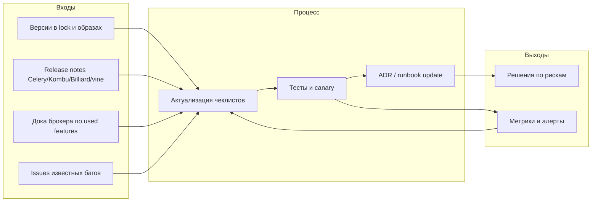

[← Назад к индексу части](index.md)
[↑ К глобальному плану](../celery_mastery_plan.md)

## Сквозная схема: цикл актуализации

Ниже — «картинка», как знание о Celery в организации остаётся свежим: не один импульс чтения, а **замкнутый контур** с привязкой к версиям и инцидентам.

**Как читать диаграмму:** метрики и инциденты **обратно** кормят процесс — если после апгрейда выросли ретраи на конкретном транспорте, вы возвращаетесь к **R** и **I**, а не «крутите prefetch наугад».

---

