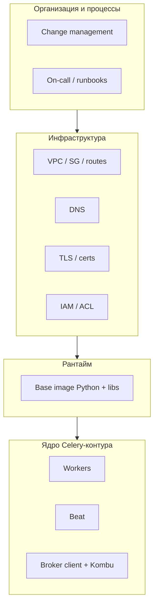
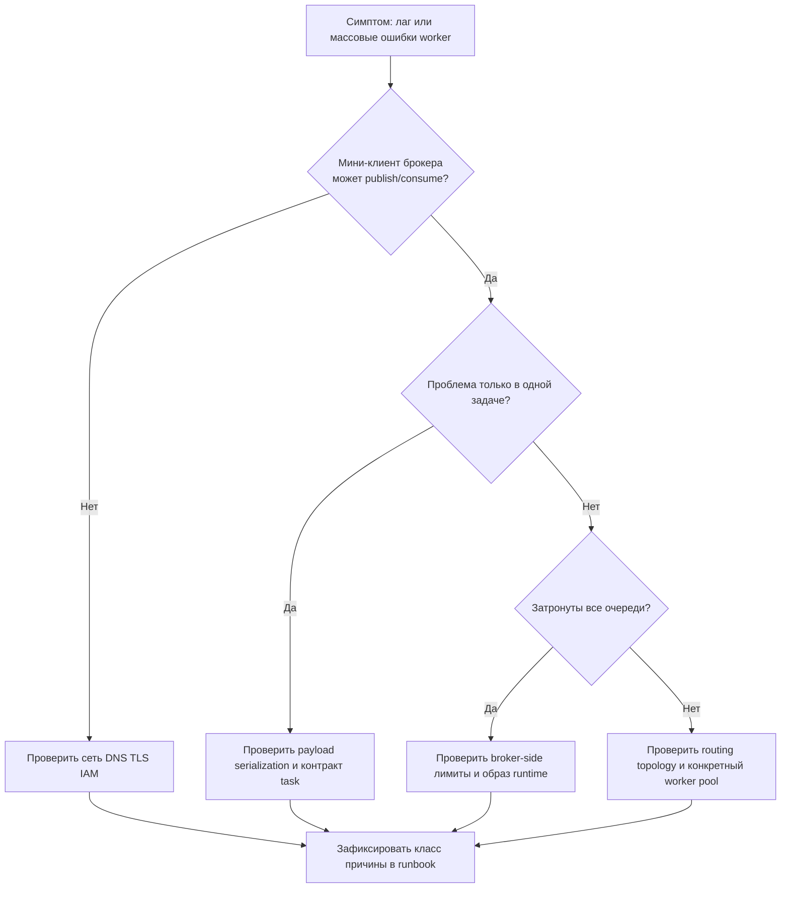

[← Назад к индексу части](index.md)
[↑ К глобальному плану](../../mastery_plan.md)

## 43.2 Что формально **вне** ядра Celery, но обязательно рядом

### Цель раздела

Научиться **не смешивать** ответственность: понимать, какие классы проблем **не решить** «правильным `CELERY_*`», потому что они живут в **инфраструктуре и организации**.

### В этом разделе главное

**Celery — библиотека и процессы worker/beat.** **VPC/DNS/TLS/IAM/образы Python/процессы компании** — это **окружение**, без которого библиотека не доезжает до брокера или падает на старте, но это **не баг Celery по определению**.

### Термины

| Термин | Коротко |
| ------ | -------- |
| **VPC** | Изолированная сеть в облаке: маршруты, security groups, egress — влияют на доступ к брокеру. |
| **DNS** | Имя брокера должно резолвиться предсказуемо; TTL и split-horizon ломают «иногда не коннектится». |
| **TLS termination** | TLS может обрываться на балансировщике; клиент видит одно, брокер — другое; сертификаты и цепочки доверия критичны. |
| **IAM / ACL** | Кто имеет право публиковать/читать очереди; облако может отозвать ключ или сменить политику. |
| **Базовый образ Python** | Системные либы (OpenSSL, glibc), патчи безопасности, иногда поведение fork — влияет на worker pool. |
| **Организационные процессы** | On-call, change management, согласование окна деплоя — см. **часть 34**. |

### Теория и правила

1. **Сеть — часть контракта доставки.** Celery предполагает, что сообщение **дойдёт** до брокера и обратно. Если пакеты дропаются, RTT скачет, MTU некорректен для VPN — вы увидите **timeouts**, **partial frames**, «залипшие» consumers. Правило: любой странный лаг без роста CPU в задаче → **сначала** сеть и DNS, **потом** prefetch.

2. **TLS — частый невидимый участник.** Ротация сертификата, устаревший CA bundle в образе, несовместимые cipher suites — классика. Правило: при SSL-ошибках собирайте **цепочку**: клиентская либа → промежуточный LB → брокер.

3. **IAM/ACL — это не `CELERY_TASK_ROUTES`.** Ошибка `ACCESS_DENIED` от managed Redis/RabbitMQ — не повод переписывать задачи. Правило: отдельный runbook «права брокера» с диаграммой субъектов (worker role, producer role, admin).

4. **Образы и системные библиотеки — скрытая совместимость.** Обновили базовый образ — могли обновиться OpenSSL/glibc; иногда страдает **fork**/DNS/SSL. Правило: любой апгрейд образа для Celery-worker проходит как **мини-мажор** для фоновой подсистемы.

5. **Организационные процессы — источник календаря.** Без окна на canary и без владельца on-call процесс из 43.1 не удержится. Это не «мягкие навыки», это **инженерная инфраструктура знаний**.

### Пошагово: диагностика «Celery или не Celery?»

1. Воспроизвести проблему **минимальным клиентом брокера** (не через Celery): publish/consume ping-queue.
2. Если минимальный клиент падает так же — это **не** логика задач Celery.
3. Если минимальный клиент здоров — сузить к **сериализации, декларации задач, воркер-пулу** (уже зона Celery + ваш код).
4. Зафиксировать вывод в тикете: **класс причины** (сеть/TLS/IAM/код) — это экономит следующий инцидент.

### Простыми словами

Celery — дирижёр, а брокер — оркестр. Если **зал** закрыт на замок, дирижёр не виноват, что концерт не состоялся — надо чинить замок, а не ускорять дирижирование.

### Картинка в голове

Представь **четыре кольца защиты** вокруг ядра: сеть, крипто/доверие, права доступа, организационный календарь. Celery сидит **внутри**, но не заменяет кольца.

### Как запомнить

**«Сначала дорога, потом машина»**: VPC/DNS/TLS/IAM → затем Celery-настройки и код.

### Примеры

**Пример — DNS TTL:** после переключения брокера на новый endpoint часть воркеров ещё долго держит старый IP. Симптом — «часть воркеров не забирает задачи». Лечится DNS/TTL/рестарт резолвера, а не `worker_prefetch_multiplier`.

**Пример — IAM:** ротация ключа доступа к Amazon MQ без обновления секрета в k8s → массовые отказы publish. Логи покажут auth failure на уровне клиента AMQP.

### Практика / реальные сценарии

- Добавьте в runbook **одну страницу** «смежный контур» со ссылками на дашборды сети, TLS, IAM — это сильно ускоряет triage ночью.

### Типичные ошибки

- Писать «Celery нестабилен», когда tcpdump показывает **packet loss** до брокера.
- Обновлять только `celery` в `requirements.txt`, забыв про **образ** и системные пакеты.

### Что будет, если путать границы

Команда тонет в бессмысленных оптимизациях задач; инциденты повторяются; безопасность не доверяет «ещё одному деплою Celery».

### Проверь себя

1. Приведи **два симптома**, которые чаще всего на самом деле про TLS/DNS, а не про Celery.
2. Почему обновление **базового образа** относится к этой части, а не к «внутренностям Celery» (часть 22)?
3. Куда по курсу отнести разговор про **on-call** и **change management**?

<details><summary>Ответ</summary>

1. SSL handshake error / certificate verify failed; «иногда» таймауты при неизменной нагрузке — часто DNS/TTL или сетевой путь.
2. Внутренности Celery — про код/протокол библиотеки; образ меняет **окружение исполнения** (libc/ssl/fork), это смежный контур.
3. К **части 34** (индустриальный контекст и экономика/процессы); здесь мы только **ссылаемся** на эту связь.

</details>

### Запомните

- **Формально вне ядра** ≠ «неважно».
- **Минимальный клиент брокера** — лучший тест «это сеть или нет».
- **Организация** — часть устойчивости знаний.

---

<a id="432-диаграмма-границ-системы"></a>

### 43.2 Диаграмма границ системы



<a id="432-ascii-ownership"></a>

#### Простая ASCII-схема «где чья ответственность»

```text
[App team]
  |- task contract, retries, routing, idempotency
  |- worker/beat config and rollout
  v
[Shared platform / SRE]
  |- network path, DNS, TLS trust chain
  |- IAM/ACL, secret rotation, node images
  v
[Cloud/Broker vendor]
  |- service SLA, regional incidents, control-plane limits
```

**Как читать:** инцидент может начаться на нижнем слое, проявиться в среднем и стать видимым в верхнем. Поэтому triage в 43.2 всегда идёт **сверху вниз по симптомам, но с проверкой всех слоёв**.

#### Проверь себя: ASCII-карта ответственности

1. Почему симптом на уровне `App team` не доказывает, что корень проблемы находится там же?
2. Как эта карта помогает сократить «пинг-понг» между командами в инциденте?
3. Что изменится в качестве расследования, если явно назначить владельца для каждого слоя?

<details><summary>Ответ</summary>

1. Потому что многие сбои поднимаются наверх как ошибки задач, хотя причина лежит ниже — в сети, TLS, IAM или внешнем сервисе брокера.
2. Она задаёт последовательность проверки слоёв и язык ответственности, чтобы обсуждение шло по фактам, а не по личным предположениям.
3. Уменьшается время локализации, быстрее собираются нужные логи/метрики и ниже риск пропустить межслойную причину.

</details>

---

<a id="432-кейс-всё-сломалось-после-ротации-сертификата"></a>

### 43.2 Кейс: «всё сломалось после ротации сертификата»

**Симптомы:** воркеры периодически падают при старте; в логах SSL verify failed; часть pod-ов ещё работает.

**Неверная гипотеза:** «надо отключить verify» в клиенте.

**Правильный ход:** проверить, обновилась ли **цепочка** на LB, совпадает ли **SNI**, не застрял ли старый IP в DNS, не устарел ли CA bundle в образе. Celery-конфигурацию трогают **после** восстановления доверия.

#### Проверь себя: кейс

1. Почему отключение verify — плохая «быстрая победа»?
2. Какой минимальный тест докажет, что проблема **не** в теле задачи?

<details><summary>Ответ</summary>

1. Это ломает безопасность и маскирует корень; через месяц инцидент вернётся иначе.
2. Отдельный скрипт клиента брокера с теми же TLS-параметрами и без импорта задач.

</details>

<a id="432-triage-flow"></a>

#### Визуал triage: «Celery не едет» за 5 шагов



**Смысл диаграммы:** не прыгать сразу в «исправим код задачи», пока не исключены инфраструктурные причины с более высокой вероятностью.

#### Проверь себя: triage-flow

1. Почему проверка «одна задача или все очереди» критична для выбора следующего шага диагностики?
2. В каком случае этот flow приведёт к проверке topology/routing вместо payload?
3. Что обязательно нужно сделать после локализации причины, чтобы диагностика улучшалась от релиза к релизу?

<details><summary>Ответ</summary>

1. Это быстро разделяет локальную проблему контракта задачи и системную проблему контура исполнения/инфраструктуры.
2. Когда мини-клиент брокера работает, а проблема не ограничена одной задачей, но проявляется по очередям/пулам — это типичный сигнал routing/topology класса.
3. Зафиксировать класс причины и решение в runbook/ADR/drift-артефактах, иначе команда повторит те же ошибки позже.

</details>

---

<a id="433-периодический-пересмотр-плана"></a>
