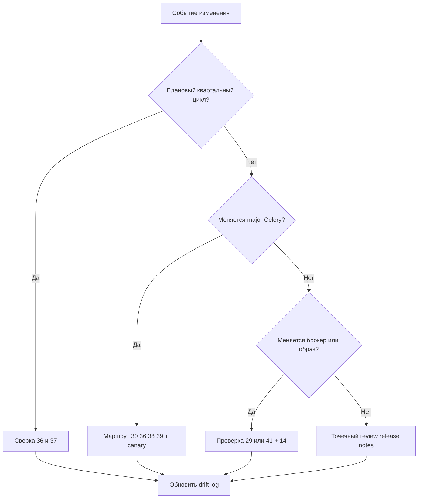

[← Назад к индексу части](index.md)
[↑ К глобальному плану](../../mastery_plan.md)

## Celery quarterly drift check
- Date:
- Service:
- Prod version / Main version:

### 36 (config) delta
- Setting:
  - old meaning:
  - current meaning:
  - action:

### 37 (CLI/env) delta
- Command/flag:
  - old note:
  - current --help behavior:
  - action:

### Risks accepted
- ...

### Follow-up tickets
- ...
```

#### Проверь себя: шаблон квартальной сверки

1. Почему блок `Risks accepted` в шаблоне так же важен, как `delta` по настройкам и CLI?
2. Что произойдёт, если в квартальном отчёте нет `Follow-up tickets`, а только описание отличий?
3. Как использовать этот шаблон при онбординге нового инженера?

<details><summary>Ответ</summary>

1. Потому что не все риски устраняются сразу; их нужно явно признать, чтобы ими управляли, а не забывали.
2. Отличия останутся информацией без исполнения: улучшения не попадут в backlog и процесс быстро деградирует в «мы заметили, но не сделали».
3. Шаблон даёт новому инженеру карту «что меняется в реальности» и какие решения команда принимала по этим изменениям.

</details>

### Простыми словами

Раз в сезон **подтягиваем часы**: не потому что время врёт, а потому что **летнее/зимнее** (изменения в софте) существует.

### Картинка в голове

**Календарь техосмотра:** квартал — масло и фильтры (36–37), мажор — двигатель и подвеска (30/38/39).

### Как запомнить

**«Квартал = имена; мажор = поведение и контракт»**.

### Практика / реальные сценарии

- **Сценарий:** в организации 5 команд с разными сервисами Celery. Квартальная сверка делается **по шаблону**; результаты падают в общий Confluence раздел «Celery drift log».

### Типичные ошибки

- Сверять только **документацию курса**, не прод-версию.
- Делать сверку без **фиксации delta** — через месяц никто не вспомнит, что именно изменилось.

### Что будет, если пропустить ритм

Команда будет жить на **мифах 3-летней давности** про defaults и флаги CLI; онбординг станет передачей неточных «байок».

### Проверь себя

1. Перечисли **четыре части**, которые план называет для мажорного апгрейда, и по одной причине для каждой.
2. Почему квартальная сверка **не заменяет** чтение release notes при апгрейде?
3. Куда записывать delta, если публичный `pact` обновлять нельзя/не нужно?

<details><summary>Ответ</summary>

1. **30** — очереди и совместимость сообщений; **36** — матрица конфигурации; **38** — hooks/signals/bootsteps; **39** — состояния/исключения/протокол — всё это типичные зоны ломки при мажоре.
2. Квартал ловит **дрейф** текущей версии; release notes — **скачок** между версиями; это разные сигналы.
3. Во внутренний документ команды, ADR или runbook — артефакт для эксплуатации, а не обязательно апстрим курса.

</details>

### Запомните

- **Квартал** держит **лексику** конфигурации и CLI в адеквате.
- **Мажор** требует **контрактно-протокольного** маршрута (30/38/39).

<a id="433-decision-flow"></a>

#### Визуал: когда запускать какой тип пересмотра



---

<a id="433-матрица-событие--какие-части-перечитать"></a>

### 43.3 Матрица «событие → какие части перечитать»

| Событие | Минимум перечитывания / действий | Зачем |
| ------- | -------------------------------- | ----- |
| Патч Celery внутри той же major | release notes + diff по используемым опциям | регрессии точечные |
| Мажор Celery | **30, 36, 38, 39** + интеграционные тесты | контракт и внутренности |
| Апгрейд брокера | **6, 29, 14** + дока брокера | семантика доставки и наблюдаемость |
| Смена базового образа | **41, 8, 21** | fork/ssl/ресурсы и эксплуатация |
| Новый managed policy (IAM) | **17, 31** + дока облака | безопасность и комплаенс |
| Рост стоимости очередей | **34, 16** | FinOps и производительность |
| Новый сильный инженер | **35, 42** | глоссарий + самопроверка навыков |

#### Проверь себя: матрица

1. Почему при смене **образа** указаны части **41** и **8**?
2. Зачем при IAM-политике тянуть **31**, а не только **17**?
3. Какое событие из таблицы **не** требует открытия документации Celery?

<details><summary>Ответ</summary>

1. **41** — платформа/рантайм; **8** — пулы, fork, prefetch, жизненный цикл воркера — типичные зоны влияния системных библиотек.
2. **31** — политики данных/аудит/retention в организационном смысле; **17** — технические механизмы; вместе закрывают «можно ли так резать права».
3. Чистая смена IAM у брокера: первично дока облака и **17/31**, Celery-дока вторична, пока не менялись версии.

</details>

<a id="433-raci"></a>

### RACI для процесса актуализации (кто за что отвечает)

| Активность | Service team | Platform/SRE | Security | Tech lead |
| ---------- | ------------ | ------------ | -------- | --------- |
| Квартальная сверка 36–37 | **R** | C | I | **A** |
| Чтение release notes и сбор рисков | **R** | C | C | **A** |
| Проверка broker-side изменений | C | **R** | C | A |
| Решение «катим/не катим мажор» | C | C | C | **A/R** |
| Обновление runbook/ADR/drift log | **R** | C | I | **A** |

Где: **R** — делает руками, **A** — несёт итоговую ответственность, **C** — консультирует, **I** — информируется.

#### Проверь себя: RACI

1. Почему совмещение `A` и `R` везде может быть плохой идеей, даже в маленькой команде?
2. Что сломается первым, если в таблице нет явного `A` для апгрейд-решения?
3. Как понять, что текущий RACI устарел и требует пересмотра?

<details><summary>Ответ</summary>

1. Это перегружает одного человека, снижает устойчивость процесса при его отсутствии и ухудшает качество ревью решений.
2. Начнутся затяжные споры «кто принимает финальное решение», релизные окна будут срываться, а риски останутся без владельца.
3. Когда задачи регулярно «зависают», инциденты повторяются на стыках ролей или команды/процессы изменились (новая платформа, новая оргструктура).

</details>

#### Что будет, если RACI не определить

- чеклисты «висят» между командами;
- апгрейд превращается в цепочку невыполненных обещаний;
- инциденты повторяются, потому что уроки не закрепляются в артефактах.

---

<a id="434-честная-формулировка-полноты"></a>
