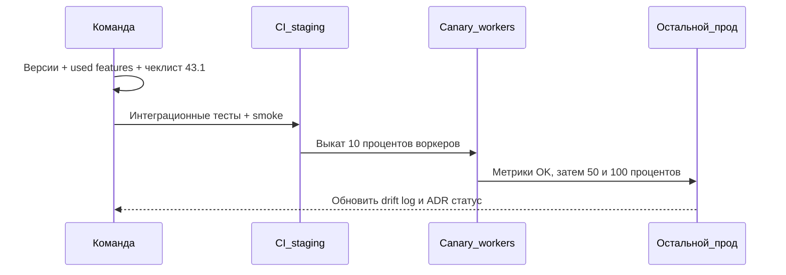

[← Назад к индексу части](index.md)
[↑ К глобальному плану](../mastery_plan.md)

## Углубление: mermaid — последовательность мажорного апгрейда (упрощённо)

Ниже схема **идеального** порядка: в реальности шаги могут сдвигаться, но **направление** важно — сначала понимание и тесты, потом расширение доли.

**В этом разделе главное:** метрики между **Canary** и **Prod** — не украшение; без них вы не отличите «успешный деплой» от «пока не ударило».

### Проверь себя

1. Почему на схеме **CI** стоит **перед** canary, а не после?
2. Какой **один** сигнал в метриках чаще всего первым ловит регрессию chord/canvas?

Ответ

1. Потому что canary в проде должен подтверждать то, что **уже** прошло автоматическую проверку; иначе вы платите прод-риском за то, что поймал бы CI.
2. Рост ошибок/ретраев на **result backend** или рост end-to-end времени chord при стабильной глубине очереди — ранние кандидаты (точный набор зависит от вашей архитектуры).

---

