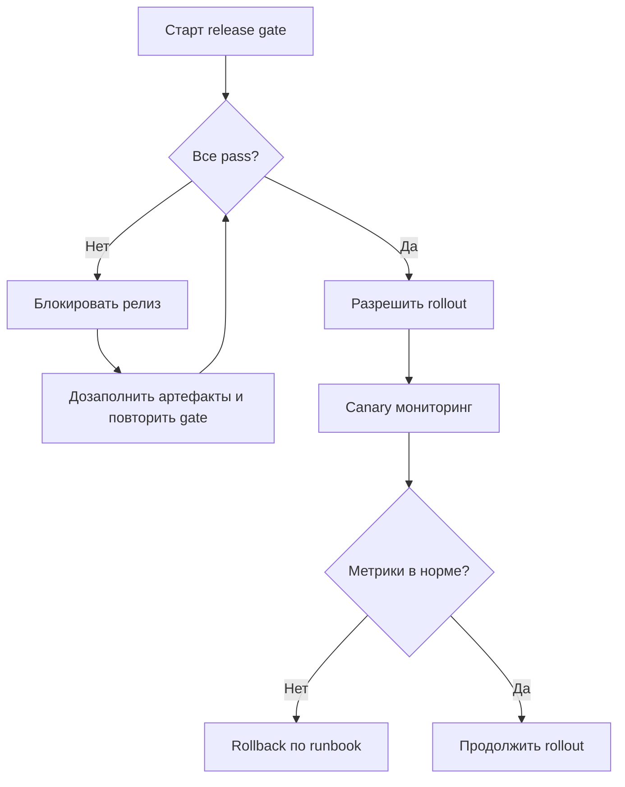

[← Назад к индексу части](index.md)
[↑ К глобальному плану](../celery_mastery_plan.md)

## Production-gate перед релизом

Этот блок напрямую отвечает формулировке глобального плана: часть 43 применять **перед production**.

### Чеклист gate (релиз блокируется, если пункт не выполнен)

| Контроль | Минимальное доказательство | Статус |
| -------- | -------------------------- | ------ |
| Прочитаны release notes Celery/Kombu/Billiard/vine | Ссылка на digest в тикете релиза | `pass/fail` |
| Проверены used features брокера | Список фич и рисков обновлён | `pass/fail` |
| Выполнен triage smoke вне Celery (мини-клиент брокера) | Лог smoke-проверки приложен | `pass/fail` |
| Подготовлен и проверен rollback plan | Ссылка на staging rollback drill | `pass/fail` |
| Обновлены runbook/ADR/drift log | Ссылки на документы с датой | `pass/fail` |
| Назначены ответственные на окно релиза (RACI) | Роли подтверждены в релизном тикете | `pass/fail` |

### Визуал: решение «пускать в production или нет»

### Что чаще всего забывают в production-gate

- есть ADR, но нет **доказательства rollback drill**;
- есть checklist, но не назначены роли на конкретное окно релиза;
- есть canary, но нет заранее согласованного порога отката.

#### Проверь себя: anti-miss в production-gate

1. Почему наличие canary без порога отката создаёт ложное чувство безопасности?
2. Как отличить «чеклист закрыт формально» от «чеклист закрыт качественно»?
3. Что делать, если один из gate-пунктов fail, но есть сильное давление «катить сейчас»?

Ответ

1. Без порога команда не знает, когда принимать решение об откате, и canary превращается в пассивное наблюдение.
2. Формально — есть галочки без доказательств; качественно — есть проверяемые артефакты и ясные критерии pass/fail.
3. Эскалировать риск, зафиксировать исключение и владельца ответственности; по умолчанию блокировать релиз до закрытия критичного fail.

#### Проверь себя: production-gate

1. Почему релиз стоит блокировать даже при «зелёном CI», если gate не закрыт?
2. Какой один пункт gate чаще всего спасает от затяжного инцидента?
3. Что важнее: «быстро выкатить» или «подтвердить rollback готовность» — и почему?

Ответ

1. CI не покрывает весь эксплуатационный контур (broker policies, инфраструктурные изменения, процедуры отката); gate закрывает именно этот разрыв.
2. Проверенный rollback plan: он ограничивает blast radius, когда регрессия проявляется только в продовой динамике.
3. Подтверждённая rollback готовность. Скорость релиза полезна только если есть контролируемый путь назад.

---
