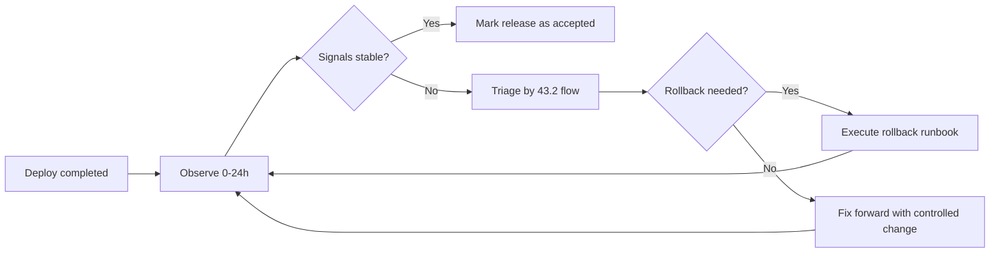

[← Назад к индексу части](index.md)
[↑ К глобальному плану](../mastery_plan.md)

## Первые 24 часа после релиза

Часть 43 закрывается не в момент нажатия «deploy», а после короткого пост-релизного окна наблюдения.  
Этот блок нужен, чтобы не спутать «релиз прошёл» с «последствия релиза ещё не проявились».

### Мини-протокол post-release контроля

| Временное окно | Что проверяем | Признак, что нужно эскалировать |
| -------------- | ------------- | -------------------------------- |
| 0-15 минут | подключение worker к брокеру, базовый consume/publish smoke | массовые disconnect/reconnect циклы, auth/ssl ошибки |
| 15-60 минут | retry/failure rate, queue lag, latency ключевых задач | устойчивый рост lag или spikes ошибок выше порога |
| 1-4 часа | стабильность canary vs baseline pool | canary деградирует относительно baseline |
| 4-24 часа | медленные эффекты: chord completion, beat schedule, cost/traffic | накопление «длинных хвостов» latency или рост стоимости без роста нагрузки |

### Визуал: post-release петля наблюдения

### Практическая рекомендация

- заранее договориться, **кто** подтверждает финальный статус релиза через 24 часа;
- не закрывать релизный тикет до завершения окна наблюдения и фиксации результата (`accepted` / `rolled back` / `fix-forward`).

#### Проверь себя: окно 0-24 часа

1. Почему в таблице есть отдельный интервал 4–24 часа, а не только «первые 60 минут»?
2. Как определить, что post-release наблюдение можно завершать досрочно (и можно ли)?
3. Что делает этот блок частью именно темы 43, а не только «операций» из части 21?

Ответ

1. Долгие эффекты (планировщик, длинные задачи, chord-замыкания, стоимость) часто проявляются позже быстрых smoke-сигналов.
2. Обычно досрочно завершать не стоит; если завершаете, это должно быть заранее оговорено в процессе и подтверждено стабильностью ключевых сигналов.
3. Он замыкает цикл актуализации: наблюдение после релиза даёт вход для обновления runbook/ADR/drift и повышает качество следующих решений.

#### Проверь себя: post-release

1. Почему релиз нельзя считать завершённым сразу после успешного canary?
2. Чем «fix forward» отличается от «мы просто терпим пока не станет лучше»?
3. Какой артефакт должен остаться после 24-часового окна даже при полностью успешном релизе?

Ответ

1. Потому что часть эффектов (beat/chord/cost/долгие задачи) проявляется позже и не видна в первые минуты.
2. Fix forward — это контролируемое изменение с ограниченным риском и наблюдаемыми критериями; «терпим» — отсутствие управляемого решения.
3. Короткая пост-релизная запись в релизном тикете/ADR: что наблюдали, какие метрики были, почему релиз принят.

---
